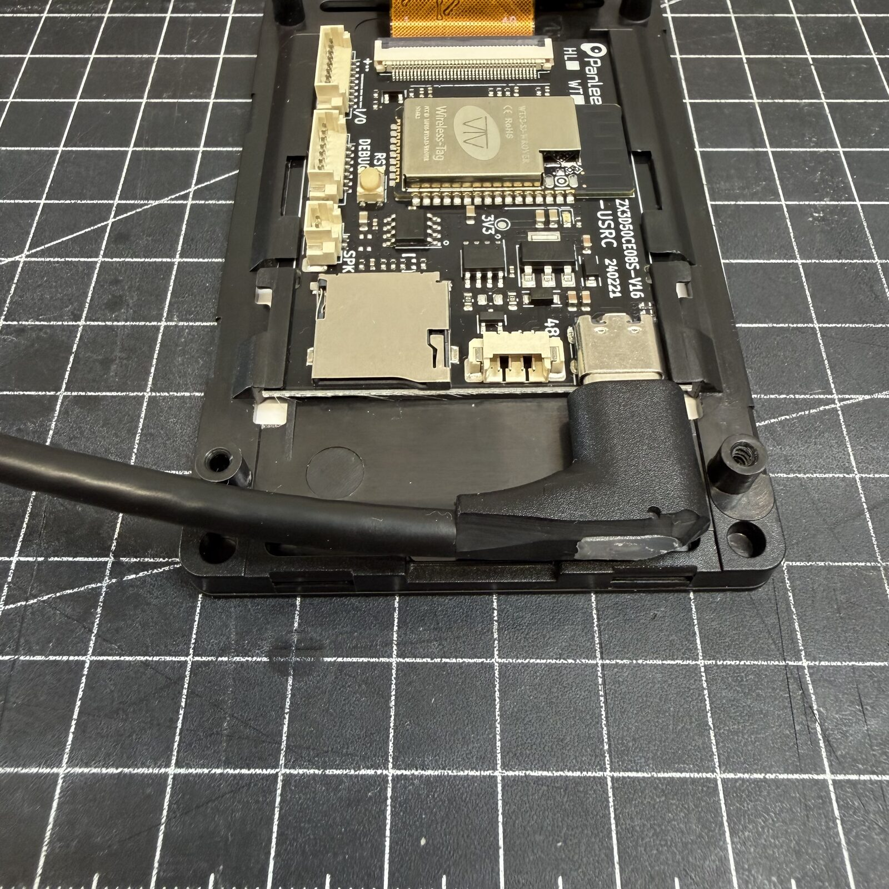
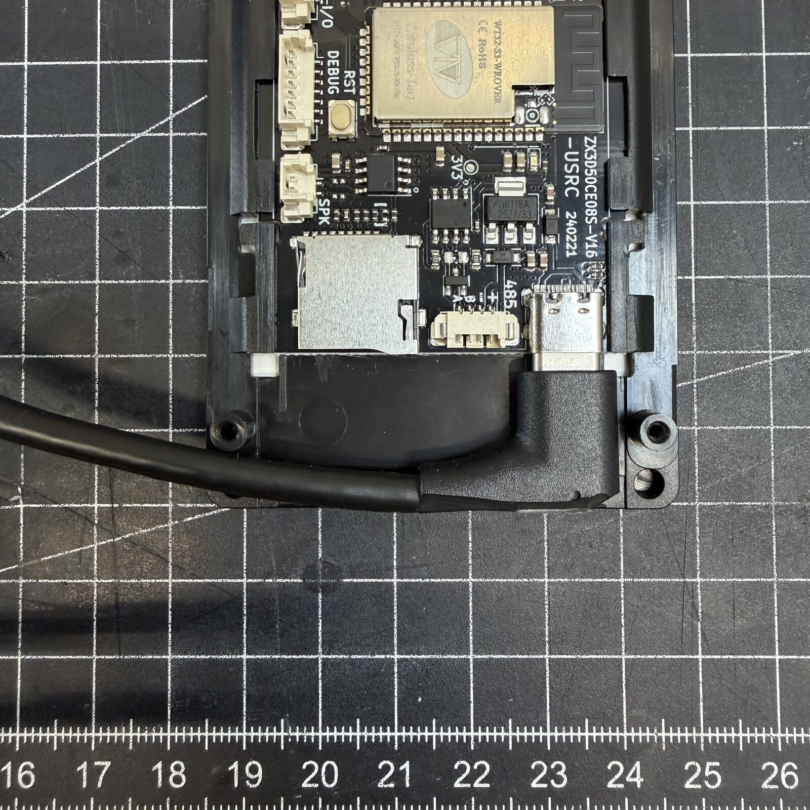
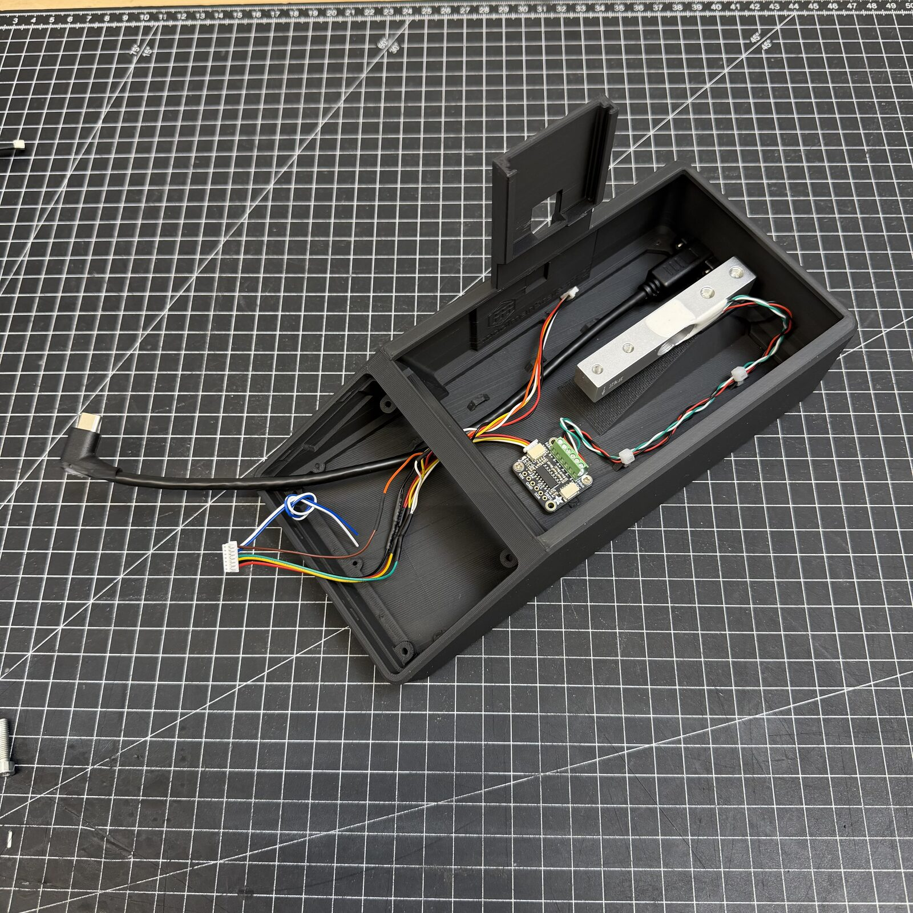
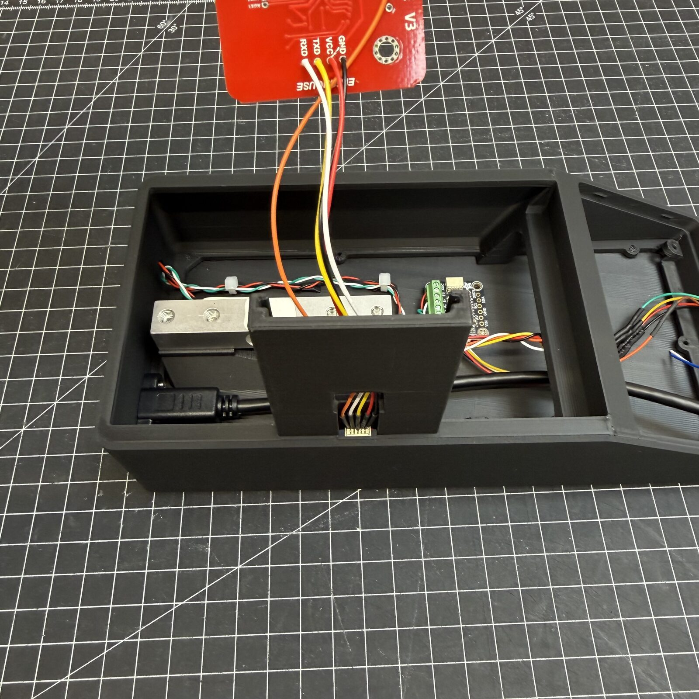
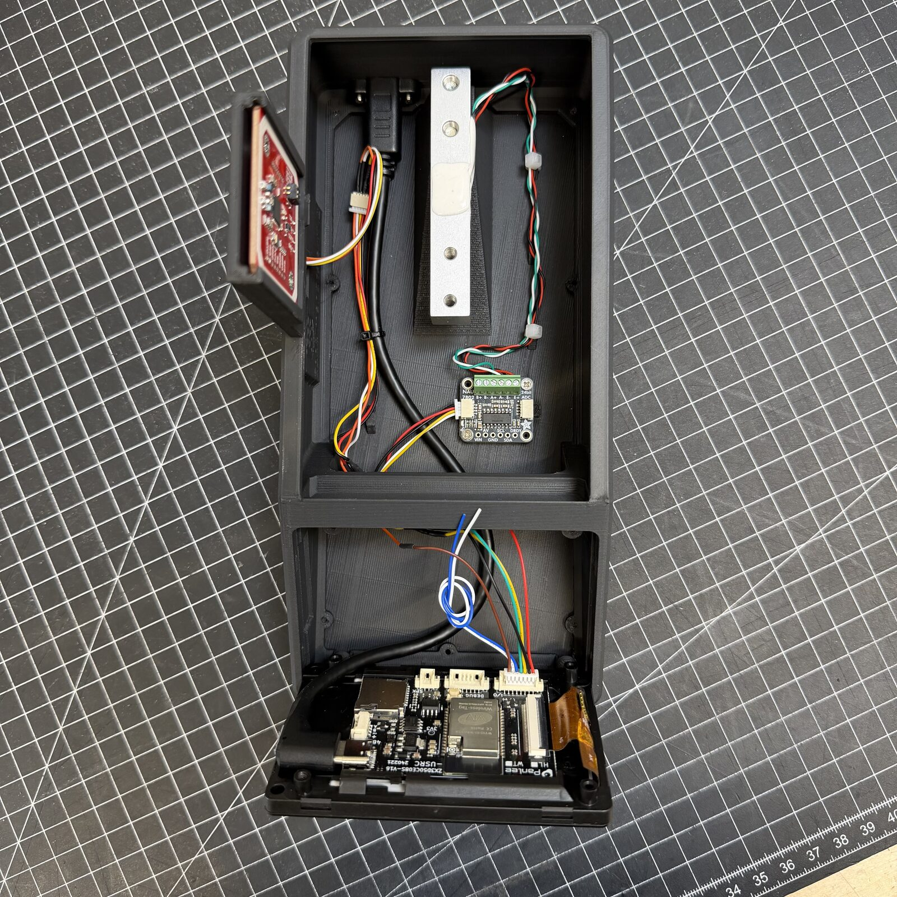

# Zusammenbau

!!! warning "Beta-Bauanleitung"
    Ist etwas unklar oder passt nicht zu deiner Hardware-Charge, melde es bitte
    im [Discord](https://discord.gg/xadskCrPFu) oder auf
    [MakerWorld](https://makerworld.com/de/models/2713675-spoolmanscale#profileId-3005075).

---

## Vorher

Druck zuerst das Gehäuse - siehe [Gehäuse drucken](case.md).

---

## Schrauben

| Schraube | Anzahl | Wofür |
|---|---|---|
| Zylinderschraube M5x25 | 2 | - |
| Zylinderschraube M4x15 | 2 | - |
| Blechschraube M2,5x5 | 9 | Hauptgehäuse |
| Blechschraube M2x4,4 | 2 bis 4 | Kleinteile |

Blechschrauben sind empfohlen, normale Maschinenschrauben (M2,5x5, M2x4) gehen
aber vermutlich auch.

---

## Die Schritte

### Schritt 1 - Zuerst flashen

Bevor du irgendetwas zusammenbaust, flash die Firmware über den
[Web-Flasher](https://niko11111.github.io/SpoolmanScale) auf die nackte Platine.
Damit weißt du, dass sie läuft, bevor du zu löten anfängst.

### Schritt 2 - Ein Bauteil nach dem anderen

Schließ die Bauteile einzeln an und prüfe jedes, bevor du weitergehst - das
lässt sich jetzt viel leichter eingrenzen als später im fertig verschraubten
Gehäuse.

**Reihenfolge:**

1. PN532 NFC-Reader
2. NAU7802 Waagen-ADC + Wägezelle

Alle Verbindungen stehen unter [Verkabelung](wiring.md).

### Schritt 3 - USB-C-Einbaubuchse

Die USB-C-Einbaubuchse muss vor dem Einbau gekürzt werden. Nimm ein
Cuttermesser und kürze das Steckergehäuse Stück für Stück, bis es nicht mehr
über die Displaykante hinaussteht. Lass dir Zeit und schneide in kleinen
Schritten. Sitzt es bündig, passt es sauber ins Gehäuse.

### Schritt 4 - Zumachen

Prüfe abschließend, ob alle Bauteile arbeiten, und drück dann das Display ins
Gehäuse. Es sollte auch ohne Schrauben fest sitzen. Wer es sicherer will, kann
es von hinten verschrauben.

### Schritt 5 - Kalibrieren

Weiter mit [Flashen & Ersteinrichtung](../use/index.md), dort steht die
Kalibrierung Schritt für Schritt.

---

## Fotos vom Zusammenbau

