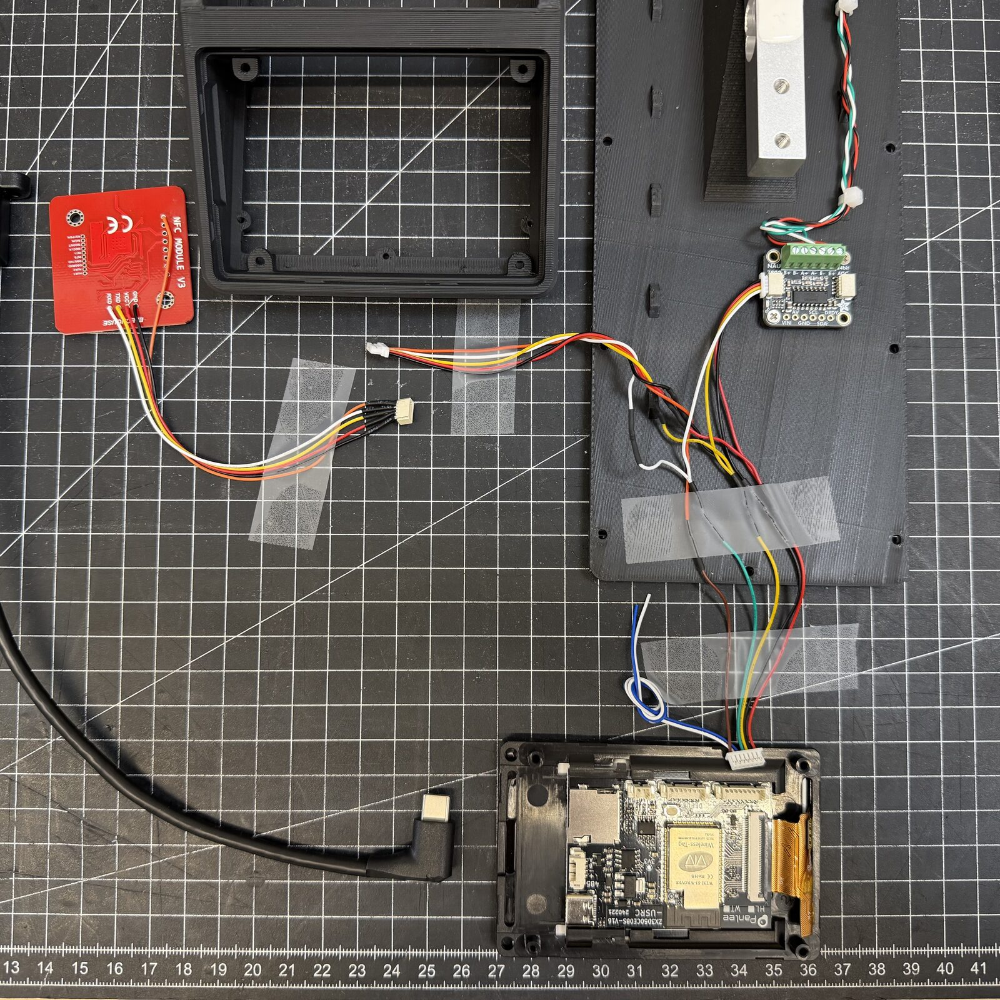
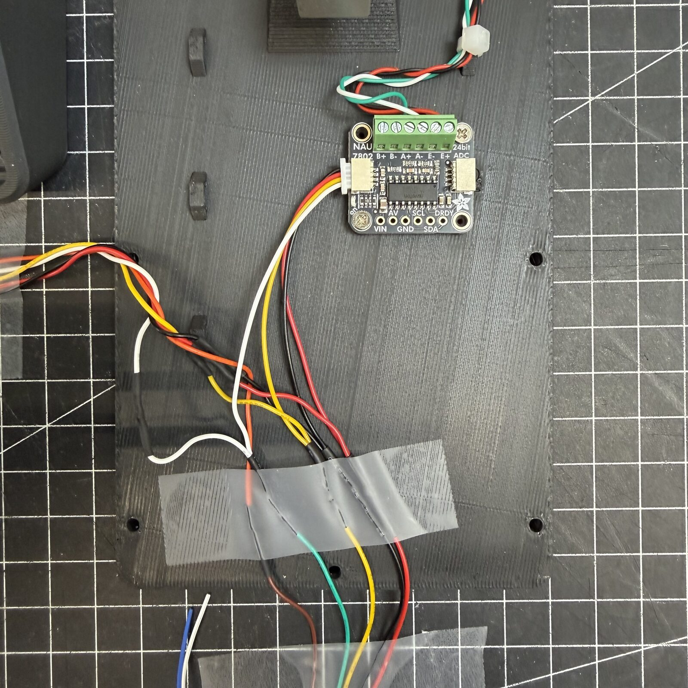
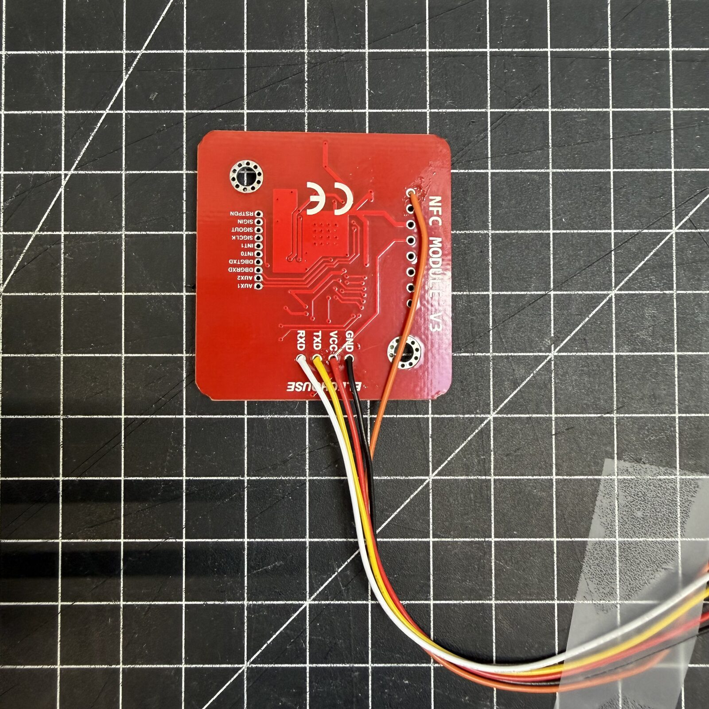
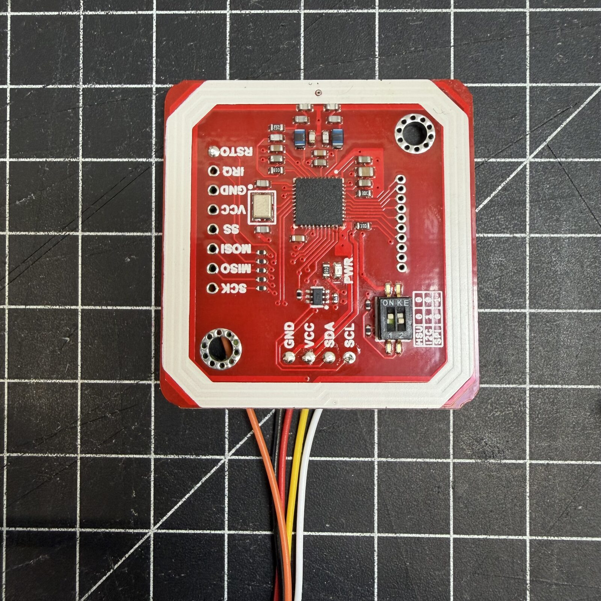

# Verkabelung

Alle Bauteile hängen an der **I/O-Buchse** des WT32-SC01 Plus, über das
mitgelieferte 7-polige Kabel. Die Buchse hat 8 Pins - steck das 7-polige Kabel
**bündig links** ein.

PN532 und NAU7802 teilen sich denselben I²C-Bus (SDA/SCL) und werden
**parallel** verdrahtet.

!!! danger "Nicht über den STEMMA-QT-Durchgang der NAU7802 durchschleifen"
    Der STEMMA-QT-Durchgang der NAU7802 liefert nur **3,3V**. Der PN532 braucht
    **5V**. Schließe beide Module immer direkt an die WT32-I/O-Buchse an.

---

## WT32-SC01 Plus I/O-Buchse

| Pin | Farbe | Signal | Geht an |
|---|---|---|---|
| **1** | Rot | 5V | PN532 VCC + NAU7802 VIN |
| **2** | Schwarz | GND | PN532 GND + NAU7802 GND |
| **3** | Gelb | GPIO10 (SDA) | PN532 SDA + NAU7802 SDA |
| **4** | Grün | GPIO11 (SCL) | PN532 SCL + NAU7802 SCL |
| **5** | Blau | GPIO12 (RST) | PN532 RST |
| **6** | Weiß | GPIO13 | unbenutzt |
| **7** | Braun | GPIO14 | unbenutzt |

---

## PN532 NFC-Reader

Der PN532 hat keinen Stecker - **die Adern werden direkt angelötet**.

!!! warning "Von hinten löten"
    Löte immer von der **Rückseite der Platine**. Vorne ist zu wenig Platz,
    sobald das Modul im Gehäuse sitzt.

### Empfohlene Reihenfolge

1. Alle anderen Bauteile zuerst löten (NAU7802, Wägezelle, WT32-Breakout-Kabel)
2. Die PN532-Adern lose und lang genug lassen, um damit arbeiten zu können
3. Die Adern von unten durch die Öffnung der PN532-Halterung führen
4. Auf der Rückseite der PN532-Platine anlöten
5. Den PN532 in seine Halterung schieben und die Kabel ins Gehäuse legen

!!! tip "JST-SH-1.0-mm-Stecker"
    Benutzt du am PN532 ein 5-poliges JST-SH-1.0-mm-Pigtail, ist die Öffnung der
    Halterung gerade groß genug, den Stecker durchzuführen - dann kannst du alles
    außerhalb des Gehäuses löten und beim Endzusammenbau nur noch einstecken.

### PN532-Belegung (JST SH 1,0 mm, 5-polig, Kabelfarben von Drittanbietern)

| PN532-Pin | Farbe (Drittanbieter) | Signal | WT32-I/O-Pin |
|---|---|---|---|
| 1 | Schwarz | GND | Pin 2 (schwarz) |
| 2 | Rot | 5V | Pin 1 (rot) |
| 3 | Gelb | SDA | Pin 3 (gelb) |
| 4 | Weiß | SCL | Pin 4 (grün) |
| 5 | Orange | RST | Pin 5 (blau) |

---

## NAU7802 Waagen-ADC

Am sichersten lötest du direkt an die beschrifteten Pads der NAU7802 (VIN, GND,
SDA, SCL). Alternativ geht der STEMMA-QT-Stecker - beachte aber, dass
JST-SH-1.0-mm-Kabel von Drittanbietern eine **andere Pinreihenfolge** haben und
umgepinnt werden müssen.

### NAU7802-Belegung (STEMMA QT, JST SH 1,0 mm, 4-polig)

| STEMMA-QT-Pin | Farbe (Drittanbieter) | Signal | WT32-I/O-Pin |
|---|---|---|---|
| 1 | Schwarz | GND | Pin 2 (schwarz) |
| 2 | Rot | 5V | Pin 1 (rot) |
| 3 | Gelb | SDA | Pin 3 (gelb) |
| 4 | Weiß | SCL | Pin 4 (grün) |

---

## Wägezelle

| Ader | NAU7802-Klemme | Funktion |
|---|---|---|
| Rot | E+ | Speisung + |
| Schwarz | E- | Speisung - |
| Weiß | A+ | Signal + |
| Grün | A- | Signal - |

!!! tip "Negative Anzeigewerte?"
    Zeigt die Waage negative Werte, tausche **A+** und **A-**.

---

## Gesamtübersicht

```
  WT32-SC01 Plus I/O (Pins 1-7)
  ┌─────────────────────────────────────────┐
  │ Pin 1 (5V)   ───────┬─────────────────── PN532 VCC
  │                     └─────────────────── NAU7802 VIN
  │ Pin 2 (GND)  ───────┬─────────────────── PN532 GND
  │                     └─────────────────── NAU7802 GND
  │ Pin 3 (SDA)  ───────┬─────────────────── PN532 SDA
  │                     └─────────────────── NAU7802 SDA
  │ Pin 4 (SCL)  ───────┬─────────────────── PN532 SCL
  │                     └─────────────────── NAU7802 SCL
  │ Pin 5 (RST)  ─────────────────────────── PN532 RST
  └─────────────────────────────────────────┘

                                NAU7802 Schraubklemmen
                                ┌──────────────────────┐
                                │ E+ ── Wägezelle ROT   │
                                │ E- ── Wägezelle SCHW. │
                                │ A+ ── Wägezelle WEISS │
                                │ A- ── Wägezelle GRÜN  │
                                └──────────────────────┘
```

---

## Fotos der Verkabelung





