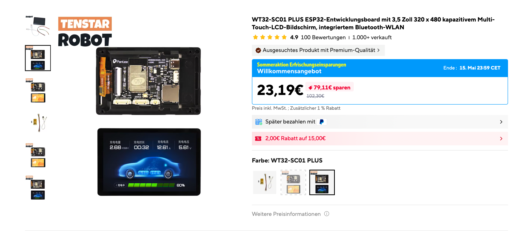
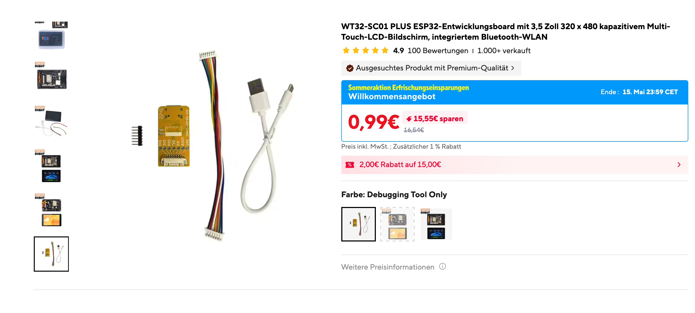
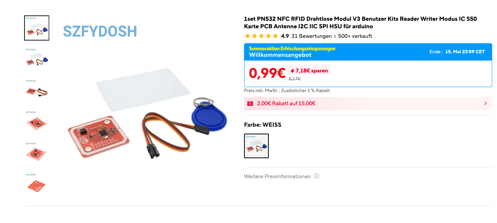
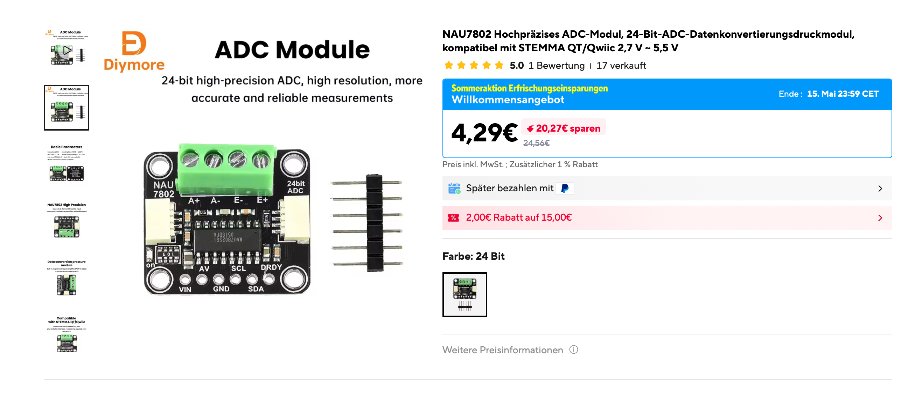
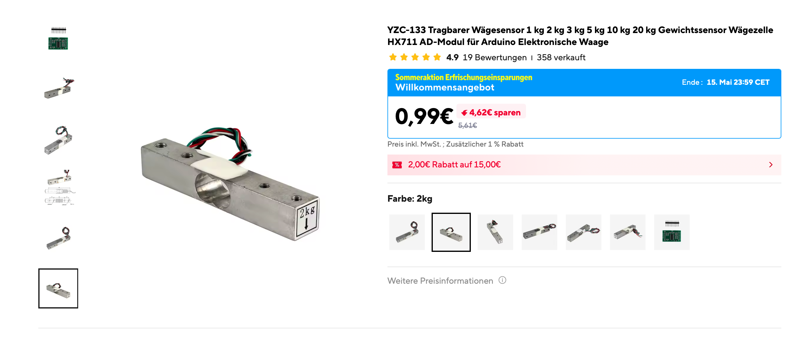
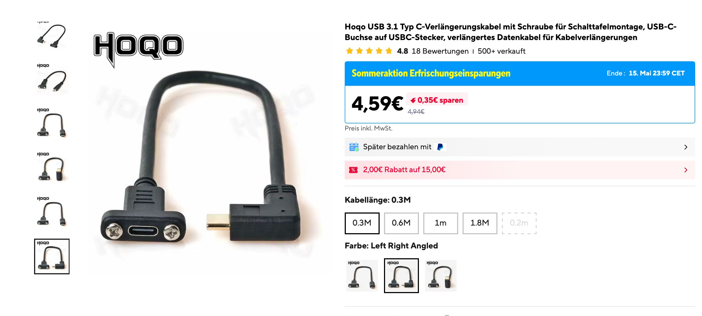
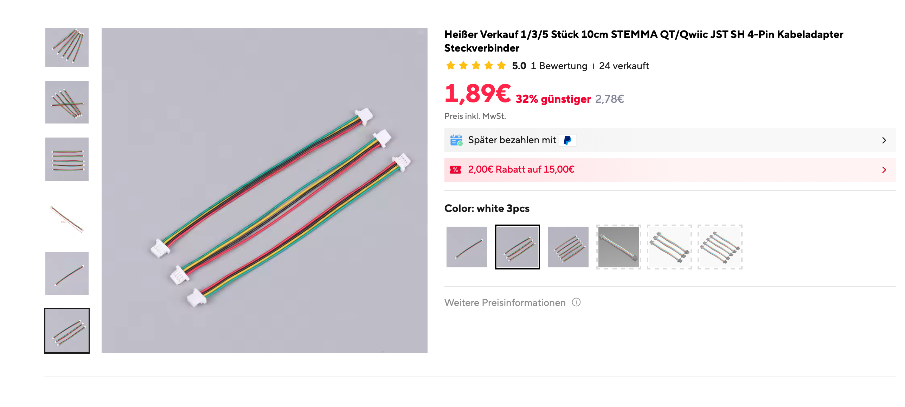
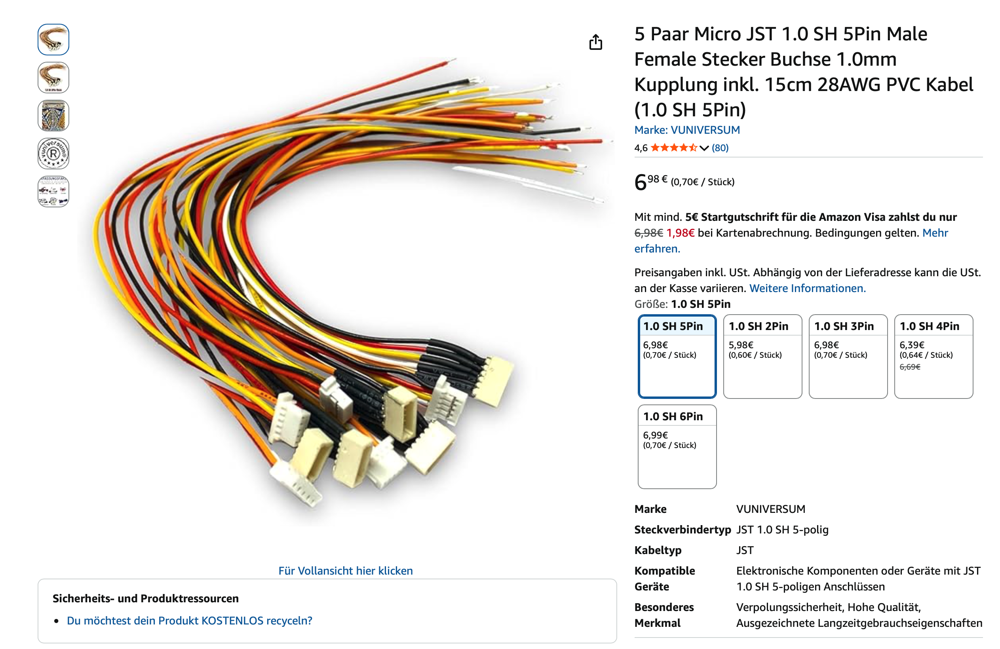

# Bill of Materials

!!! warning "Beta build guide"
    If something is unclear or doesn't fit your hardware batch, please report it on [Discord](https://discord.gg/GzQzGa5pBG) or [MakerWorld](https://makerworld.com/de/models/2713675-spoolmanscale#profileId-3005075).

---

## Core Components

| Image | Component | Model | Link |
|---|---|---|---|
|  | MCU + Display | WT32-SC01 Plus (ESP32-S3, 480×320, ST7796) | [AliExpress](https://de.aliexpress.com/item/1005006050379552.html) |
|  | Debug Board (not necessary) | ZXACC-ESPDB | [AliExpress](https://a.aliexpress.com/_Eu5Y0Ug) |
|  | NFC Reader | PN532 | [AliExpress](https://a.aliexpress.com/_ExScN8M) |
|  | Scale ADC | NAU7802 (Adafruit recommended) | [AliExpress](https://de.aliexpress.com/item/1005011685825986.html) |
|  | Load Cell | YZC-133 **2 kg** beam cell (5 kg works too) | [AliExpress](https://a.aliexpress.com/_EuhhVF2) |
|  | USB-C Panel Mount 90° | 30 cm, Left/Right Angled, full USB-C PD + data | [AliExpress](https://de.aliexpress.com/item/1005003488021890.html) |
|  | Connector Cables | STEMMA QT / JST cables | [AliExpress](https://de.aliexpress.com/item/1005011904682215.html) |
|  | Connector Cables (easier assembly) | Micro JST 1.0 SH 5-pin | [Amazon](https://amzn.eu/d/0aKJ4Va9) |

!!! tip "2 kg vs 5 kg load cell"
    The 2 kg cell is recommended — most filament spools are well within range. A 5 kg cell works too but may be slightly less precise at low weights.

---

## Additional Materials

- Thin stranded wire in 5 different colors (black, red, yellow, white, green — ~30–40 cm each)
- 2× M5×25 socket head screws
- 2× M4×15 socket head screws
- 9× M2.5×5 self-tapping screws
- 2–4× M2×4.4 self-tapping screws ([example](https://a.aliexpress.com/_EyCD3rS))

Self-tapping screws are recommended, but standard machine screws (M2.5×5, M2×4) will likely work as well.

---

## 3D Printed Enclosure

Download from MakerWorld:

👉 [makerworld.com/@FormFollowsF](https://makerworld.com/de/models/2713675-spoolmanscale#profileId-3005075)

All parts fit on 3 print plates (currently distributed across 4). TPU is recommended for the feet — they grip better. Otherwise self-adhesive silicone feet work just as well.

---

## Budget Estimate

| Item | Approx. cost |
|---|---|
| WT32-SC01 Plus | ~€35 |
| PN532, NAU7802, Load Cell, Cables | ~€15–25 |
| Screws, wire | ~€5 |
| **Total** | **~€50–60** |

!!! note "Shipping time"
    Most parts ship from China. Expect **6–15 days** delivery depending on your location and shipping option.

---

## Next Step

➡️ [Wiring](wiring.md)
