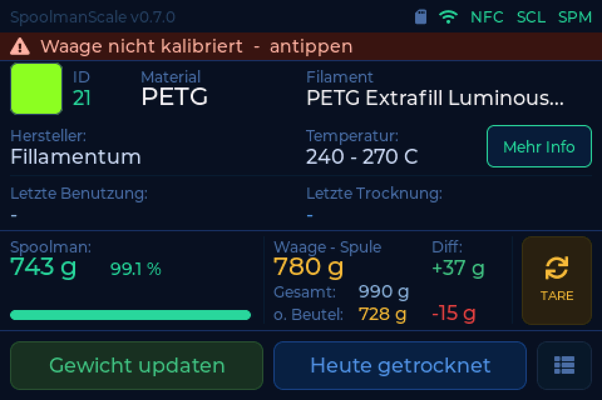
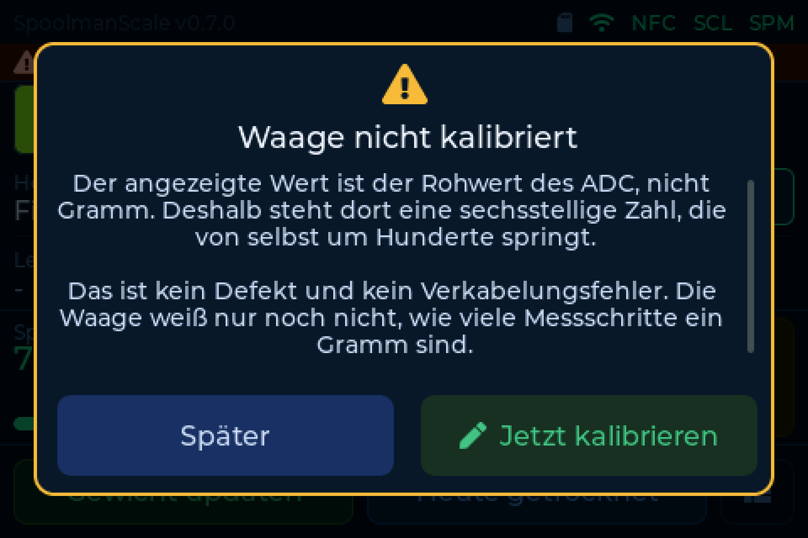

# Was die Waage dir sagt

Seit v0.7.0 prüft sich die Waage im Betrieb selbst und schreibt das Ergebnis im
Klartext in die Statuszeile. Ein Tippen darauf erklärt, was sie beobachtet,
woran es liegt und was zu tun ist. Wo es etwas zu tun gibt, führt der Knopf
direkt dorthin.

Diese Seite listet jeden Befund auf, den sie melden kann, damit du den Text
findest, den du gerade vor dir hast.

!!! info "Immer nur ein Befund"
    Fehlende Hardware geht vor fehlender Kalibrierung, und die geht vor der
    Messqualität. Drei Warnungen auf einmal führen dazu, dass keine davon
    behoben wird, also nennt die Waage nur die wichtigste. Ist alles in
    Ordnung, siehst du davon nichts.

---

## Kein Modul am I2C-Bus

> **Kein Modul am I2C-Bus**

Weder der NFC-Reader noch der Waagen-ADC antworten.

Das 7-polige Kabel muss bündig **links** in der 8-poligen I/O-Buchse sitzen.
Ein Pin daneben und beide Module sind stromlos.

**Prüfe:** Pin 1 (5V, rot), Pin 2 (GND, schwarz), Pin 3 (SDA, gelb) und
Pin 4 (SCL, grün). Siehe [Verkabelung](../build/wiring.md).

---

## Waagen-ADC fehlt (NAU7802)

> **Waagen-ADC fehlt (NAU7802)**

Die NAU7802 antwortet nicht auf `0x2A`. Der NFC-Reader schon, SDA und SCL sind
also grundsätzlich in Ordnung.

**Prüfe:** VIN, GND, SDA und SCL an der NAU7802.

!!! warning "STEMMA-QT-Kabel von Drittanbietern"
    Bei fertigen Kabeln von Drittanbietern stimmt die Pinreihenfolge oft nicht
    mit der des WT32-Kabels überein. Vergleiche Ader für Ader, statt dich auf
    die Farben zu verlassen.

---

## NFC-Reader fehlt (PN532)

> **NFC-Reader fehlt (PN532)**

Der PN532 antwortet nicht auf `0x24`. Der Waagen-ADC schon, SDA und SCL sind
also grundsätzlich in Ordnung.

**Prüfe zuerst die beiden DIP-Schalter auf dem Modul.** Für I2C muss
**SW1 = ON** und **SW2 = OFF** stehen. In der HSU- oder SPI-Stellung meldet sich
der Chip auf dem I2C-Bus überhaupt nicht - genau dieses Bild.

Sonst braucht der PN532 **5V von Pin 1** des I/O-Kabels.

!!! danger "Nicht über die NAU7802 durchschleifen"
    Der STEMMA-QT-Durchgang der NAU7802 führt nur 3,3V. Der PN532 braucht 5V.
    Schließe beide Module direkt an die WT32-I/O-Buchse an.

---

## NFC-Reader meldet sich nicht

> **NFC-Reader antwortet nicht**

Der PN532 bestätigt `0x24`, beantwortet aber keinen Befehl. Er steht damit *auf*
I2C - sonst würde er sich gar nicht melden - und SDA und SCL stimmen ebenfalls.

**Prüfe zuerst die beiden DIP-Schalter:** Für I2C muss **SW1 = ON** und
**SW2 = OFF** stehen. Ein Schalter zwischen zwei Stellungen ist die häufigste
Ursache.

**Prüfe dann die 5V an Pin 1.** Zu wenig Spannung lässt den Chip sich am Bus
melden, ohne dass er arbeiten kann.

!!! info "Ob es einen Reset zu ziehen gibt, hängt an deiner Verdrahtung"
    Bei Waagen von vor September 2026 liegt der orange RST-Draht auf einem Pad,
    das ein Ausgang des Moduls ist statt seines Reset-Eingangs - es erreicht
    also kein Reset den Chip, und Aus- und wieder Einstecken ist der einzige
    harte Reset. Auf RSTPDN umgelötet ist das behoben, siehe
    [Verkabelung](../build/wiring.de.md#nach-dem-umloten). Die Waage misst die
    Leitung selbst und benutzt sie erst, wenn die Prüfung bestanden ist.

---

## Waage nicht kalibriert

> **Waage nicht kalibriert**

Der angezeigte Wert ist der Rohwert des ADC, nicht Gramm. Deshalb steht dort
eine sechsstellige Zahl, die von selbst um Hunderte springt.

Das ist **kein Defekt und kein Verkabelungsfehler**. Die Waage weiß nur noch
nicht, wie viele Messschritte ein Gramm sind.

**Abhilfe:** ein bekanntes Gewicht auflegen und kalibrieren. Siehe
[Wiegen & Kalibrieren](../use/weighing.md#kalibrierung). Der Knopf im Popup
führt direkt dorthin.

---

## Wägezelle verpolt (A+/A-) { #wagezelle-verpolt }

> **Wägezelle verpolt (A+/A-)**

Die Waage liest bei leerer Plattform stark negativ und hat seit dem Start nie
ein positives Gewicht gesehen. Auflegen macht die Zahl **kleiner** statt größer.

**Abhilfe:** an der NAU7802 die beiden Signaladern tauschen, A+ (weiß) und
A- (grün). Danach neu tarieren und kalibrieren.

!!! warning "Nach dem Verkabeln neu kalibrieren"
    Eine Kalibrierung, die bei falscher Verkabelung entstanden ist, bleibt
    gespeichert. Wer die Adern richtigstellt und nicht neu kalibriert, hat das
    Gewicht danach auf neue Weise falsch.

---

## Wägezelle unruhig

> **Wägezelle unruhig**

Der Messwert schwankt dauerhaft, obwohl auf der Plattform nichts bewegt wird.

Das ist typisch für eine **lose Ader** an der NAU7802.

**Prüfe:** E+ (rot), E- (schwarz), A+ (weiß) und A- (grün) auf kalte
Lötstellen. Prüfe außerdem, ob ein Kabel gegen die Wiegeplattform drückt.

---

## Kommst du nicht weiter?

- [Troubleshooting](troubleshooting.md) für Probleme, die die Waage nicht selbst
  erkennen kann - Netzwerk, Backend, Tags
- Der [Discord](https://discord.gg/xadskCrPFu), dort hilft die Community gern
