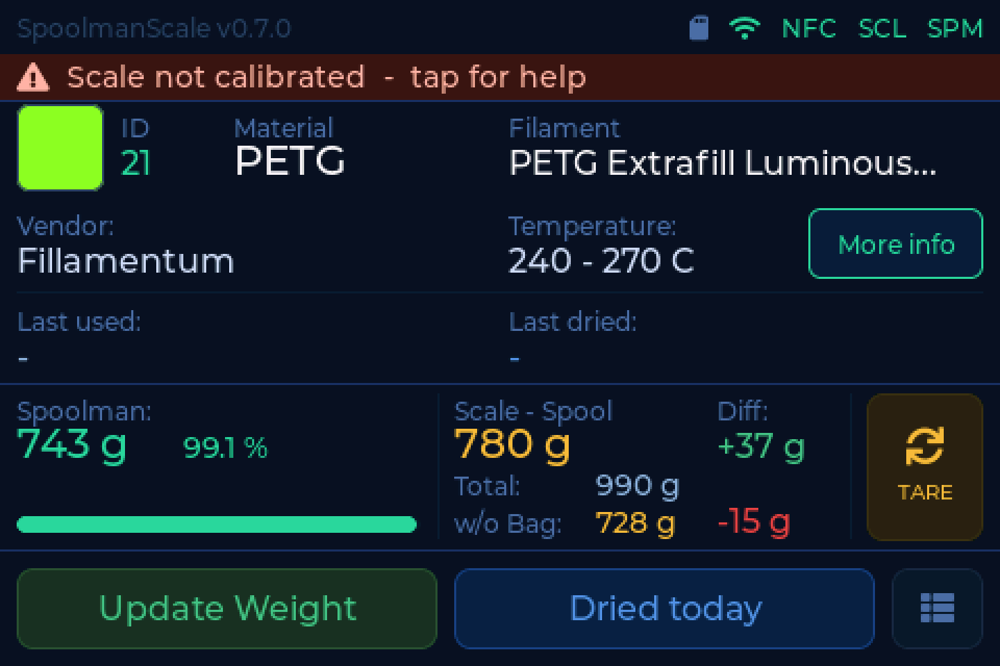
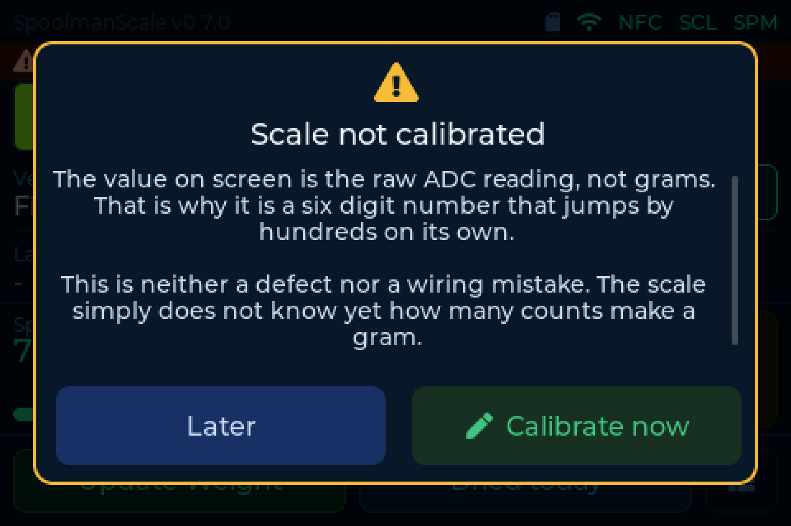

# What the scale is telling you

Since v0.7.0 the scale checks itself while it runs and writes the result in
plain words into the status bar. Tap the bar and it explains what it sees, what
causes it, and what to do. Where there is something to do, the button takes you
straight there.

This page lists every finding it can report, so you can search for the text you
are looking at.

!!! info "One finding at a time"
    Missing hardware outranks a missing calibration, which outranks measurement
    quality. Showing three warnings at once gets none of them fixed, so the
    scale names only the most important one. With a healthy scale you never see
    any of this.

---

## Nothing on the I2C bus

> **Nothing on the I2C bus**

Neither the NFC reader nor the scale ADC answers.

The 7 pin cable has to sit flush **to the left** in the 8 pin I/O socket. One
pin off and both modules are unpowered.

**Check:** pin 1 (5V, red), pin 2 (GND, black), pin 3 (SDA, yellow) and
pin 4 (SCL, green). See [Wiring](../build/wiring.md).

---

## Scale ADC missing (NAU7802)

> **Scale ADC missing (NAU7802)**

The NAU7802 does not answer on `0x2A`. The NFC reader does, so SDA and SCL are
basically fine.

**Check:** VIN, GND, SDA and SCL on the NAU7802.

!!! warning "Third party STEMMA QT cables"
    On ready-made third party cables the pin order often does not match the
    WT32 cable. Compare wire by wire rather than trusting the colours.

---

## NFC reader missing (PN532)

> **NFC reader missing (PN532)**

The PN532 does not answer on `0x24`. The scale ADC does, so SDA and SCL are
basically fine.

**Check the two DIP switches on the module first.** I2C needs **SW1 = ON** and
**SW2 = OFF**. Set to HSU or SPI the chip does not answer on the I2C bus at all,
which is exactly this picture.

Otherwise the PN532 needs **5V from pin 1** of the I/O cable.

!!! danger "Do not daisy-chain through the NAU7802"
    The NAU7802's STEMMA QT passthrough carries only 3.3V. The PN532 needs 5V.
    Wire both modules directly to the WT32 I/O connector.

---

## NFC reader stays silent

> **NFC reader does not answer**

The PN532 acknowledges `0x24` but answers no command. That means it *is* set to
I2C - it would not answer at all otherwise - and SDA and SCL are right too.

**Check the RST wire on connector pin 5 (blue, GPIO12).** Without it the chip
stays in reset and says nothing.

Also make sure both DIP switches sit firmly: SW1 = ON, SW2 = OFF.

!!! note "The on-device text names pin 7"
    Up to and including v0.7.0 this popup on the device says "pin 7 (brown)".
    Pin 7 is GPIO14 and nothing drives it. The reset line is **pin 5 (blue)**,
    which is what `PN532_RESET = 12` in the firmware actually uses.

---

## Scale not calibrated

> **Scale not calibrated**

The value on screen is the raw ADC reading, not grams. That is why it is a six
digit number that jumps by hundreds on its own.

This is **neither a defect nor a wiring mistake**. The scale simply does not
know yet how many counts make a gram.

**Fix:** place a known weight on it and calibrate. See
[Weighing & calibration](../use/weighing.md#calibration). The popup's button
takes you straight into it.

---

## Load cell reversed (A+/A-) { #load-cell-reversed }

> **Load cell reversed (A+/A-)**

The scale reads far below zero with an empty platform and has never seen a
positive weight since it started. Loading it makes the number go **down**
instead of up.

**Fix:** swap the two signal wires on the NAU7802, A+ (white) and A- (green).
Then tare and calibrate again.

!!! warning "Recalibrate after fixing the wiring"
    A calibration taken while the wiring was wrong is still stored. Fixing the
    wires without recalibrating leaves the weight wrong in a new way.

---

## Load cell unstable

> **Load cell unstable**

The reading keeps swinging although nothing on the platform is moving.

That is typical for a **loose wire** on the NAU7802.

**Check:** E+ (red), E- (black), A+ (white) and A- (green) for cold solder
joints. Also check whether a cable is pressing against the weighing platform.

---

## Still stuck?

- [Troubleshooting](troubleshooting.md) for problems the scale cannot diagnose
  itself - network, backend, tags
- The [Discord](https://discord.gg/xadskCrPFu), where the community is happy to
  help
