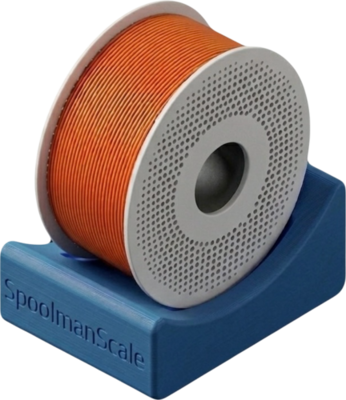
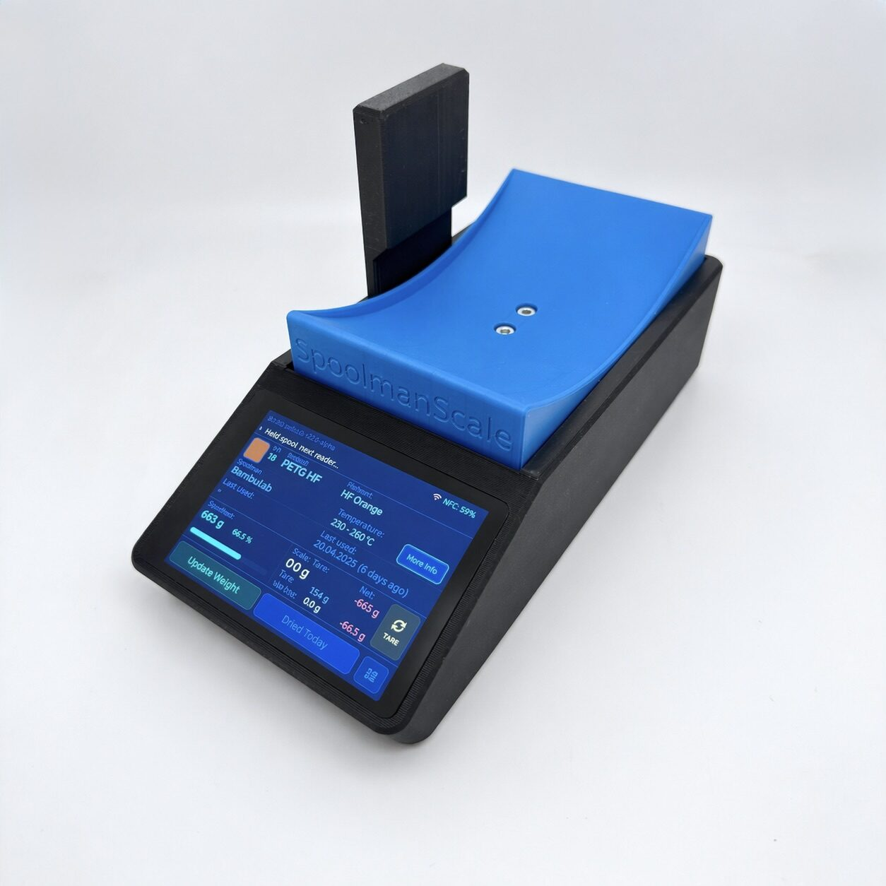
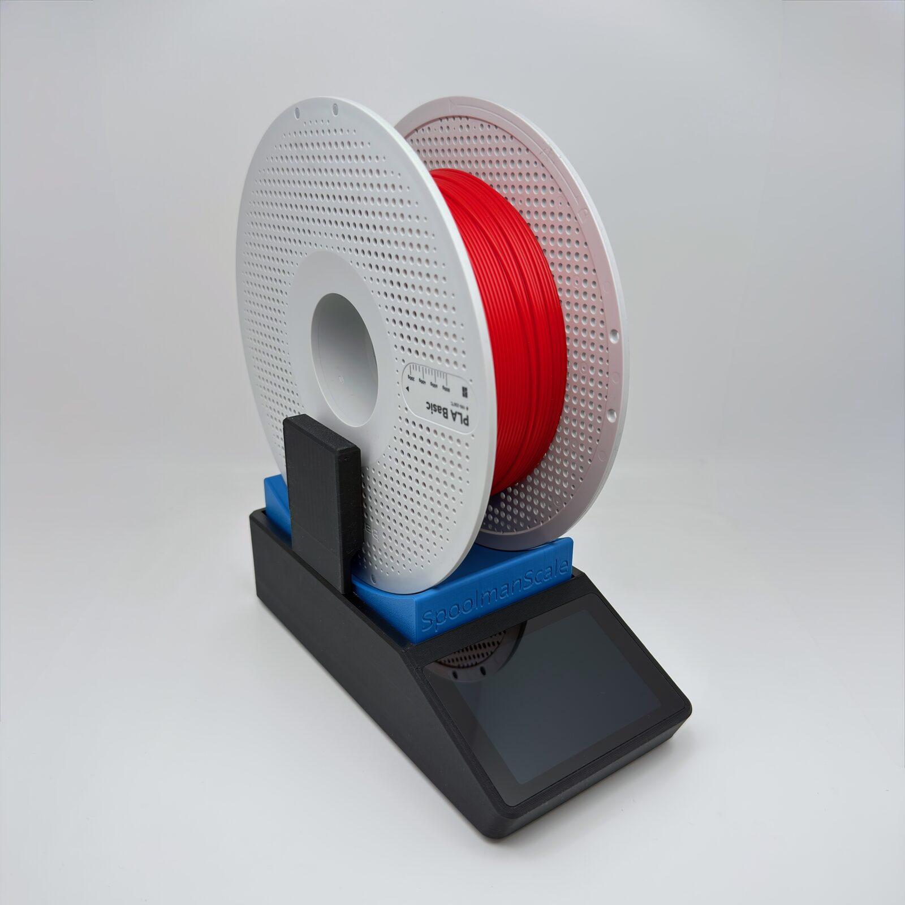

  

  
  

  <h1>SpoolmanScale</h1>
  
Open-source ESP32-S3 filament scale with NFC — integrates with Spoolman and FilaMan. No cloud. No subscription. Just works.

  

    
    
    
  

  

    <a href="getting-started/" class="primary">🚀 Get Started</a>
    <a href="https://github.com/Niko11111/SpoolmanScale" class="secondary">⭐ GitHub</a>
  

  
  

---

## What is SpoolmanScale?

SpoolmanScale is a standalone, self-contained filament scale for 3D printing. Place a spool on it, tap the NFC reader, and it instantly identifies the filament, shows the remaining weight, and syncs with your filament management backend — all without opening a browser.

  

    
📡

    <h3>NFC Identification</h3>
    
Tag your spools once. Tap to identify instantly. Supports NTAG213/215/216.

  

  

    
⚖️

    <h3>Precision Scale</h3>
    
NAU7802 24-bit ADC with 5 kg load cell. Auto tare, bag weight correction, live diff to Spoolman.

  

  

    
🔗

    <h3>Spoolman & FilaMan</h3>
    
Seamless two-way sync with both popular backends. Switch at any time.

  

  

    
📺

    <h3>480×320 Touchscreen</h3>
    
WT32-SC01 Plus display with full LVGL UI. No computer needed — everything on-device.

  

  

    
🔄

    <h3>OTA Updates</h3>
    
Update firmware over WiFi directly from GitHub releases — or via the web flasher.

  

  

    
🏠

    <h3>Fully Local</h3>
    
No cloud. No account. Runs entirely on your network. Your data stays yours.

  

---

## Hardware at a Glance

| Component | Part |
|---|---|
| Microcontroller | ESP32-S3 (WT32-SC01 Plus) |
| Display | 3.5" IPS 480×320, Capacitive Touch |
| NFC Reader | PN532 (I²C) |
| Scale ADC | NAU7802 (I²C) |
| Load Cell | 5 kg single-point |
| Enclosure | Custom 3D-printed (MakerWorld) |

---

## Quick Start

=== "New Build"
    1. [Buy the parts](getting-started/bom.md)
    2. [Wire everything](getting-started/wiring.md)
    3. [Print the case](hardware/case.md)
    4. [Flash the firmware](getting-started/flashing.md)
    5. [First setup](getting-started/first-setup.md)

=== "Existing Device"
    If you already have a SpoolmanScale, update your firmware via the [OTA update](firmware/ota.md) page.

=== "SpoolmanScale Pro"
    The Pro variant adds a Raspberry Pi Zero 2W running Spoolman or FilaMan locally. See the [Pro overview](reference/pro.md).

---

## Community

SpoolmanScale is open-source and community-driven.

- **Discord** — [discord.gg/TQvdxGuFcq](https://discord.gg/TQvdxGuFcq)
- **GitHub** — [github.com/Niko11111/SpoolmanScale](https://github.com/Niko11111/SpoolmanScale)
- **MakerWorld** — 3D models [@FormFollowsF](https://makerworld.com)
- **Ko-fi** — [Support the project](https://ko-fi.com/formfollowsfunction)

!!! tip "Want to contribute?"
    Found a bug? Missing a feature? See [Contributing](community/contributing.md) or open an issue on GitHub.
