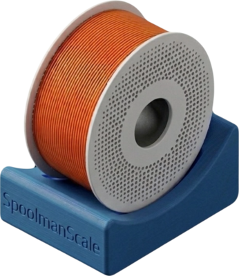
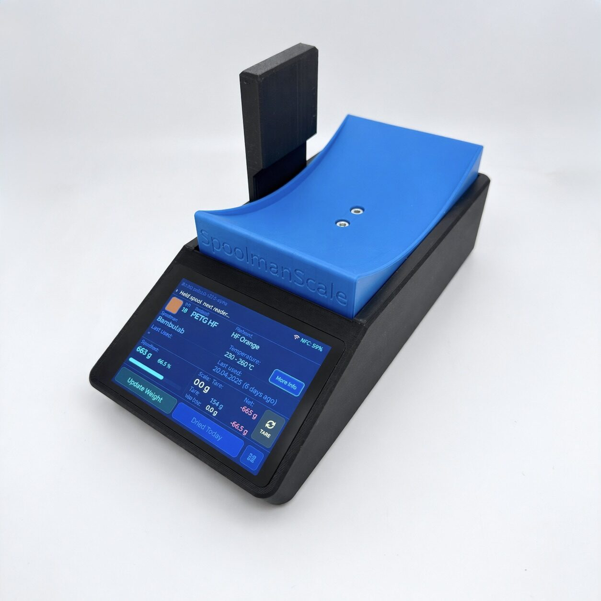
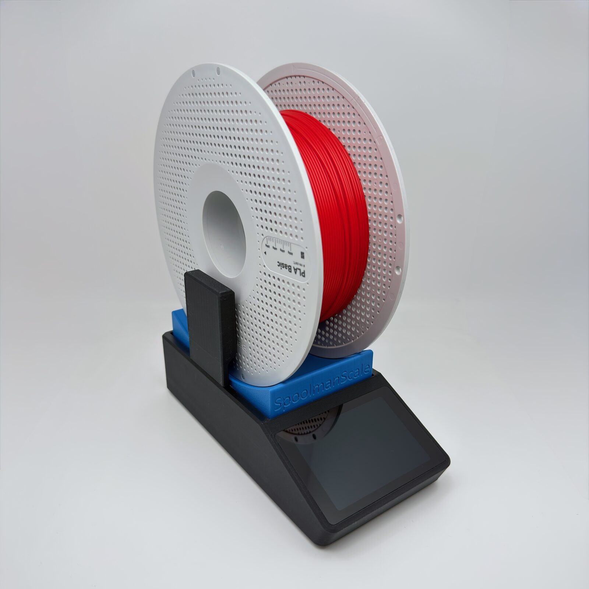

  

  
  

  <h1>SpoolmanScale</h1>
  
Open-source ESP32-S3 filament scale with NFC - talks to Spoolman, FilaMan and BamBuddy. No cloud. No subscription. Just works.

  

    
    
    
  

  

    <a href="build/" class="primary">🚀 Build one</a>
    <a href="https://github.com/Niko11111/SpoolmanScale" class="secondary">⭐ GitHub</a>
  

  
  

---

## What is SpoolmanScale?

A standalone filament scale for 3D printing. Put a spool on it and it identifies
the filament from its NFC tag, shows what is left, and syncs with your filament
manager - without opening a browser.

---

## New in v0.8.0

- 🏷️ **Label printing** *(beta, first version)* - via Bluetooth on a Phomemo M220
  (M110 experimental), with material, colour, spool ID and a QR code to the
  spool. This is a start: labels from the backend, a small editor in the
  browser, more printers and sizes are planned.
- ⚡ **Much faster** - linking a new spool takes under a second instead of 2 to
  7 s, the inventory loads in the background while the screen keeps working,
  and touch is read 100 times a second.
- 🧵 **Spoolman 0.27 native tags** - tags belong to the spool, several per
  spool, and existing scales move over by themselves.
- 📇 **Tags** - tap the NFC chip in the header to see the tag on the reader,
  writing shows its progress, and Snapmaker tags can be read (optional).
- 📝 **Log without an SD card** - in the scale's internal memory, read in the
  browser.
- 🇫🇷 **French** - on the scale and in the web interface.

!!! note "Already running 0.7.x?"
    Because 0.8.0 divides the memory anew, this one update goes through the
    [web flasher](https://niko11111.github.io/SpoolmanScale/) once: connect,
    choose **Update**, about 2 minutes, all settings are kept. From then on
    updates arrive over the air as before. [More](use/updating.md)

[All release notes on GitHub :material-arrow-right:](https://github.com/Niko11111/SpoolmanScale/releases/tag/v0.8.0){ .md-button }

---

## What it does

- 🔌 **Three backends** - [Spoolman, FilaMan or BamBuddy](use/backends.md).
  Switch any time, your settings for the others are kept.
- 📡 **NFC identification** - put a spool down and it is identified: NTAG,
  Bambu Lab's own tags, MIFARE Classic, a tag on each side of the spool if you
  like. [NFC tags](use/tags.md)
- ✍️ **Writing tags** - OpenSpool, FilaMan or Anycubic ACE format, on its own
  or on request, with every backend.
- ⚖️ **Precision scale** - 24-bit NAU7802 on a 2 kg load cell. Tare, bag weight,
  live difference to your inventory. [Weighing](use/weighing.md)
- 🖨️ **AMS view** - with FilaMan and BamBuddy: every bay with its spool,
  remaining filament and drying, and the drying recorded right from the card.
- 💧 **Drying reminder** - per material or one rule for everything, with a
  multiplier for airtight storage. [Drying & location](use/drying.md)
- 🌐 **Web interface** - separate pages in three languages, firmware updates
  from the browser, just as usable on a phone. [Web interface](use/web.md)
- 🩺 **It says what is wrong** - the scale checks itself and names the fault in
  plain words, with the fix. [What the scale is telling you](help/index.md)
- 🔄 **Updates over WiFi** - the scale checks GitHub itself and installs over
  the air. [Updating](use/updating.md)
- 🏠 **Fully local** - no cloud, no account. Runs on your own network.

---

## Hardware at a glance

| Component | Part |
|---|---|
| Microcontroller | ESP32-S3 (WT32-SC01 Plus) |
| Display | 3.5" IPS 480x320, capacitive touch |
| NFC reader | PN532 (I²C, `0x24`) |
| Scale ADC | NAU7802 (I²C, `0x2A`) |
| Load cell | 2 kg single point (5 kg works too) |
| Enclosure | 3D printed, free on MakerWorld |

Around **€50 to €60** in parts. Details on the
[bill of materials](build/bom.md).

---

## Where to start

=== "I want to build one"

    1. [Buy the parts](build/bom.md)
    2. [Print the case](build/case.md)
    3. [Wire it up](build/wiring.md)
    4. [Put it together](build/assembly.md)
    5. [Flash and set up](use/index.md)

=== "I have one already"

    - [Updating the firmware](use/updating.md)
    - [What is new in v0.8.0](https://github.com/Niko11111/SpoolmanScale/releases/tag/v0.8.0)
    - [The web interface](use/web.md)

=== "Something is wrong"

    - [What the scale is telling you](help/index.md) - it diagnoses itself
    - [Troubleshooting](help/troubleshooting.md)
    - [FAQ](help/faq.md)

---

## Community

- **Discord** - [discord.gg/xadskCrPFu](https://discord.gg/xadskCrPFu)
- **GitHub** - [github.com/Niko11111/SpoolmanScale](https://github.com/Niko11111/SpoolmanScale)
- **MakerWorld** - [@FormFollowsF](https://makerworld.com/de/models/2713675-spoolmanscale#profileId-3005075)
- **Ko-fi** - [Support the project](https://ko-fi.com/formfollowsfunction)

!!! tip "Want to help?"
    Found a bug? Missing something? See [Contributing](help/contributing.md) or
    open an issue on GitHub.
