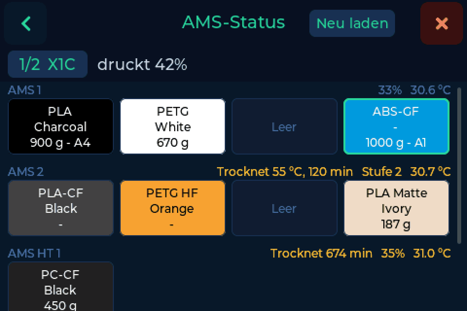
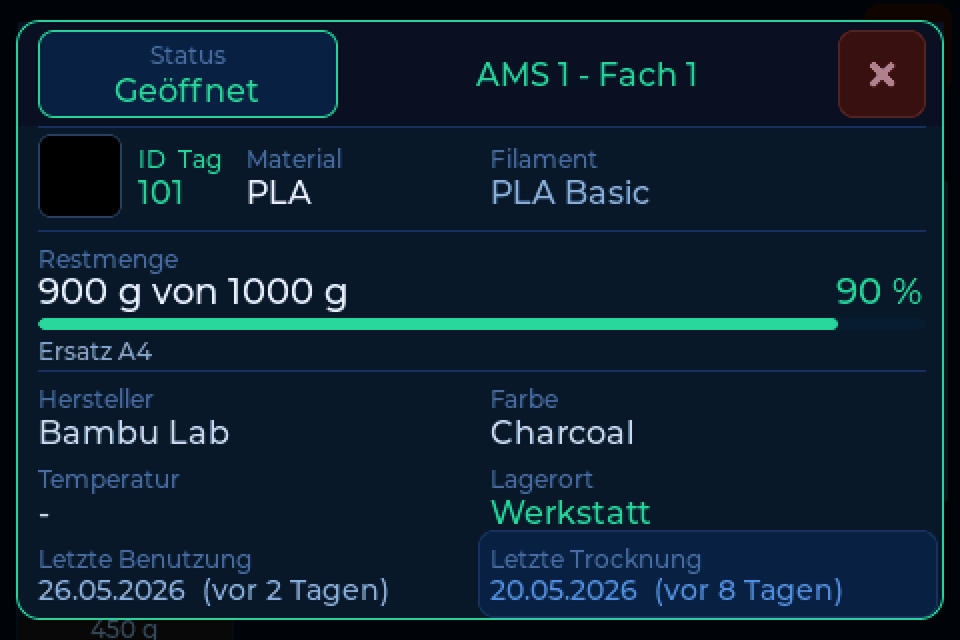
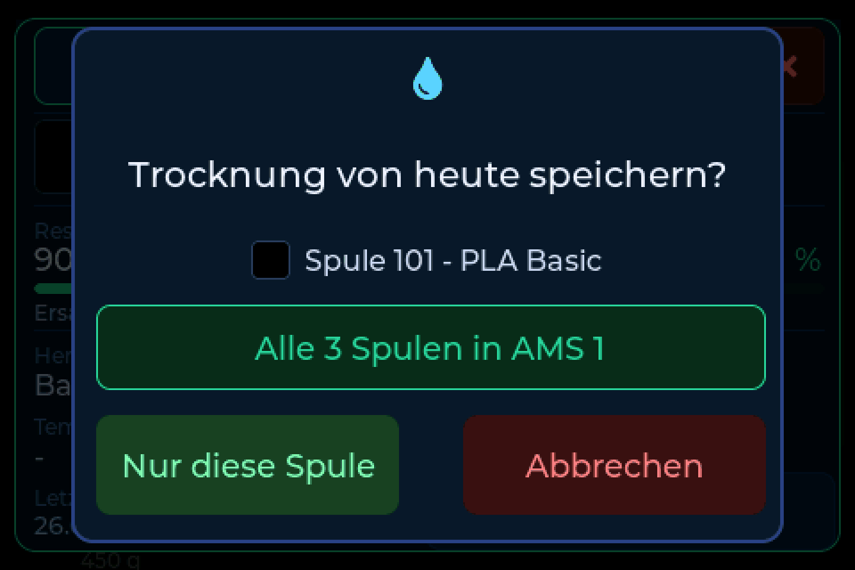

# AMS-Ansicht

Die AMS-Ansicht zeigt, was in deinem Drucker geladen ist: jede Einheit, jedes
Fach, mit Material, Farbe und Restmenge. Tippst du auf ein Fach, zeigt eine
Karte, was deine Filamentverwaltung über diese Spule weiß, und du trägst eine
Trocknung ein, ohne die Spule herauszunehmen.

!!! note "Nur mit FilaMan und BamBuddy"
    Die AMS-Ansicht braucht [FilaMan oder BamBuddy](backends.md) als Backend.
    Sie erscheint, sobald der Drucker geantwortet hat und ein AMS meldet: als
    Chip **AMS** in der Kopfzeile und als **AMS ansehen** unter
    **Einstellungen → Waage**.

---

## Das Raster

Jede Einheit hat eine Zeile: **AMS 1**, **AMS 2**, **AMS HT 1** und **Extern**.
Jedes belegte Fach ist eine Kachel in der Farbe des Filaments, mit Material,
Farbe und Restmenge. Das Fach, aus dem der Drucker gerade zieht, hat einen
grünen Rahmen. Feuchte, Temperatur und ein laufender Trocknungszyklus stehen
neben dem Namen der Einheit.

Über dem Raster stehen der Drucker und was er gerade tut. Bei mehreren Druckern
tippst du auf den Druckernamen, um zu wechseln. **Neu laden** fragt den Drucker
erneut ab. Ist der Drucker offline, zeigt das Raster seinen letzten Stand.

---

## Die Fachkarte

Tipp auf ein belegtes Fach, und die Karte öffnet sich.

Sie zeigt die Spule, die dein Backend dem Fach zugeordnet hat: ID, Material,
Name, Restmenge, Hersteller, Farbe, Lagerort, letzte Benutzung und letzte
Trocknung. Das Trocknungsdatum trägt die Farbe der
[Trocknungserinnerung](drying.md). Mit FilaMan änderst du über **Status** oben
links den Status der Spule.

Meldet der Drucker ein anderes Material als die Spule in deinem Backend, sagt die
Karte das. Meist wurde eine Spule getauscht, ohne sie neu zuzuordnen.

---

## Eine Trocknung eintragen

Eben im AMS getrocknet? Tipp auf der Karte auf **Letzte Trocknung** und
bestätige. Das heutige Datum landet in deinem Backend.

Ein AMS 2 Pro trocknet alle Spulen darin gleichzeitig, dort trägst du es auf
Wunsch für die ganze Einheit auf einmal ein:

---

## Nach dem Wiegen ins AMS

=== "BamBuddy"

    Schalte **Nach dem Wiegen ins AMS** unter
    **Einstellungen → Verbindung → Weitere Optionen** ein. Wieg eine Spule, heb
    sie ab, und die AMS-Ansicht öffnet sich mit **in welches Fach?**. Tipp auf
    das Fach, und BamBuddy trägt es ein. BamBuddy richtet dabei auch das Fach am
    Drucker ein.

=== "FilaMan"

    Stell **Auto AMS-Zuordnung** unter
    **Einstellungen → Verbindung → Weitere Optionen** auf **Nachfragen** oder
    **Automatisch**. Hebst du eine gewogene Spule ab, hält FilaMan sie kurz
    bereit, und das nächste Fach, das der Drucker lädt, bekommt sie. Bei
    **Nachfragen** fragt die Waage vorher, und **AMS-Ansicht** zeigt dir die
    Fächer, bevor du dich entscheidest.
