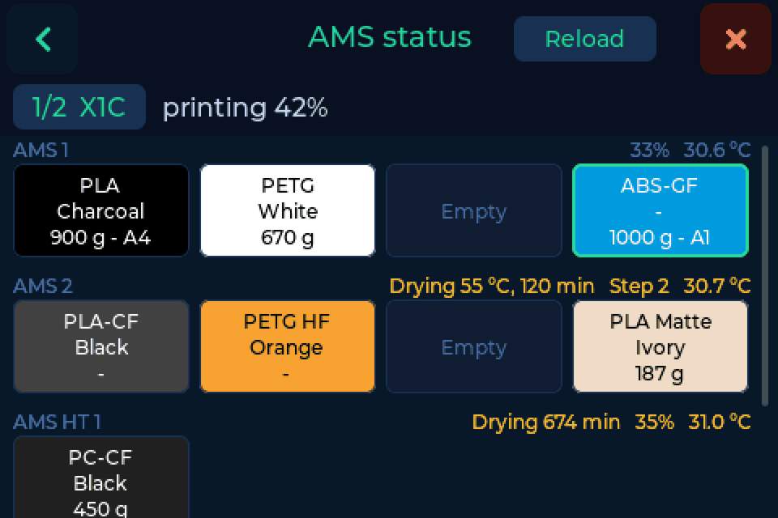
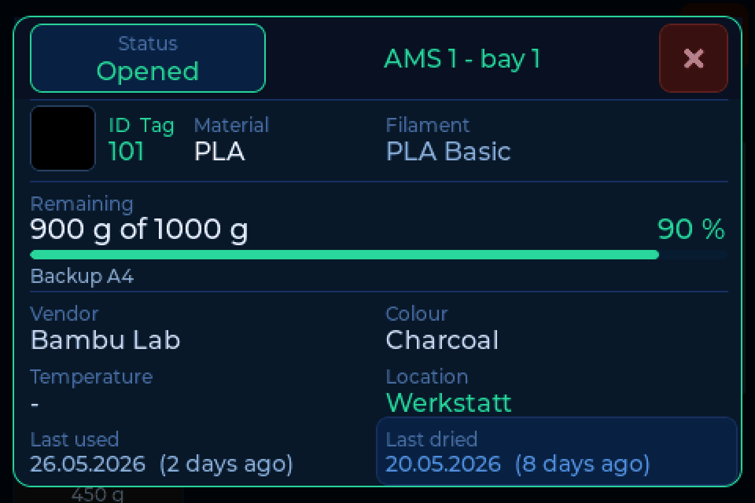
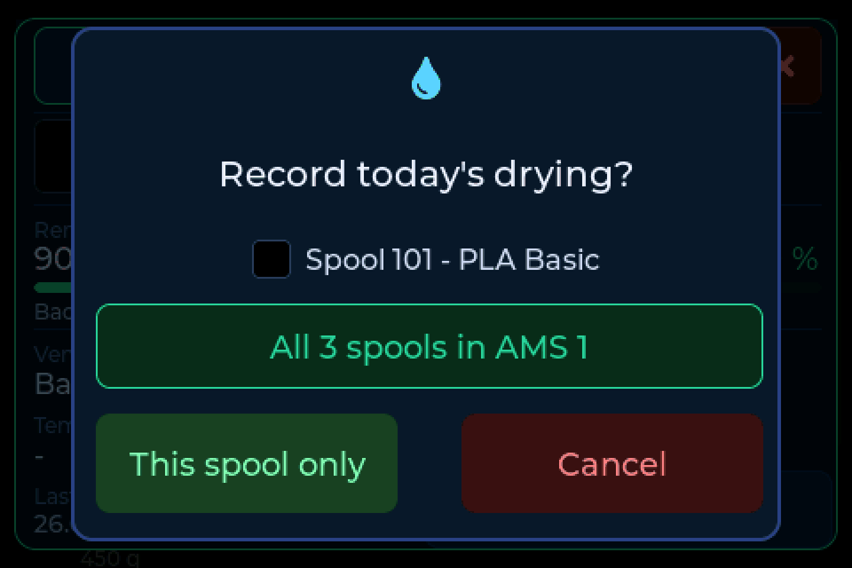

# AMS view

The AMS view shows what is loaded in your printer: every unit, every bay, with
material, colour and remaining filament. Tap a bay and a card shows what your
filament manager knows about that spool, and you can record a drying run
without taking the spool out.

!!! note "FilaMan and BamBuddy only"
    The AMS view needs [FilaMan or BamBuddy](backends.md) as the backend. It
    appears once the printer has answered and reports an AMS: as the **AMS**
    chip in the header, and as **Show the AMS** under **Settings → Scale**.

---

## The grid

Each unit has a row: **AMS 1**, **AMS 2**, **AMS HT 1** and **External**. Every
filled bay is a tile in the filament's colour with material, colour and
remaining amount. The bay the printer is feeding from has a green frame.
Humidity, temperature and a running drying cycle stand next to the unit name.

Above the grid stand the printer and what it is doing. With several printers,
tap the printer's name to switch. **Reload** reads the printer again. When the
printer is offline, the grid shows its last known state.

---

## The bay card

Tap a filled bay and the card opens.

It shows the spool your backend has assigned to the bay: ID, material, name,
remaining filament, vendor, colour, location, last used and last dried. The
drying date takes the colour of the [drying reminder](drying.md). With FilaMan,
**Status** at the top left changes the spool's status.

If the printer reports a different material than the spool in your backend, the
card says so. Most likely a spool was swapped without a new assignment.

---

## Recording a drying run

Just dried the spool in the AMS? Tap **Last dried** on the card and confirm.
Today's date is written to your backend.

An AMS 2 Pro dries every spool in it at once, so there you can record it for
the whole unit in one go:

---

## Into the AMS after weighing

=== "BamBuddy"

    Switch on **Into the AMS after weighing** under
    **Settings → Connection → More options**. Weigh a spool, lift it off the
    pad, and the AMS view opens with **into which bay?**. Tap the bay and
    BamBuddy records it. BamBuddy also sets up the bay on the printer.

=== "FilaMan"

    Set **Auto AMS assign** under **Settings → Connection → More options** to
    **Ask** or **Automatic**. When you lift a weighed spool, FilaMan holds it
    ready for a short time, and the next tray the printer loads gets it. With
    **Ask**, the scale asks first, and **AMS view** shows the bays before you
    decide.
