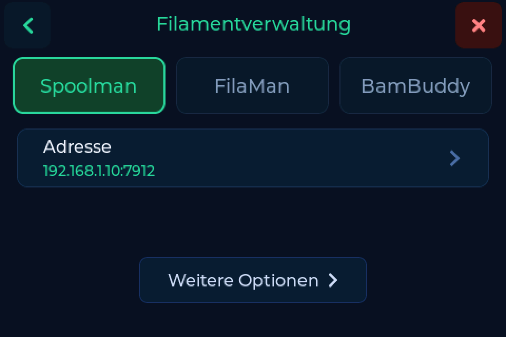

# Backends

SpoolmanScale spricht mit drei Filament-Verwaltungen. Aktiv ist immer eine,
gewählt unter **Einstellungen → Verbindung** oder auf der Backend-Seite der
[Weboberfläche](web.md). Beim Wechsel bleiben die Zugangsdaten der anderen
erhalten, die Anzeige wird geleert, und die aufliegende Spule wird beim neuen
Backend neu abgefragt.

---

## Welches

| | Spoolman | FilaMan | BamBuddy |
|---|---|---|---|
| Üblicher Port | `7912` | `8002` | `8000` |
| Zugangsdaten | keine | Device-Token **und** API-Key | ein API-Key, optional |
| Finden, wiegen, zurückschreiben | ja | ja | ja |
| Tags verknüpfen und lösen | ja | ja | ja |
| [Tags beschreiben](tags.md) | ja | ja | ja |
| Spule anlegen | ja | ja | ja, auch direkt aus einem Bambu-Tag |
| Archivieren und zurückholen | ja | ja | ja |
| Lagerort, Trocknungsdatum | ja | ja | ja |
| Tara je Filament oder Hersteller | ja | ja | nein |
| AMS-Zuordnung | - | ja | - |
| Mobile App | - | ja | - |

!!! note "Ohne Port geht es auf 80"
    Das Adressfeld nimmt `Host` oder `Host:Port`. Ohne Port geht die Anfrage an
    Port 80 und scheitert so, dass es aussieht, als sei der Server aus.

---

## Die drei

=== "Spoolman"

    { .backend-logo }

    Der volle Umfang, und das Backend, mit dem das Projekt angefangen hat. Eine
    einfache Basis-URL, keine Zugangsdaten.

    **Wo die Tag-UID landet, entscheidest du.** `tag`, `nfc_id` oder
    `card_uids`, je nachdem, was sonst noch in deine Datenbank schaut - siehe
    [Ersteinrichtung](index.md#schritt-4-wo-die-tag-uid-landet). Mehrere Tags an
    einer Spule gehen.

    UIDs werden als reines Hex geschrieben (`04B9E542447080`), genau wie bei
    jedem anderen Werkzeug im Spoolman-Umfeld. Eine Spule, die ein anderes
    Programm verknüpft hat, findet die Waage - und umgekehrt. Spulen mit der
    älteren Doppelpunkt-Schreibweise werden weiterhin gefunden und beim ersten
    Scan einmalig umgeschrieben.

    !!! tip "Kommt: Spoolmans eigene Tag-Verwaltung"
        Spoolman bekommt eine eigene Tag-Verwaltung. Tags gehören dann zur
        Spule statt in ein Zusatzfeld, und die Waage meldet sich als Lesegerät
        an, ein Scan an der Waage öffnet die Spule im Browser. Das kommt mit
        **Spoolman 0.27.0** und ist dort noch nicht veröffentlicht.
        SpoolmanScale unterstützt es ab Tag 1.

=== "FilaMan"

    { .backend-logo }

    Der volle Umfang, plus alles, was FilaMan selbst mitbringt. Es braucht zwei
    Zugänge, weil FilaMan keine Rechte pro Gerät kennt:

    | Zugang | Wofür |
    |---|---|
    | Device-Token | Heartbeat, Gewicht melden, Lesen |
    | API-Key | alles, was schreibt |

    Das Device-Token entsteht, indem du den 6-stelligen Code registrierst, den
    die Waage anzeigt. Den API-Key legst du in der FilaMan-Oberfläche an.

    **Hier greifen die Tag-Funktionen am weitesten.** FilaMan kann der Waage
    einen Schreibauftrag samt Tag-Inhalt schicken, den du am Gerät bestätigst.
    Umgekehrt kann FilaMan die Waage bitten, einen Tag zu lesen, und übernimmt
    die Daten in seinen Bestand. Der Spulenstatus lässt sich direkt an der Waage
    ändern.

    **AMS.** Hebst du eine frisch gewogene Spule ab, fragt die Waage, ob sie ins
    AMS wandert. Ein Tipp auf Ja, und FilaMan hält sie für den nächsten Drucker
    bereit, der ein Fach lädt - das Zuordnen von Hand entfällt.

    !!! info "Wiegen ohne Tag"
        FilaMan kann ein Gewicht auch für eine Spule ohne Tag übernehmen. Bei
        eingeschalteter Automatik passiert das von selbst, nicht nur über den
        Knopf. FilaMans eigener Dialog meldet dabei einen Fehler, obwohl die
        Spule geladen ist - das ist FilaMans Meldung, kein Fehlschlag an der
        Waage.

=== "BamBuddy"

    { .backend-logo }

    Ein einzelner API-Key, gesendet als `X-API-Key`, anzulegen unter
    **Settings → API Keys** mit **Read Status** und **Manage Inventory**. Der
    Key ist optional: eine Instanz mit abgeschalteter Authentifizierung
    antwortet auch ohne.

    **BamBuddy führt seinen Bestand an einem von zwei Orten** - in der eigenen
    Datenbank oder auf einem Spoolman-Server dahinter. Die Waage erkennt,
    welcher Fall vorliegt, und schreibt in den richtigen. In der Statuszeile
    steht, welcher:

    | Statuszeile | Bedeutung |
    |---|---|
    | `Inventar: BamBuddy` | BamBuddys eigene Datenbank |
    | `Inventar: Spoolman` | ein Spoolman-Server hinter BamBuddy |

    **Nur BamBuddy legt eine Spule direkt aus einem Bambu-Tag an**, mit
    Material, Marke, Farbe und Temperaturen vom Tag. Auflegen, anlegen, fertig.

    !!! warning "Keine Tara je Filament oder Hersteller"
        BamBuddy kennt weder Filamente noch Hersteller als eigene Objekte, also
        kann dort auch kein Tarawert hängen. Trag das Leergewicht je Spule ein
        oder nimm das [Beutelgewicht](weighing.md#beutelgewicht).

---

## Wechseln

**Einstellungen → Verbindung → Backend**, oder die Backend-Seite in der
[Weboberfläche](web.md). Was du für die anderen beiden eingetragen hast, bleibt
stehen. Nach dem Wechsel wird die Anzeige geleert und die aufliegende Spule beim
neuen Backend neu abgefragt - du siehst also nie Daten aus dem gerade
verlassenen.
