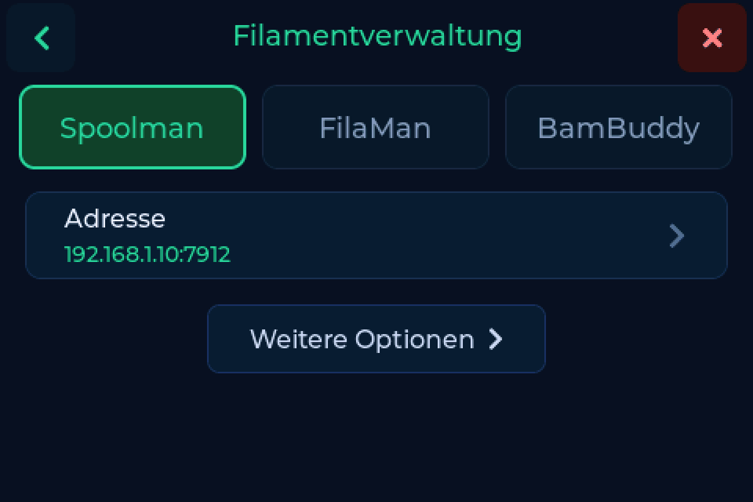

# Backends

SpoolmanScale spricht mit drei Filamentverwaltungen. Eine ist jeweils aktiv,
gewählt unter **Einstellungen → Verbindung → Filamentverwaltung** oder auf der
Backend-Seite der [Weboberfläche](web.md). Beim Wechsel bleibt erhalten, was du
für die anderen eingetragen hast, und die aufliegende Spule wird beim neuen
Backend neu abgefragt.

---

## Welches

| | Spoolman | FilaMan | BamBuddy |
|---|---|---|---|
| Üblicher Port | `7912` | `8083` | `8000` |
| Zugangsdaten | keine | Device-Token **und** API-Key | ein API-Key, optional |
| Wiegen, verknüpfen, [Tags schreiben](tags.md), kopieren, archivieren, Lagerort, Trocknung | ja | ja | ja |
| Zweiter Tag pro Spule | ab 0.27 | ab 1.3.1 | - |
| Tara je Filament oder Hersteller | ja | ja | - |
| Spule aus einem Bambu-Tag anlegen | - | - | ja |
| [AMS-Ansicht](ams.md) | - | ja | ja |
| Browser folgt der Waage | ab 0.27 | ab 1.3.7 | - |

!!! note "Ohne Port geht es auf 80"
    Das Adressfeld nimmt `Host` oder `Host:Port`. Ohne Port geht die Anfrage an
    80, und das scheitert so, als wäre der Server aus.

---

## Die drei

=== "Spoolman"

    { .backend-logo }

    Der volle Umfang, und das Backend, mit dem das Projekt angefangen hat. Eine
    einfache Adresse, keine Zugangsdaten.

    **Spoolman 0.27 und neuer** verwaltet Tags selbst, an der Spule, und eine
    Spule kann mehrere tragen. Die Waage nutzt das standardmäßig, und eine
    Waage, die ihre Tags vorher in `extra.tag` abgelegt hat, zieht sie einmal
    von selbst um. Ein Scan an der Waage kann die Spule in Spoolmans Webseite
    öffnen.

    **Ältere Spoolman-Versionen** speichern den Tag in einem Zusatzfeld. Fehlende
    Felder legt die Waage beim ersten Schreiben selbst an, vorher ist nichts
    einzurichten.

    !!! tip "Nutzt du auch OpenSpoolman?"
        OpenSpoolman kennt die nativen Tags noch nicht. Schalte
        **Für OpenSpoolman** ein, und die Waage schreibt die Bambu-UUID
        zusätzlich in `extra.tag`, wo OpenSpoolman sie sucht.

=== "FilaMan"

    { .backend-logo }

    Der volle Umfang, dazu, was FilaMan selbst mitbringt. Es braucht zwei
    Zugänge:

    | Zugang | Anzulegen in FilaMan |
    |---|---|
    | API-Key | Zahnrad neben dem Benutzernamen → **API Keys** |
    | Device-Token | **Admin-Bereich → Geräte → Gerät erstellen** |

    Beim Anlegen eines Geräts bekommst du einen 6-stelligen Code: Gib ihn an der
    Waage ein, und sie tauscht ihn gegen das Token. FilaMan zeigt Key und Code
    nur einmal. Schritt für Schritt in der
    [Ersteinrichtung](index.md#schritt-3-backend-wahlen).

    **Tags von FilaMan.** FilaMan kann der Waage einen Tag zum Schreiben
    schicken, den du am Gerät bestätigst, und die Waage bitten, einen Tag zu
    lesen.

    **AMS.** Hebst du eine frisch gewogene Spule ab, fragt die Waage "Spule jetzt
    ins AMS legen?". Sagst du ja, ordnet FilaMan sie dem nächsten Fach zu, das
    der Drucker lädt. Mehr unter [AMS-Ansicht](ams.md).

    **Der Browser folgt der Waage** (FilaMan 1.3.7 und neuer). Leg eine Spule
    auf, und der FilaMan-Tab am Rechner springt zu ihr. Wähle die Waage dafür
    einmal in den Browser-Einstellungen von FilaMan als Leser.

=== "BamBuddy"

    { .backend-logo }

    Ein API-Key mit **Read Status** und **Manage Inventory**, angelegt in
    BamBuddy unter **Settings → API Keys**. Ohne Anmeldung in BamBuddy braucht es
    keinen Key.

    **BamBuddy führt seinen Bestand an einem von zwei Orten:** in der eigenen
    Datenbank oder in Spoolman hinter BamBuddy. Die Waage findet heraus, welcher
    es ist, und zeigt es in der Statusleiste: `Inventar: BamBuddy` oder
    `Inventar: Spoolman`.

    **Nur BamBuddy legt eine Spule direkt aus einem Bambu-Tag an**, mit
    Material, Marke, Farbe und Temperaturen vom Tag.

    **AMS.** Ist **Nach dem Wiegen ins AMS** an, wiegst du die Spule, hebst sie
    ab und tippst auf das Fach. Mehr unter [AMS-Ansicht](ams.md).

    !!! warning "Keine Tara je Filament oder Hersteller"
        BamBuddy kennt keine Filamente oder Hersteller als eigene Objekte, an
        denen ein Tarawert hängen könnte. Trag das Leerspulengewicht je Spule
        ein oder nimm das [Beutelgewicht](weighing.md#beutelgewicht).

---

## Optionen

Jedes Backend hat ein paar eigene Optionen, unter
**Einstellungen → Verbindung → Weitere Optionen**. Angezeigt werden nur die des
aktiven Backends, und das **?** daneben erklärt jede am Gerät.

- **Spoolman:** Tag-Feld und Zusatzfelder, **Für OpenSpoolman**, mehrere Tags
  pro Spule, **Zweites Tag abfragen**, **Chip-UID mitschreiben** (Happy Hare).
- **FilaMan:** **Zweites Tag abfragen**, verknüpfen und wiegen ohne Nachfrage,
  Tags schreiben, die FilaMan schickt, **Auto AMS-Zuordnung**.
- **BamBuddy:** wohin das Trocknungsdatum geht (standardmäßig ins Notizfeld),
  **Nach dem Wiegen ins AMS**.
