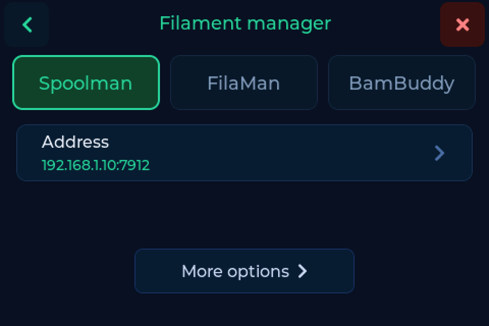

# Backends

SpoolmanScale talks to three filament managers. One is active at a time, chosen
under **Settings → Connection** or on the [web interface](web.md)'s backend page.
Switching keeps the credentials of the others, clears the display and asks the
new backend about whatever spool is on the pad.

---

## Which one

| | Spoolman | FilaMan | BamBuddy |
|---|---|---|---|
| Usual port | `7912` | `8002` | `8000` |
| Credentials | none | device token **and** API key | one API key, optional |
| Find, weigh, write back | yes | yes | yes |
| Link and unlink tags | yes | yes | yes |
| [Write tags](tags.md) | yes | yes | yes |
| Create a spool | yes | yes | yes, also straight from a Bambu tag |
| Archive and bring back | yes | yes | yes |
| Location, drying date | yes | yes | yes |
| Tare per filament or vendor | yes | yes | no |
| AMS assignment | - | yes | - |
| Mobile app | - | yes | - |

!!! note "Leave the port off and you get port 80"
    The address field takes `host` or `host:port`. Without a port the request
    goes to 80, which fails in a way that looks like the server is down.

---

## The three

=== "Spoolman"

    { .backend-logo }

    The full range, and the backend the project started on. A plain base URL,
    no credentials.

    **Where the tag UID lives is yours to pick.** `tag`, `nfc_id` or
    `card_uids`, depending on what else reads your database - see
    [First setup](index.md#step-4-where-the-tag-uid-is-stored). Several tags on
    one spool work.

    UIDs are written as plain hex (`04B9E542447080`), the same as every other
    tool in the Spoolman ecosystem. A spool another program linked is found by
    the scale, and the other way round. Spools carrying the older colon form are
    still matched and get rewritten once, on their first scan.

    !!! tip "Coming: Spoolman's own tag handling"
        Spoolman is growing tag support of its own. Tags will belong to the
        spool instead of sitting in an extra field, and the scale registers
        itself as a reader, so a scan at the scale opens that spool in your
        browser. That arrives with **Spoolman 0.27.0**, which is not released
        yet. SpoolmanScale supports it from day one.

=== "FilaMan"

    { .backend-logo }

    The full range, plus what FilaMan brings itself. It needs two credentials,
    because FilaMan has no per-device permissions:

    | Credential | Used for |
    |---|---|
    | Device token | heartbeat, weight reporting, reading |
    | API key | everything that writes |

    The device token comes from registering the 6 character code the scale
    shows. The API key you create in the FilaMan UI.

    **The tag features reach furthest here.** FilaMan can send the scale a write
    request together with the tag contents, and you confirm it on the device.
    The other way round, FilaMan can ask the scale to read a tag and takes the
    data into its inventory. Spool status can be changed at the scale directly.

    **AMS.** Lift a freshly weighed spool off the pad and the scale asks whether
    it goes into the AMS. Tap yes and FilaMan holds it ready for the next
    printer that loads a tray, so you do not assign it by hand.

    !!! info "Weighing without a tag"
        FilaMan can take a weight for a spool that has no tag. With automatic
        saving on this happens by itself, not only via the button. FilaMan's own
        dialog reports an error while doing so even though the spool is loaded -
        that is FilaMan's message, not a failure at the scale.

=== "BamBuddy"

    { .backend-logo }

    A single API key, sent as `X-API-Key`, created under **Settings → API Keys**
    with **Read Status** and **Manage Inventory**. The key is optional: an
    instance with authentication switched off answers without one.

    **BamBuddy keeps its inventory in one of two places** - its own database, or
    a Spoolman server behind it. The scale works out which and writes to the
    right one. The status bar names it:

    | Status bar | Meaning |
    |---|---|
    | `Inventory: BamBuddy` | BamBuddy's own database |
    | `Inventory: Spoolman` | a Spoolman server behind BamBuddy |

    **Only BamBuddy creates a spool straight from a Bambu tag**, with material,
    brand, colour and temperatures taken off the tag. Put it down, create it,
    done.

    !!! warning "No tare per filament or vendor"
        BamBuddy keeps neither filaments nor vendors as objects of their own, so
        a tare value cannot hang off them. Set the empty spool weight per spool,
        or use the [bag weight](weighing.md#bag-weight).

---

## Switching

**Settings → Connection → Backend**, or the backend page in the
[web interface](web.md). What you entered for the other two stays. After the
switch the display clears and the spool on the pad is looked up again at the new
backend, so you are never looking at data from the one you just left.
