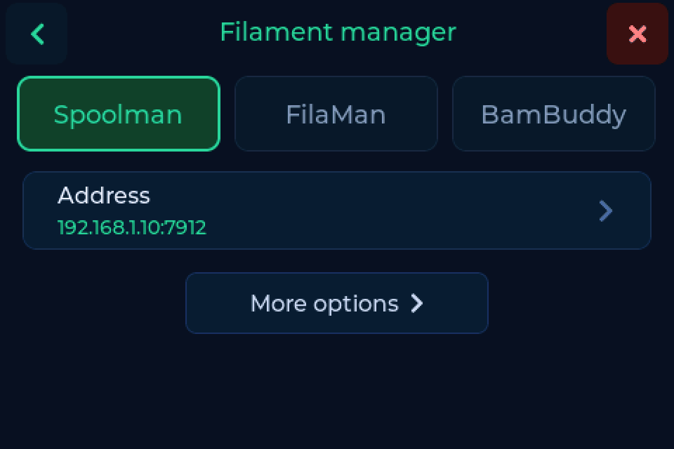

# Backends

SpoolmanScale talks to three filament managers. One is active at a time, chosen
under **Settings → Connection → Filament manager** or on the backend page of the
[web interface](web.md). Switching keeps what you entered for the others, and
the spool on the pad is looked up again at the new backend.

---

## Which one

| | Spoolman | FilaMan | BamBuddy |
|---|---|---|---|
| Usual port | `7912` | `8083` | `8000` |
| Credentials | none | device token **and** API key | one API key, optional |
| Weigh, link, [write tags](tags.md), copy, archive, location, drying | yes | yes | yes |
| Second tag per spool | 0.27 and newer | 1.3.1 and newer | - |
| Tare per filament or vendor | yes | yes | - |
| Create a spool from a Bambu tag | - | - | yes |
| [AMS view](ams.md) | - | yes | yes |
| Browser follows the scale | 0.27 and newer | 1.3.7 and newer | - |

!!! note "Leave the port off and you get port 80"
    The address field takes `host` or `host:port`. Without a port the request
    goes to 80, which fails in a way that looks like the server is down.

---

## The three

=== "Spoolman"

    { .backend-logo }

    The full range, and the backend the project started on. A plain address,
    no credentials.

    **Spoolman 0.27 and newer** keeps tags itself, attached to the spool, and a
    spool can carry several. The scale uses this by default, and a scale that
    stored its tags in `extra.tag` before moves them over once, by itself. A
    scan at the scale can open the spool in Spoolman's web page.

    **Older Spoolman versions** keep the tag in an extra field. The scale
    creates any field it is missing on the first write, so there is nothing to
    set up beforehand.

    !!! tip "Using OpenSpoolman too?"
        OpenSpoolman does not know the native tags yet. Turn on
        **For OpenSpoolman** and the scale also writes the Bambu UUID into
        `extra.tag`, where OpenSpoolman looks for it.

=== "FilaMan"

    { .backend-logo }

    The full range, plus what FilaMan brings itself. It needs two credentials:

    | Credential | Created in FilaMan |
    |---|---|
    | API key | gear icon next to your user name → **API Keys** |
    | Device token | **Admin Panel → Devices → Create Device** |

    Creating a device gives you a 6 character code: enter it on the scale and
    the scale trades it for the token. FilaMan shows the key and the code only
    once. Step by step in [First setup](index.md#step-3-pick-a-backend).

    **Tags from FilaMan.** FilaMan can send the scale a tag to write, which you
    confirm on the device, and it can ask the scale to read a tag.

    **AMS.** Lift a freshly weighed spool and the scale asks "Putting the spool
    into the AMS?". Say yes and FilaMan assigns it to the next tray the printer
    loads. More in [AMS view](ams.md).

    **The browser follows the scale** (FilaMan 1.3.7 and newer). Put a spool on
    the pad and the FilaMan tab on your computer jumps to it. Pick the scale as
    your reader once in FilaMan's browser settings.

=== "BamBuddy"

    { .backend-logo }

    One API key with **Read Status** and **Manage Inventory**, created in
    BamBuddy under **Settings → API Keys**. Without authentication in BamBuddy
    no key is needed.

    **BamBuddy keeps its inventory in one of two places:** in its own database
    or in Spoolman behind BamBuddy. The scale works out which and says so in the
    status bar: `Inventory: BamBuddy` or `Inventory: Spoolman`.

    **Only BamBuddy creates a spool straight from a Bambu tag**, with material,
    brand, colour and temperatures taken off the tag.

    **AMS.** With **Into the AMS after weighing** on, you weigh the spool, lift
    it and tap the bay. More in [AMS view](ams.md).

    !!! warning "No tare per filament or vendor"
        BamBuddy has no filament or vendor objects to hang a tare value on. Set
        the empty spool weight per spool, or use the
        [bag weight](weighing.md#bag-weight).

---

## Options

Each backend has a few options of its own, under
**Settings → Connection → More options**. Only those of the active backend are
shown, and the **?** next to each one explains it on the device.

- **Spoolman:** tag field and extra fields, **For OpenSpoolman**, several tags
  per spool, **Ask for a second tag**, **Also write the chip UID** (Happy Hare).
- **FilaMan:** **Ask for a second tag**, linking and weighing without asking,
  writing tags FilaMan sends, **Auto AMS assign**.
- **BamBuddy:** where the drying date goes (by default into the note field),
  **Into the AMS after weighing**.
