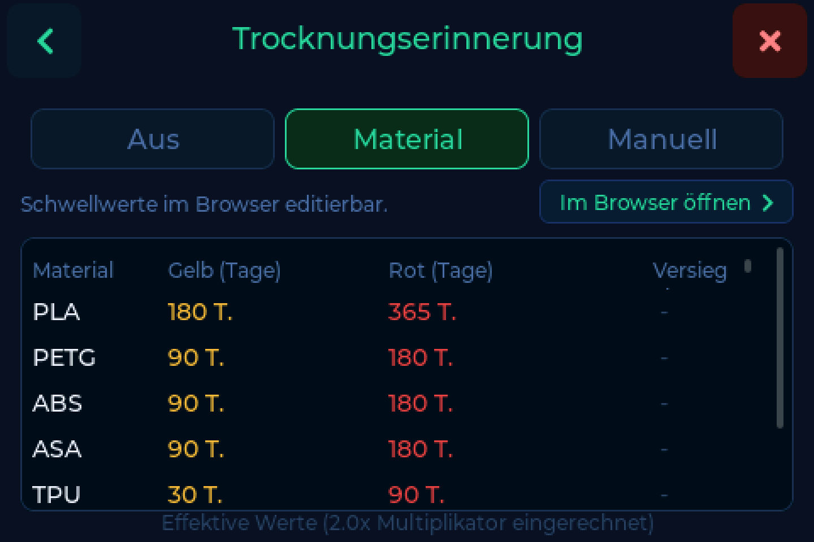

# Trocknung & Lagerort

Filament zieht Feuchtigkeit aus der Luft, und eine Spule, die monatelang offen
stand, druckt schlechter als eine, die letzte Woche getrocknet wurde. Die Waage
hält fest, wann eine Spule zuletzt getrocknet wurde, und warnt dich, bevor du
mit einer feuchten einen Druck startest.

---

## Die Erinnerung

**Einstellungen → Waage → Trocknungserinnerung**

Ein Ampelsystem auf dem Hauptbildschirm, gesteuert über die Tage seit der
letzten Trocknung:

| Modus | Was er tut |
|---|---|
| **Aus** | Keine Ampel. Die Daten werden trotzdem festgehalten. |
| **Material** | Schwellwerte je Material - PLA bekommt mehr Spielraum als PA oder PVA |
| **Manuell** | Ein Gelb- und ein Rot-Wert für alles |

### Modus Material

Jedes Material hat einen eigenen **Gelb-** und **Rot-**Wert in Tagen, dazu einen
**Multiplikator** für luftdichte Lagerung. Eine versiegelt mit Trockenmittel
gelagerte Spule altert langsamer als eine im offenen Regal, und der Multiplikator
ist die Art, das zu sagen.

Die Tabelle lässt sich am Gerät bearbeiten, bequemer auf der Trocknungsseite der
[Weboberfläche](web.md).

### Modus Manuell

Ein Gelb-Wert, ein Rot-Wert, für jedes Material gleich. Einfacher, wenn du alles
im selben Rhythmus trocknest.

---

## Eine Trocknung festhalten

Wenn du eine Spule aus dem Trockner nimmst, leg sie auf die Waage und halte es
fest. Das Datum wird bei deinem [Backend](backends.md) zur Spule gespeichert.

!!! info "Im richtigen Kalendertag gespeichert"
    Eine Spule, die kurz nach Mitternacht getrocknet wurde, galt früher als
    *gestern* getrocknet, und die Erinnerung zählte einen Tag zu viel. In v0.7.0
    behoben.

Bei Spoolman liegt das Datum im Zusatzfeld `last_dried`, das bei der
[Ersteinrichtung](index.md#schritt-4-wo-die-tag-uid-landet) für dich angelegt
wird.

---

## Lagerort

Die Waage kann festhalten, **wo** eine Spule liegt, damit dein Bestand weiß, aus
welcher Kiste oder welchem Regal sie kam.

### Ortsabfrage bei Entnahme

**Einstellungen → Waage → Ortsabfrage bei Entnahme**

Hebst du eine Spule ab, fragt die Waage, wohin sie geht. Ein Tipp auf den
Lagerort, und er wird zurückgeschrieben.

!!! warning "Abschalten, wenn sie von selbst aufgeht"
    Bei NTAG-Tags kann der Leser den Tag kurz verlieren, obwohl die Spule sich
    nicht bewegt hat - das liest sich wie eine Entnahme und öffnet die Auswahl
    ungefragt. Prüfe zuerst die
    [Tag-Position](tags.md#position-naher-ist-nicht-besser), zu wenig Abstand ist
    die häufigere Ursache. Bleibt es dabei, schalte das hier aus.

    Bambu-Lab-Spulen zeigen das nicht.
