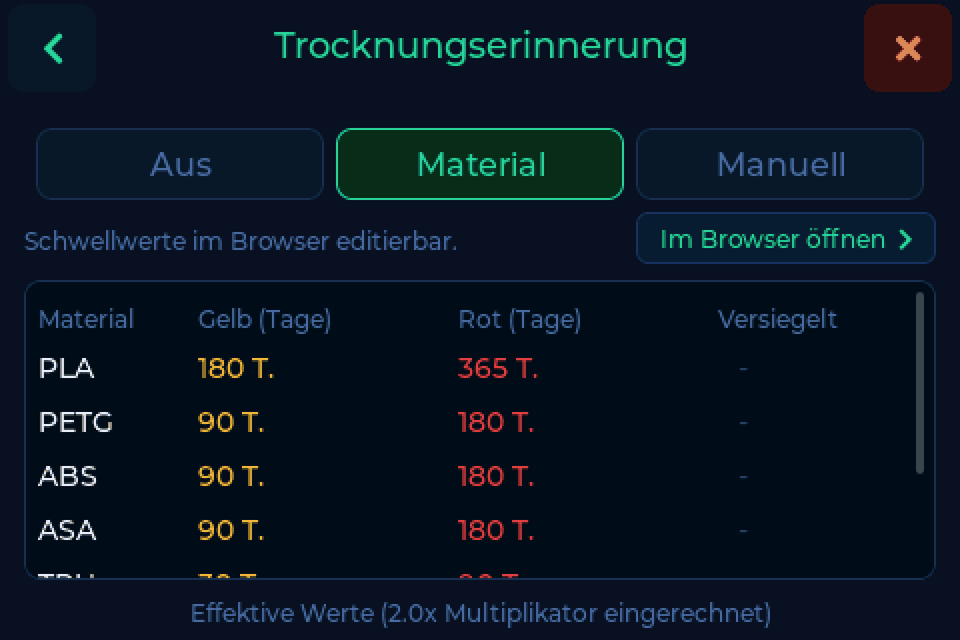
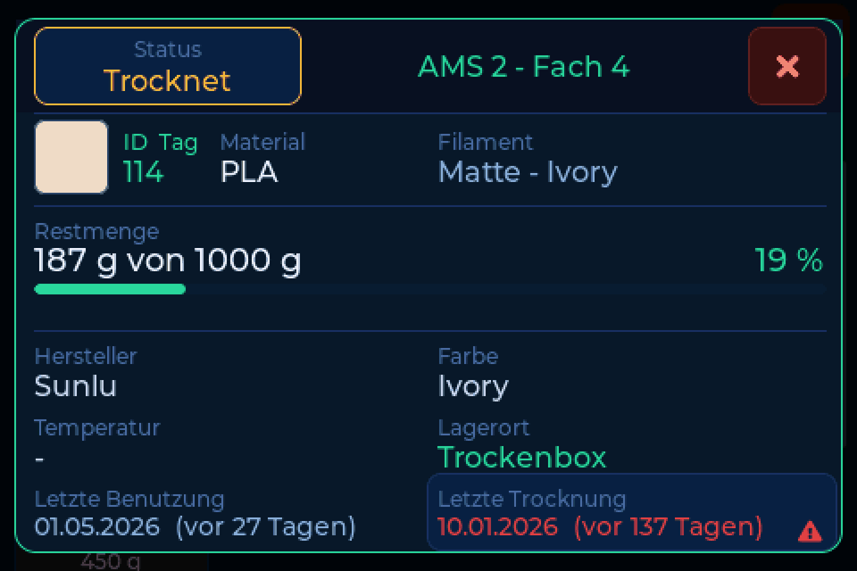

# Trocknung & Lagerort

Filament zieht Feuchtigkeit aus der Luft, und eine Spule, die monatelang offen
stand, druckt schlechter als eine, die letzte Woche getrocknet wurde. Die Waage
hält fest, wann eine Spule zuletzt getrocknet wurde, und warnt dich, bevor du
mit einer feuchten einen Druck startest.

---

## Die Erinnerung

**Einstellungen → Waage → Trocknungserinnerung**

Ein Ampelsystem auf dem Hauptbildschirm, gesteuert über die Tage seit der
letzten Trocknung:

| Modus | Was er tut |
|---|---|
| **Aus** | Keine Ampel. Die Daten werden trotzdem festgehalten. |
| **Material** | Schwellwerte je Material - PLA bekommt mehr Spielraum als PA oder PVA |
| **Manuell** | Ein Gelb- und ein Rot-Wert für alles |

### Modus Material

Jedes Material hat einen eigenen **Gelb-** und **Rot-**Wert in Tagen, dazu einen
**Multiplikator** für luftdichte Lagerung. Eine versiegelt mit Trockenmittel
gelagerte Spule altert langsamer als eine im offenen Regal, und der Multiplikator
ist die Art, das zu sagen.

Die Tabelle lässt sich am Gerät bearbeiten, bequemer auf der Trocknungsseite der
[Weboberfläche](web.md).

### Modus Manuell

Ein Gelb-Wert, ein Rot-Wert, für jedes Material gleich. Einfacher, wenn du alles
im selben Rhythmus trocknest.

---

## Eine Trocknung festhalten

Wenn du eine Spule aus dem Trockner nimmst, leg sie auf die Waage, tippe auf
**Heute getrocknet** und bestätige. Das Datum wird bei deinem
[Backend](backends.md) zur Spule gespeichert.

!!! info "Im richtigen Kalendertag gespeichert"
    Das Datum ist dein örtlicher Kalendertag. Eine Spule, die kurz nach
    Mitternacht getrocknet wurde, gilt also als heute getrocknet, nicht als
    gestern.

Bei Spoolman liegt das Datum im Zusatzfeld `last_dried`. Fehlt das Feld, legt
die Waage es beim ersten Schreiben an.

### Aus dem AMS

Mit FilaMan und BamBuddy muss eine Spule dafür nicht aus dem AMS. Tippe in der
AMS-Ansicht auf ein belegtes Fach, und die Karte bietet an, die Trocknung von
heute zu speichern. Bei einem AMS 2 Pro bietet sie alle Spulen der Einheit auf
einmal an. Die Ampel der Trocknungserinnerung gilt auch auf der Karte.

---

## Lagerort

Die Waage kann festhalten, **wo** eine Spule liegt, damit dein Bestand weiß, aus
welcher Kiste oder welchem Regal sie kam.

### Ortsabfrage bei Entnahme

**Einstellungen → Waage → Ortsabfrage bei Entnahme**

Hebst du eine Spule ab, fragt die Waage nach etwa 1,5 Sekunden, wohin sie geht.
Ein Tipp auf den Lagerort, und er wird zurückgeschrieben.

Die Waage erkennt die Entnahme am Gewicht, nicht am Leser allein. Eine Spule,
die noch daliegt, löst die Frage nicht aus, auch wenn der Leser ihren Tag kurz
verliert. Die Ausnahmen, sehr leichte Spulen und ein Gerät ohne Wägezelle,
stehen unter [NFC-Tags](tags.md#verlorene-lesungen-und-die-lagerort-frage).

Eine Liste, die sich von selbst geöffnet hat, schließt sich nach 30 Sekunden,
als hättest du **Abbrechen** gedrückt, und der Knopf läuft dabei leer. Aus
**Mehr Info** geöffnet, wartet sie auf dich.
