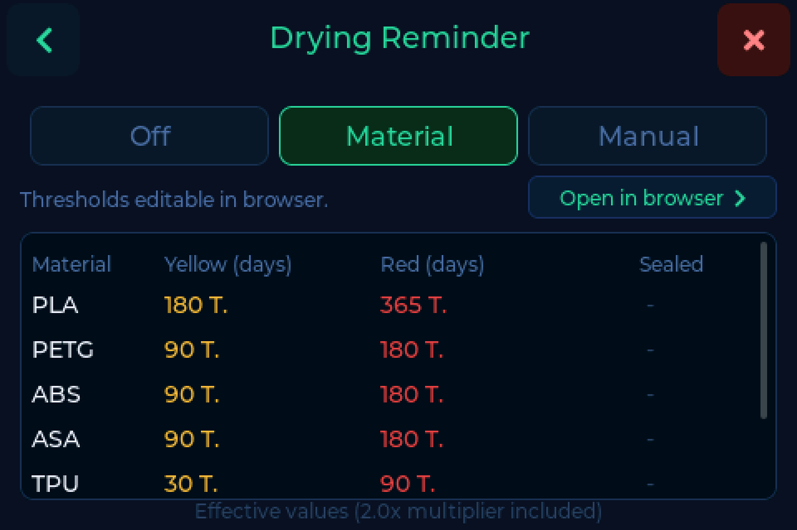

# Drying & location

Filament takes up moisture from the air, and a spool that has been sitting out
for months prints worse than one that was dried last week. The scale records
when a spool was last dried and warns you before you start a print with a wet
one.

---

## The reminder

**Settings → Scale → Drying reminder**

A traffic light on the main screen, driven by the days since the spool was last
dried:

| Mode | What it does |
|---|---|
| **Off** | No traffic light. Dates are still recorded. |
| **Material** | Thresholds per material - PLA gets more grace than PA or PVA |
| **Manual** | One yellow and one red threshold for everything |

### Material mode

Each material carries its own **yellow** and **red** day count, plus a
**multiplier** for airtight storage. A spool kept sealed with desiccant ages
more slowly than one on an open shelf, and the multiplier is how you say so.

The table is editable on the device, and more comfortably on the drying page of
the [web interface](web.md).

### Manual mode

One yellow threshold, one red threshold, applied to every material. Simpler when
you dry everything on the same rhythm.

---

## Recording a drying run

When you take a spool out of the dryer, put it on the scale and record it. The
date is stored with the spool at your [backend](backends.md).

!!! info "Stored on the correct calendar day"
    A spool dried shortly after midnight used to count as dried *yesterday*, and
    the reminder counted a day too many. Fixed in v0.7.0.

With Spoolman the date lives in the `last_dried` extra field, created for you
during [first setup](index.md#step-4-where-the-tag-uid-is-stored).

---

## Location

The scale can record **where** a spool is stored, so your inventory knows which
box or shelf it came from.

### Location on removal

**Settings → Scale → Location on removal**

Lift a spool off the pad and the scale asks where it is going. Tap the location
and it is written back.

!!! warning "Switch it off if it fires by itself"
    With NTAG tags the reader can briefly lose the tag while the spool has not
    moved, which reads as a removal and opens the picker unprompted. Check the
    [tag positioning](tags.md#positioning-closer-is-not-better) first - too
    little distance is the more frequent cause. If it persists, switch this off.

    Bambu Lab spools do not show this.
