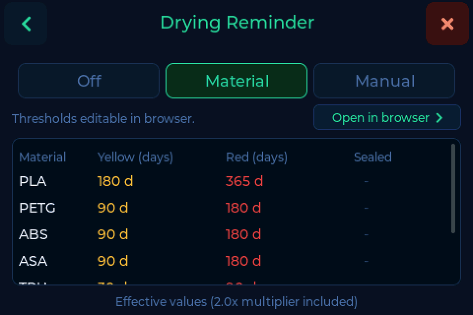
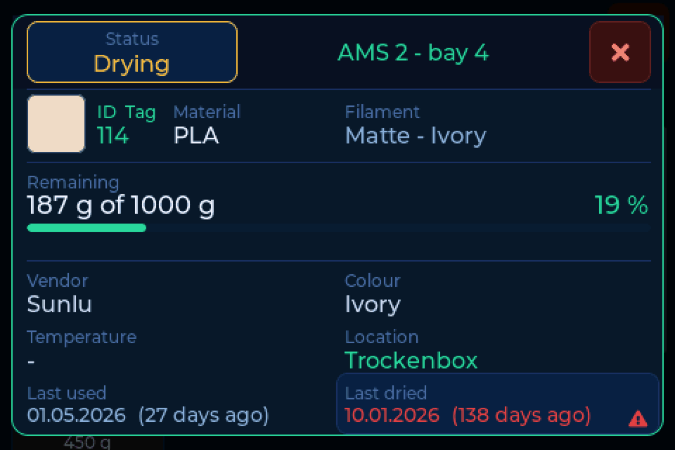

# Drying & location

Filament takes up moisture from the air, and a spool that has been sitting out
for months prints worse than one that was dried last week. The scale records
when a spool was last dried and warns you before you start a print with a wet
one.

---

## The reminder

**Settings → Scale → Drying Reminder**

A traffic light on the main screen, driven by the days since the spool was last
dried:

| Mode | What it does |
|---|---|
| **Off** | No traffic light. Dates are still recorded. |
| **Material** | Thresholds per material - PLA gets more grace than PA or PVA |
| **Manual** | One yellow and one red threshold for everything |

### Material mode

Each material carries its own **yellow** and **red** day count, plus a
**multiplier** for airtight storage. A spool kept sealed with desiccant ages
more slowly than one on an open shelf, and the multiplier is how you say so.

The table is editable on the device, and more comfortably on the drying page of
the [web interface](web.md).

### Manual mode

One yellow threshold, one red threshold, applied to every material. Simpler when
you dry everything on the same rhythm.

---

## Recording a drying run

When you take a spool out of the dryer, put it on the scale, tap **Dried today**
and confirm. The date is stored with the spool at your [backend](backends.md).

!!! info "Stored on the correct calendar day"
    The date is your local calendar day, so a spool dried shortly after midnight
    counts as dried today, not yesterday.

With Spoolman the date lives in the `last_dried` extra field. If the field is
missing, the scale creates it on the first write.

### From the AMS

With FilaMan and BamBuddy a spool does not have to leave the AMS for this. Tap
a filled bay in the AMS view, and the card offers to record today's drying. On
an AMS 2 Pro it offers all spools in the unit at once. The drying reminder's
traffic light shows on the card as well.

---

## Location

The scale can record **where** a spool is stored, so your inventory knows which
box or shelf it came from.

### Location on removal

**Settings → Scale → Location on removal**

Lift a spool off the pad, and after about 1.5 seconds the scale asks where it
is going. Tap the location and it is written back.

The scale tells a removal from the weight, not from the reader alone. A spool
that is still lying there does not trigger the question, even when the reader
briefly loses its tag. The exceptions, very light spools and a device without a
load cell, are on [NFC tags](tags.md#lost-reads-and-the-location-question).

A list that opened by itself closes after 30 seconds as if you had pressed
**Cancel**, and the Cancel button drains meanwhile. Opened from **More info**,
it waits for you.
