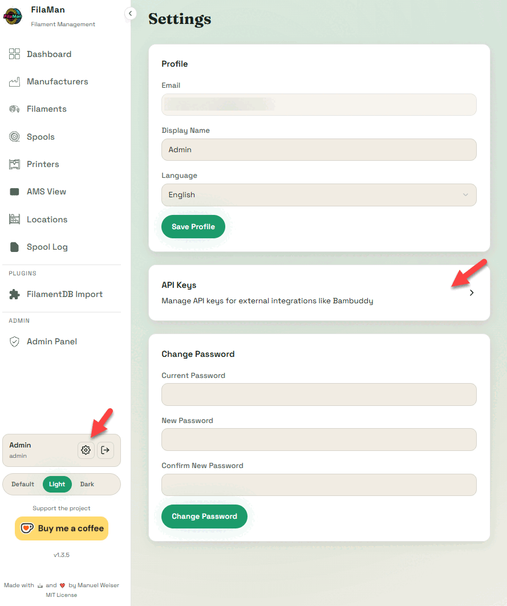
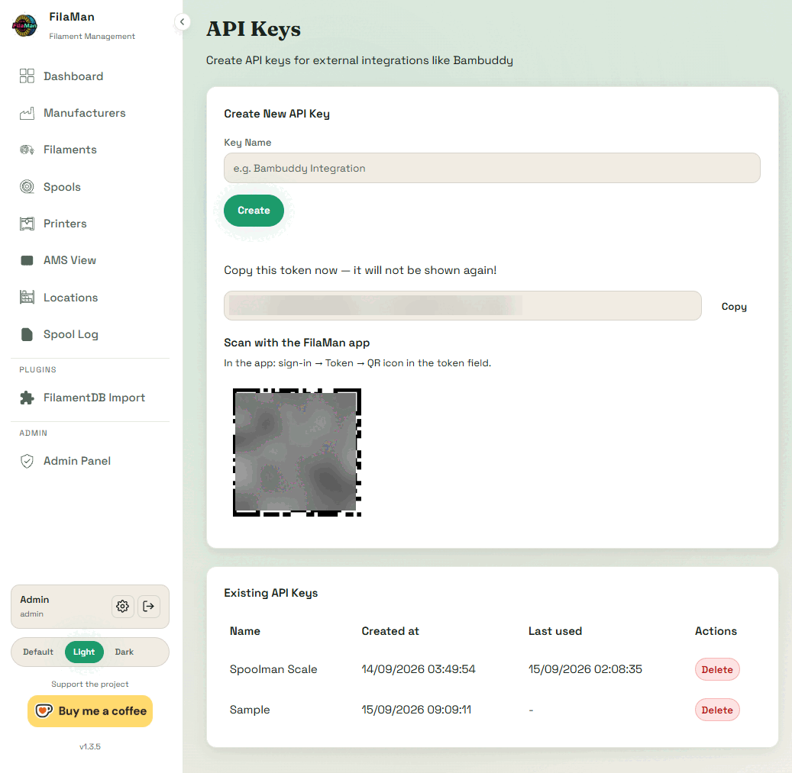
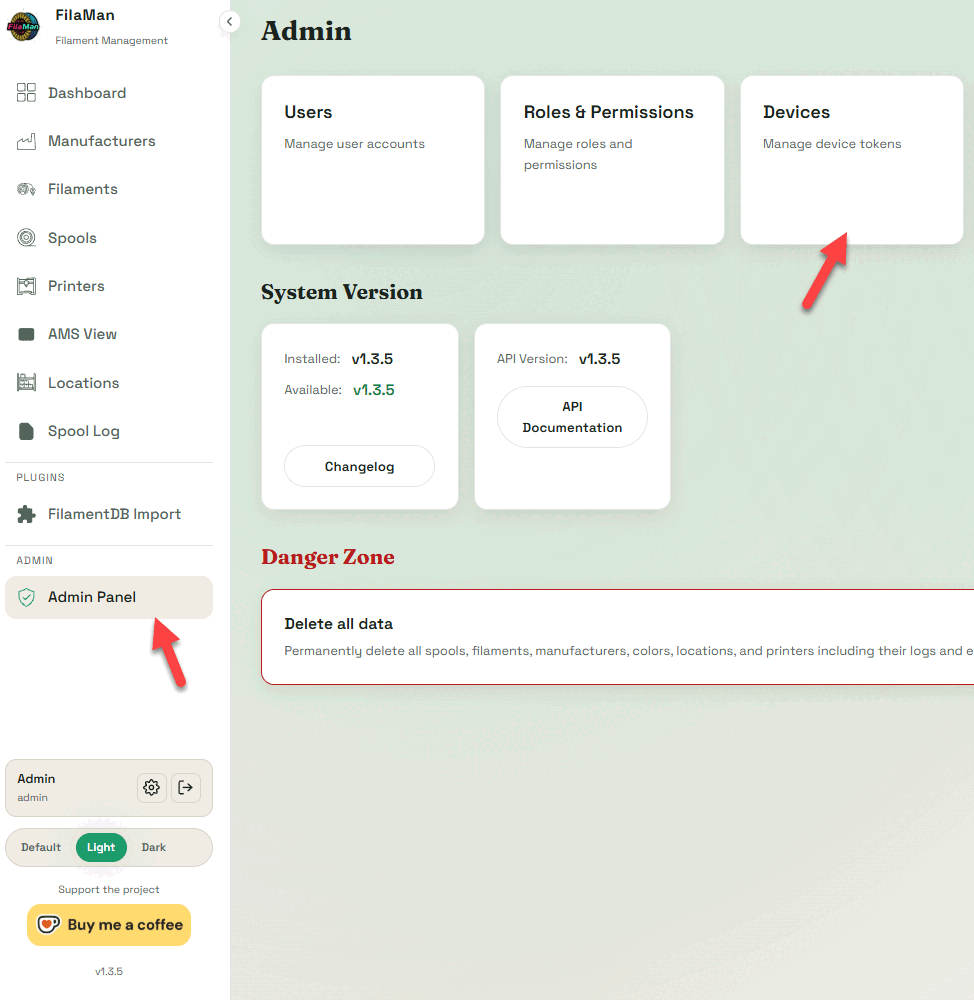
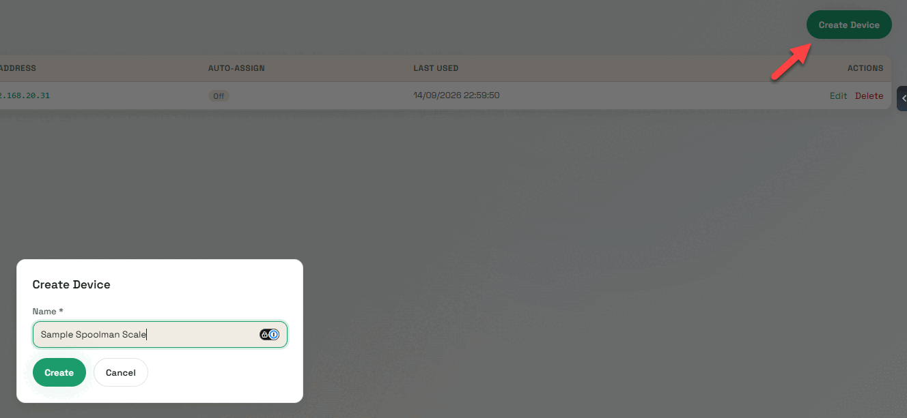
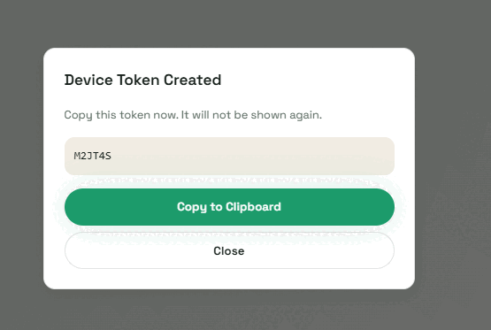

# Flashing & First Setup

Getting firmware onto a fresh device, and walking through the setup wizard.
Budget about 20 minutes.

---

## First flash - the web flasher

The very first flash has to happen over USB. It works in any Chrome-based
browser (Chrome, Edge, Brave), with nothing to install.

1. Connect the WT32-SC01 Plus to your computer with a USB-C cable
2. Open **[niko11111.github.io/SpoolmanScale](https://niko11111.github.io/SpoolmanScale)**
3. Click **Flash Latest**
4. Pick the serial port of your device
5. Wait about 60 seconds
6. The browser offers to set up your WiFi. Enter it now, or skip it and do it
   on the scale in step 2

!!! warning "It has to be a data cable"
    Many USB-C cables carry power only. If no serial port shows up, that is the
    first thing to swap.

!!! note "Chrome, not Firefox"
    The flasher uses the WebSerial API. Firefox does not implement it.

!!! tip "Changing the WiFi later"
    The flasher page also changes the WiFi of a scale that is already
    installed. Connect it by USB, open the page, click the button, pick the
    port and choose **Change Wi-Fi**. Nothing gets flashed.

Every later update runs on the device itself or from your browser over the
network. See [Updating the firmware](updating.md) - you will not need the cable
again.

---

## Step 1 - Language

**English** or **German**. Changeable later under **Settings → System → Language**.

---

## Step 2 - WiFi

If you already entered your WiFi in the web flasher, the scale shows
**Already connected to WiFi.** with the network, its IP and the signal. Tap
**Next**, or **Change WiFi** to pick a different one.

Otherwise there are two ways, and with the second one the password is never
typed on the scale.

=== "On the touchscreen"

    1. The list of networks fills by itself; the button at the top scans again
    2. Tap your network
    3. Type the password. `1#` switches to digits and special characters,
       including `^ ~ |` and `` ` ``
    4. Confirm with ✓ or ↵

=== "With your phone"

    1. Tap **Set up by phone** below the list
    2. The scale opens a WiFi network of its own and shows two QR codes. Scan
       the left one to join; the password is new every time and only on the
       display
    3. The setup page usually opens by itself. If not, scan the right QR code
       or open `http://10.42.0.1/`
    4. Pick your network, or type the name of a hidden one, enter the password
       and tap **Connect**
    5. The scale closes its own network, connects and shows the result on its
       display

    !!! tip "The phone says the network has no internet"
        That is right, it is the scale's own network. Stay connected, otherwise
        some phones switch to mobile data and the page does not load.

!!! note "2.4 GHz only"
    The ESP32-S3 has no 5 GHz radio. A 5 GHz network will not appear in the
    scan at all, which looks like the network is missing rather than
    unsupported.

---

## Step 3 - Pick a backend

SpoolmanScale talks to three filament managers. Pick one now, change it any
time under **Settings → Connection** or from the
[web interface](web.md) - your entries for the others are kept.

=== "Spoolman"

    Address and port, nothing else. There are no credentials to enter.

    | Field | Example |
    |---|---|
    | Host | `192.168.1.100` |
    | Port | `7912` |

=== "FilaMan"

    FilaMan needs **two** credentials, and it creates them in two different
    places. Enter the host and test the connection first. Once the test
    passes, **Next** shows an address: open it in a browser on your computer,
    and the credentials go into the **Credentials** card of the **Backend**
    page. Later you get back there under
    **Settings → Connection → Set up in browser**.

    | Field | Example / where it comes from |
    |---|---|
    | Host | `192.168.1.100:8002` |
    | API key | FilaMan: gear icon → **API Keys** |
    | Device code | FilaMan: **Admin Panel → Devices** |

    **1. API key.** In FilaMan, click the **gear icon** next to your user name
    at the bottom of the sidebar, open **API Keys** and create a key, named
    `SpoolmanScale` for example. Enter it under **API key** and press **Save**.

    

    

    **2. Device code.** In FilaMan, open **Admin Panel → Devices** and click
    **Create Device**. FilaMan shows a 6 character code of digits and capital
    letters. The dialog is titled **Device Token Created**, but what it shows
    is the code, not the token. Enter it under **Device code** and press
    **Register**. The scale trades the code for a device token, and the code
    is used up.

    

    

    

    !!! warning "Both are shown only once"
        Copy the key and the code the moment FilaMan shows them. If one gets
        lost, create a new one.

    !!! info "Use an admin account for both"
        Only an admin can create a device. An API key has the rights of the
        account that created it, so create the key with the admin account as
        well, or FilaMan refuses the AMS assignment.

=== "BamBuddy"

    A single API key, sent as `X-API-Key`. Create it in BamBuddy under
    **Settings → API Keys** with **Read Status** and **Manage Inventory**.

    The key is **optional**: a BamBuddy instance with authentication switched
    off answers without one.

    With authentication switched on, the connection test says **API key still
    missing** until you have entered it. That is expected, and the setup
    carries on to the step where the key goes in.

    | Field | Example |
    |---|---|
    | Host | `192.168.1.100:8000` |
    | API key | optional |

Tap **Test connection** before moving on.

---

## Step 4 - Where the tag UID is stored

!!! info "Spoolman only"
    FilaMan and BamBuddy keep tag identifiers themselves. This step does not
    apply to them.

SpoolmanScale stores the UID of an NFC tag in a Spoolman extra field, and you
choose which one:

| Field | Use it when |
|---|---|
| `tag` | Nothing else reads your tags. The default. |
| `nfc_id` | Another tool in your setup already uses this name |
| `card_uids` | You want several tags on one spool |

A second extra field, `last_dried`, holds the drying date. On first connect the
scale checks whether the fields exist and offers to create them for you.

!!! tip "If the fields will not create"
    Make a test field by hand in Spoolman under **Settings → Extra fields**.
    If that fails too, the problem is the Spoolman connection, not the scale.

The UID is written as **plain hex** (`04B9E542447080`), the same way every other
tool around Spoolman writes it. Spools linked by an older firmware, which used
colons, are still found and get rewritten once on their first scan.

---

## Step 5 - Calibrate

A scale that has never been calibrated shows the converter's raw value, not
grams - a six digit number that drifts by hundreds on its own. That is expected
on a new build, and the scale says so in the status bar.

1. **Settings → Scale → Calibration**
2. Clear the platform, tap **Tare**, wait for 0
3. Put on a weight you know precisely, ideally around 1000 g
4. Type that weight in grams
5. Tap **Calculate** and save

!!! tip "The reference weight sets the ceiling"
    A full spool checked on a kitchen scale is plenty. Whatever error is in
    your reference weight is baked into every measurement afterwards.

Details and the finer points in [Weighing & calibration](weighing.md).

---

## Done

You land on the [main screen](main-screen.md). Put a spool on it and the display
wakes up by itself.
