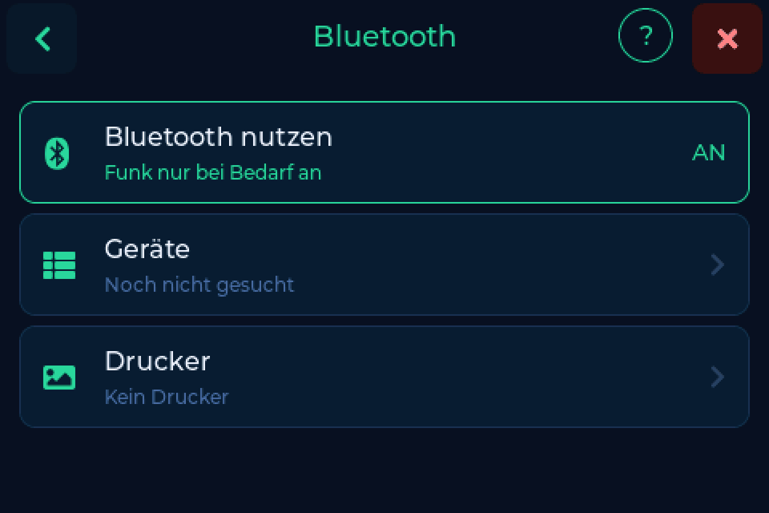
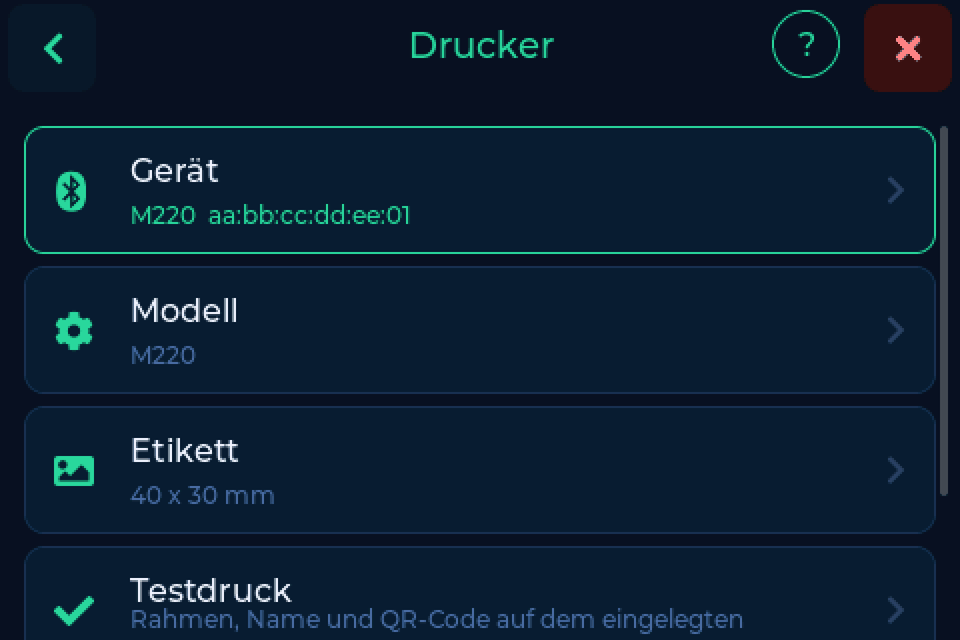
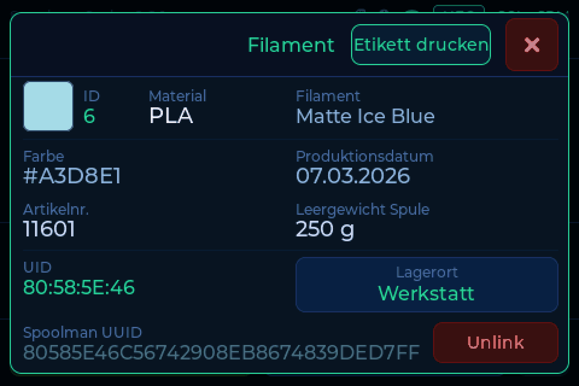

# Bluetooth & Etiketten

Die Waage kann für die aufliegende Spule ein Etikett drucken, auf einem
Bluetooth-Etikettendrucker. Das Etikett trägt die wichtigsten Angaben und einen
QR-Code, der die Spule in deinem Backend öffnet.

!!! warning "Beta: eine erste Version"
    Der Etikettendruck ist neu in 0.8.0 und wird ausgebaut: Etiketten direkt vom
    Backend (FilaMan zuerst), ein kleiner Etiketten-Editor im Browser, weitere
    Drucker und Etikettengrößen. Ideen und Hilfe sind sehr willkommen, auf
    [Discord oder GitHub](../help/contributing.md).

---

## Den Drucker einrichten

1. **Einstellungen → Verbindung → Bluetooth**, schalte **Bluetooth nutzen** ein.
   Die Waage startet einmal neu. Danach läuft der Funk nur, solange er gebraucht
   wird.
2. Schalte den Drucker ein und tippe auf **Geräte**. Die Waage listet, was in
   Reichweite ist.
3. Tipp auf deinen Drucker und wähle **Als Drucker**.
4. Unter **Drucker** wählst du **Modell** und **Etikett**, dann tippst du auf
   **Testdruck**.

Unterstützt sind vorerst der **Phomemo M220** (getestet) und der **M110**
(experimentell), mit Etiketten in **40 x 30 mm** oder **50 x 30 mm**. Die
Etikettengröße ist Breite quer zum Druckkopf mal Länge in Laufrichtung, so wie
sie auf der Rolle steht.

---

## Ein Etikett drucken

Leg die Spule auf, tippe auf **Mehr Info** und dann auf **Etikett drucken**.

Eine Karte begleitet den Druck und endet mit der Antwort des Druckers.
**Gesendet** ohne Bestätigung heißt meist: Papier und Deckel prüfen.

Auf dem Etikett stehen Hersteller, Material, Name, Farbe mit Hex-Code, ein Datum
(erste Benutzung oder wann die Spule angelegt wurde), das Backend mit der
Spulen-ID und ein QR-Code, der die Spule in deinem Backend öffnet.

Die Seite **Drucker** der [Weboberfläche](web.md) bietet dieselbe Einrichtung
und den Testdruck.

---

## Danke

Danke an @akira69, dessen Druckerunterstützung in seinem Fork die Grundlage und
der Machbarkeitsnachweis für diese Funktion war.
