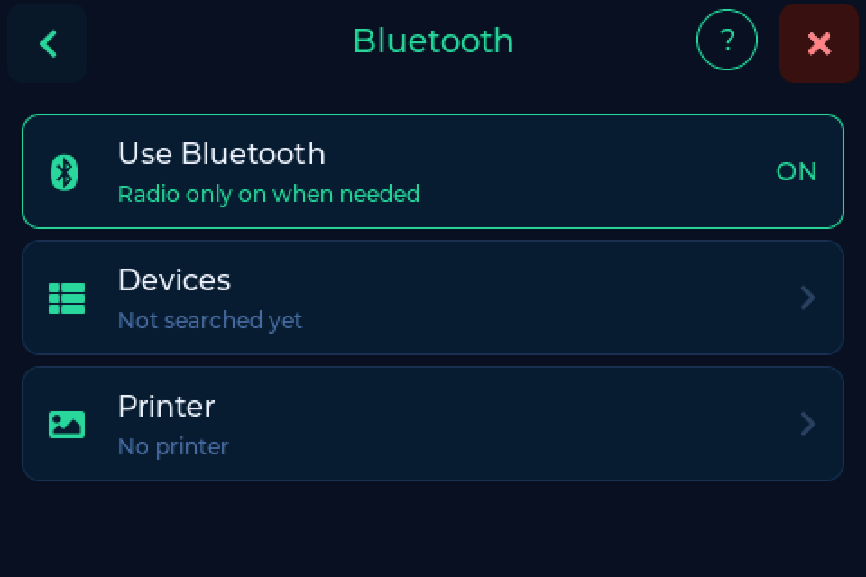
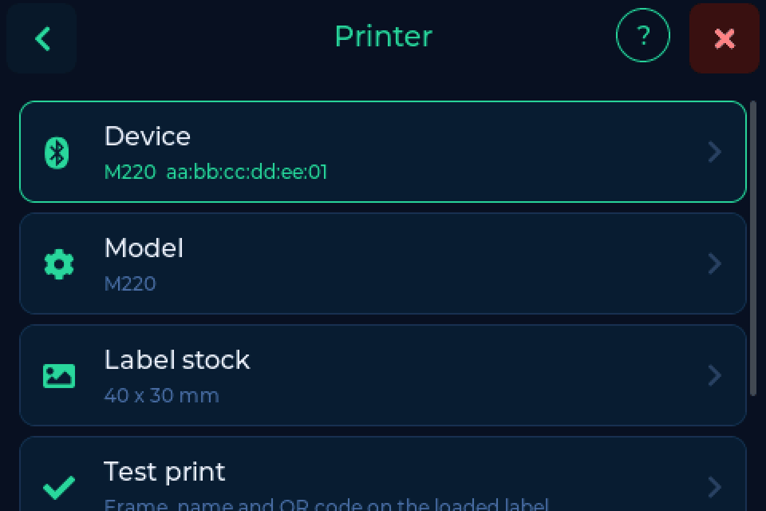
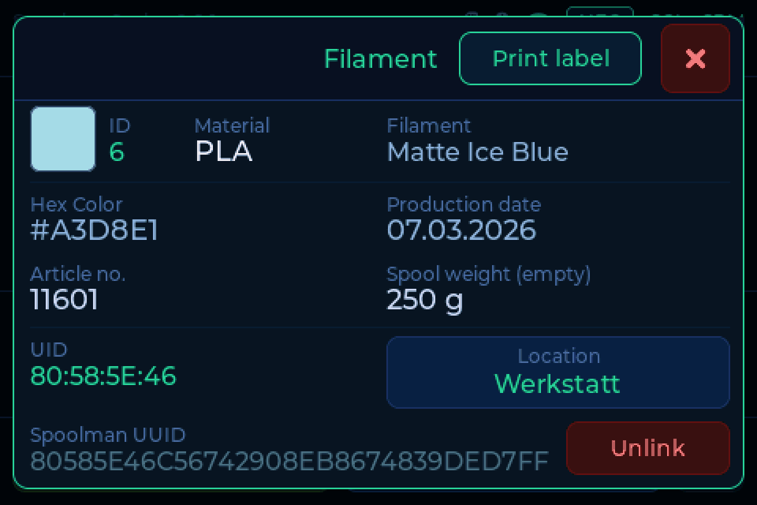

# Bluetooth & labels

The scale can print a label for the spool on the pad, on a Bluetooth label
printer. The label carries the key facts and a QR code that opens the spool in
your backend.

!!! warning "Beta: a first version"
    Label printing is new in 0.8.0 and will grow: labels straight from the
    backend (FilaMan first), a small label editor in the browser, and more
    printers and label sizes. Ideas and help are very welcome on
    [Discord or GitHub](../help/contributing.md).

---

## Setting up the printer

1. **Settings → Connection → Bluetooth**, switch on **Use Bluetooth**. The
   scale restarts once. The radio then only runs while it is needed.
2. Switch the printer on and tap **Devices**. The scale lists what is in range.
3. Tap your printer and choose **As printer**.
4. Under **Printer**, pick the **Model** and the **Label stock**, then tap
   **Test print**.

Supported for now: the **Phomemo M220** (tested) and the **M110**
(experimental), with labels of **40 x 30 mm** or **50 x 30 mm**. The label stock
is width across the head by length along the feed, as printed on the roll.

---

## Printing a label

Put the spool on the pad, tap **More info** and then **Print label**.

A card follows the print and ends with the printer's answer. **Sent** without a
confirmation usually means: check the paper and the lid.

The label shows the manufacturer, material, name, colour with hex code, a date
(first use or when the spool was added), the backend with the spool ID, and a QR
code that opens the spool in your backend.

The **Printer** page of the [web interface](web.md) offers the same setup and
the test print.

---

## Thanks

Thanks to @akira69, whose printer support in his fork was the groundwork and
the proof of concept for this feature.
