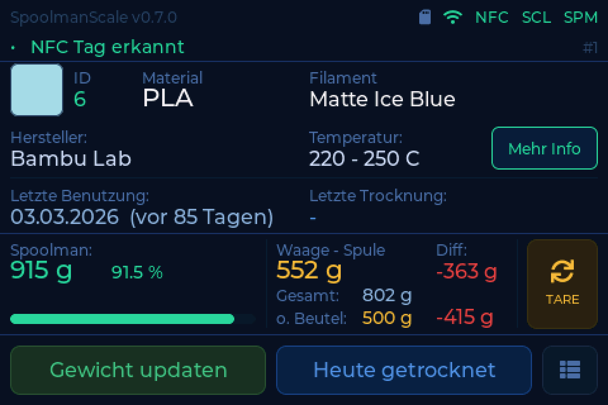
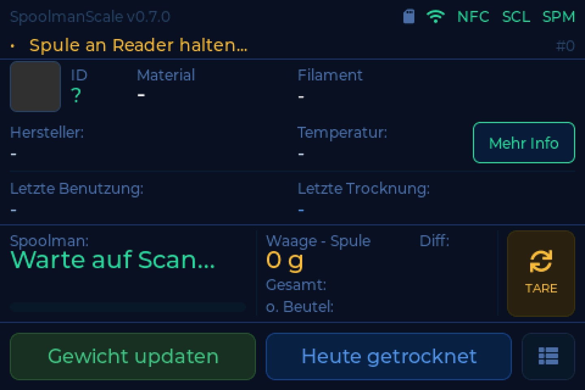
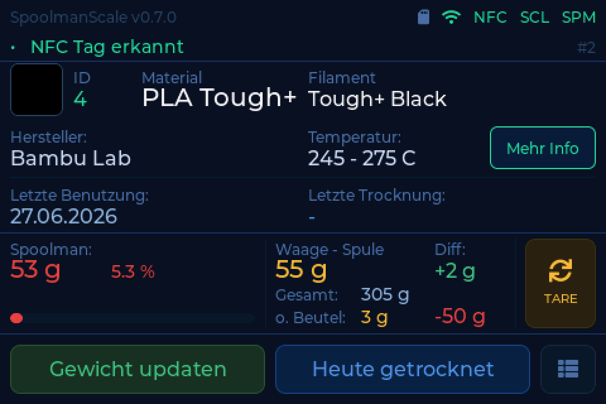
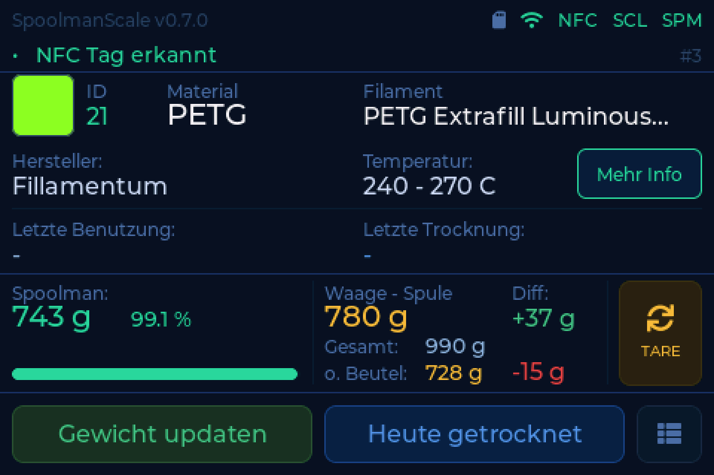
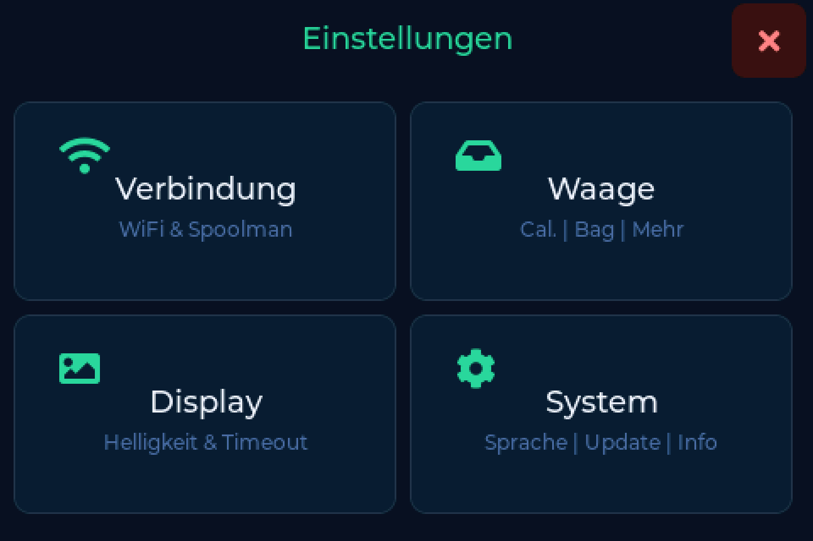

# Der Hauptbildschirm

Alles, was die Waage über die Spule vor dir weiß, auf einem Bildschirm.

!!! tip "Er wacht von selbst auf"
    Leg etwas auf, und die Anzeige kommt von allein zurück. Kein Antippen nötig.

---

## Was darauf steht

| Bereich | Zeigt |
|---|---|
| Kopfzeile | Filamentname, Hersteller, Farbfeld |
| Statuszeile | WLAN, Backend und jeden [Diagnosebefund](../help/index.md) |
| Rest | was dein Bestand als Restmenge führt |
| Waage | was die Wägezelle gerade misst |
| Differenz | Waage minus Bestand, damit du auf einen Blick siehst, was ein Druck verbraucht hat |
| Fußzeile | zuletzt benutzt, zuletzt getrocknet |
| Unten rechts | Einstellungen |

Gewichte werden in **ganzen Gramm** angezeigt und zurückgeschrieben.

---

## Die Zustände, die dir begegnen

=== "Nichts aufgelegt"

    

    Wartestellung. Die Waage ist tariert und bereit.

=== "Fast leer"

    

    Eine Spule mit wenig Rest. Die Restmenge wird hervorgehoben, damit eine fast
    leere Spule auffällt, bevor du einen langen Druck startest.

=== "Backend nicht erreichbar"

    

    WLAN steht, aber das Backend antwortet nicht. Die Waage wiegt weiter, sie
    kann nur nichts nachschlagen und nichts zurückschreiben.

    Prüfe Adresse und Port unter **Einstellungen → Verbindung**. Ein fehlender
    Port ist eine häufige Ursache - siehe [Backends](backends.md).

=== "Kein WLAN"

    

    Gar kein Netz. Wiegen geht weiterhin, alles andere wartet.

---

## Die Statuszeile spricht

Stimmt etwas mit der Hardware nicht, sagt die Statuszeile das im Klartext statt
mit einem kryptischen Kürzel. Ein Tippen darauf erklärt die Ursache und was zu
tun ist, mit einem Knopf, der direkt dorthin führt, wo es etwas zu tun gibt.

Jede Meldung, die dort erscheinen kann, steht unter
[Was die Waage dir sagt](../help/index.md).

---

## Detailansicht

Tippe auf den Spulenbereich für den vollständigen Datensatz: Artikelnummer,
Produktionsdatum, Temperaturen, Spoolman-ID, Tag-UID. Hauptbildschirm und
Detailansicht liegen auf einem gemeinsamen Raster, es springt also nichts, wenn
du zwischen ihnen wechselst.

---

## Einstellungen

Unten rechts. Vier Kacheln:

| Kachel | Enthält |
|---|---|
| **Verbindung** | WLAN, Backend, Adressen und Zugangsdaten |
| **Waage** | [Beutelgewicht](weighing.md), [Trocknung](drying.md), Lagerort, [Tag-Schreiben](tags.md), Kalibrierung |
| **Anzeige** | Helligkeit, Zeitabschaltung, Datumsformat |
| **System** | [Weboberfläche](web.md), [Firmware](updating.md), Sprache, Info, Neustart, Werksreset |
