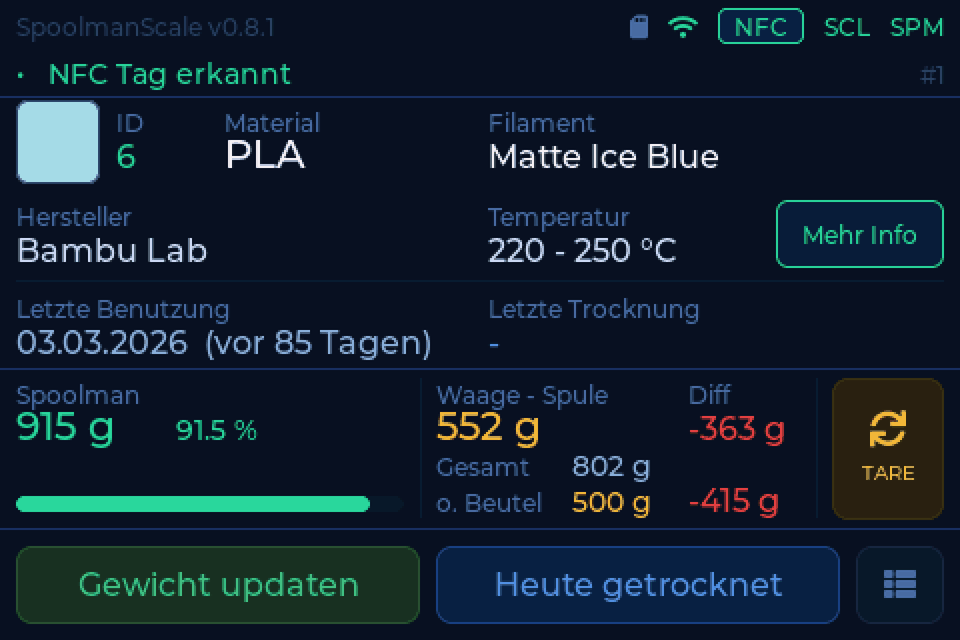
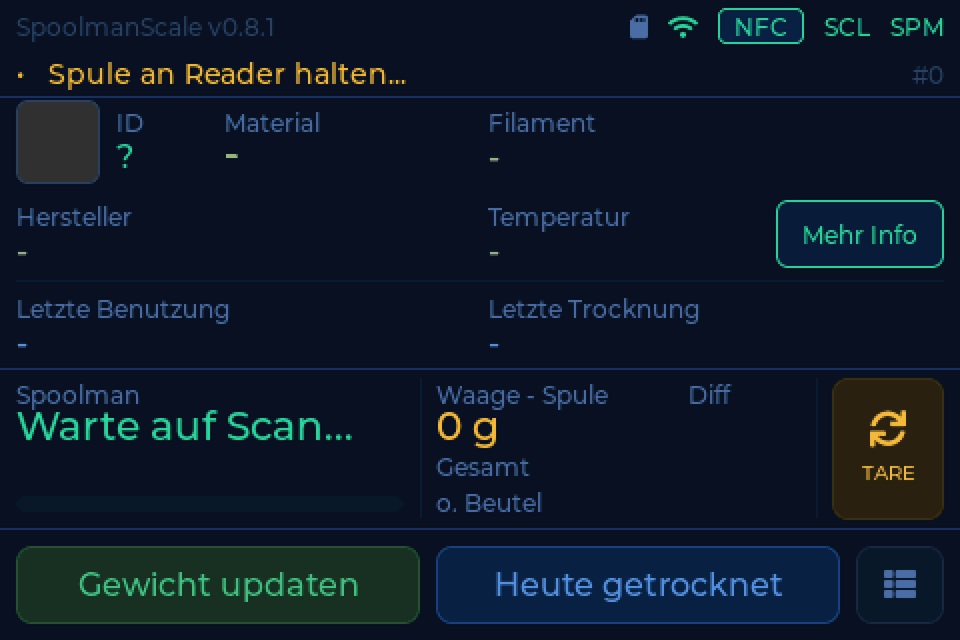
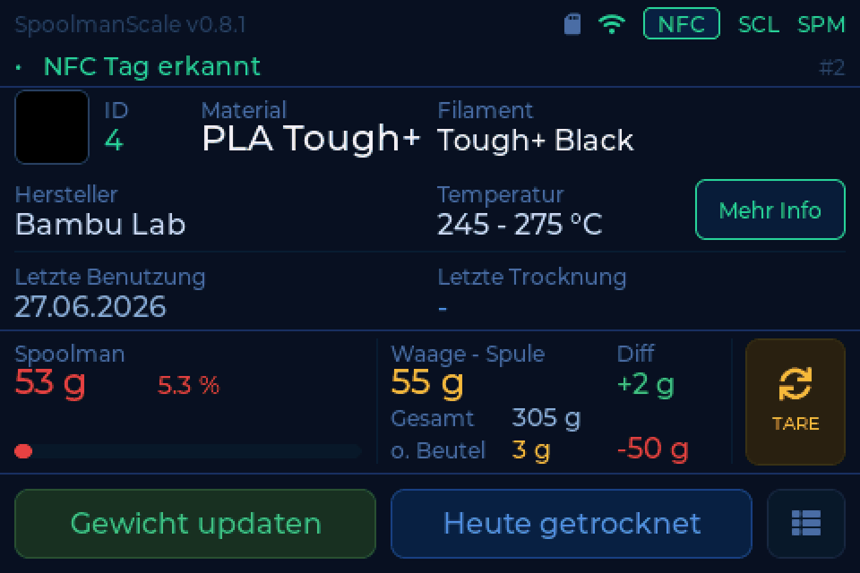
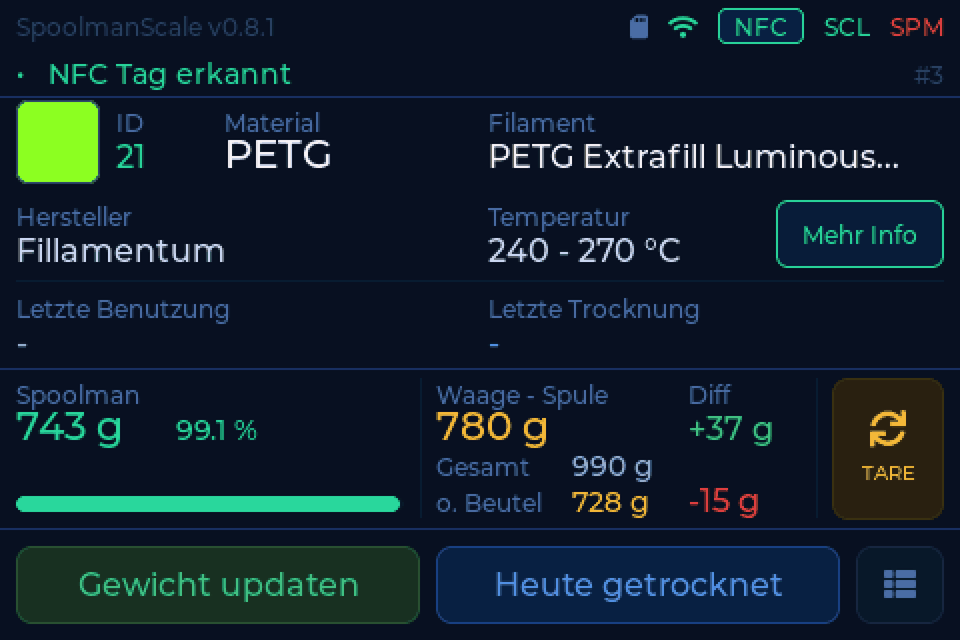
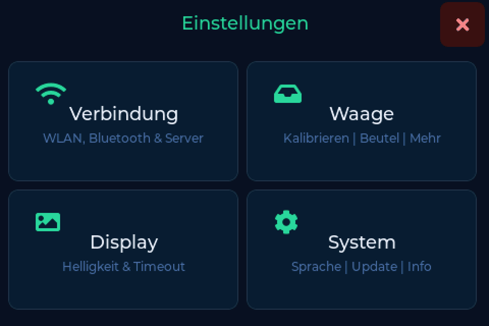
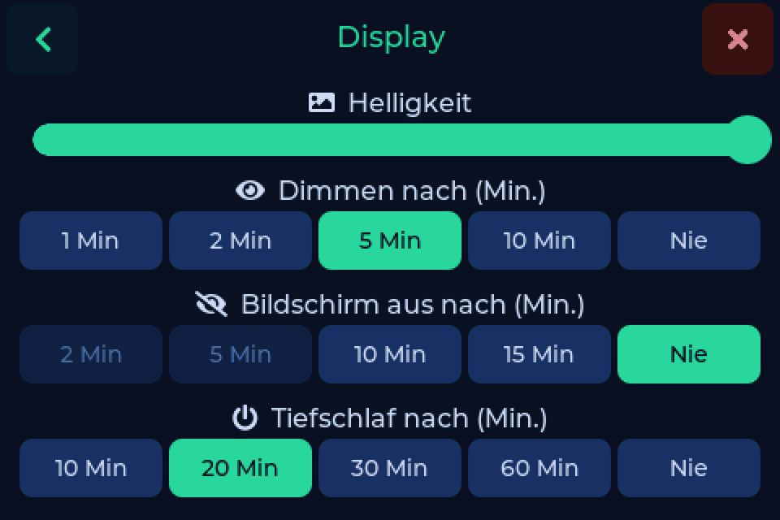

# Der Hauptbildschirm

Alles, was die Waage über die Spule vor dir weiß, auf einem Bildschirm.

!!! tip "Er wacht von selbst auf"
    Leg etwas auf, und die Anzeige kommt von allein zurück. Kein Antippen nötig.

---

## Was darauf steht

| Bereich | Zeigt |
|---|---|
| Kopfzeile | Firmware-Version und Status-Chips: SD-Karte, Bluetooth, WLAN, NFC, SCL (Wägezelle), AMS und das Backend-Kürzel |
| Statuszeile | was die Waage gerade tut, jeden [Diagnosebefund](../help/index.md), den Scan-Zähler |
| Spule | ID, Material, Filamentname, Farbfeld, Hersteller, Temperatur und der Knopf **Mehr Info** |
| Darunter | letzte Benutzung, letzte Trocknung |
| Rest | was dein Bestand als Restmenge führt |
| Waage - Spule | das Filament, das gerade auf der Waage liegt, ohne die leere Spule. Darunter das Gesamtgewicht und das Gewicht ohne Beutel |
| Diff | Waage minus Bestand, damit du auf einen Blick siehst, was ein Druck verbraucht hat |
| **TARE** | setzt die Waage auf null |
| Unten | **Gewicht updaten** und **Heute getrocknet**. Bei einem Tag, der noch nicht verknüpft ist, **Spule verknüpfen** und **Spule kopieren** |
| Unten rechts | Einstellungen |

Zwei der Chips in der Kopfzeile sind Knöpfe:

- **NFC** öffnet die Tag-Ansicht: was der Tag auf dem Leser enthält, und bei
  einem NTAG Knöpfe, um ihn zu löschen oder die Spule darauf zu schreiben.
  Antwortet der Leser nicht, steht dort rot **NFC!**.
- **AMS** öffnet die AMS-Ansicht. Er erscheint nur mit FilaMan oder BamBuddy,
  und nur, wenn dein Drucker ein AMS hat.

Das Backend-Kürzel (**SPM**, **FLM**, **BBY** oder **BBS**) wird rot, wenn der
Server nicht antwortet. Ein rotes **SCL!** heißt, die Wägezelle antwortet
nicht.

Gewichte werden in **ganzen Gramm** angezeigt und zurückgeschrieben.

---

## Die Zustände, die dir begegnen

=== "Nichts aufgelegt"

    

    Wartestellung. Die Waage ist tariert und bereit.

=== "Fast leer"

    

    Eine Spule mit wenig Rest. Die Restmenge wird hervorgehoben, damit eine fast
    leere Spule auffällt, bevor du einen langen Druck startest.

=== "Langer Name"

    

    Ein Filamentname, der nicht in sein Feld passt, wird mit drei Punkten
    abgeschnitten.

=== "Backend nicht erreichbar"

    

    WLAN steht, aber das Backend antwortet nicht. Die Waage wiegt weiter, sie
    kann nur nichts nachschlagen und nichts zurückschreiben.

    Prüfe Adresse und Port unter **Einstellungen → Verbindung**. Ein fehlender
    Port ist eine häufige Ursache - siehe [Backends](backends.md).

=== "Kein WLAN"

    

    Gar kein Netz. Wiegen geht weiterhin, alles andere wartet.

---

## Die Statuszeile spricht

Stimmt etwas mit der Hardware nicht, sagt die Statuszeile das im Klartext statt
mit einem kryptischen Kürzel. Ein Tippen darauf erklärt die Ursache und was zu
tun ist, mit einem Knopf, der direkt dorthin führt, wo es etwas zu tun gibt.

Jede Meldung, die dort erscheinen kann, steht unter
[Was die Waage dir sagt](../help/index.md).

---

## Detailansicht

Tippe auf **Mehr Info** für den vollständigen Datensatz: ID, Material,
Filament, Farbe, Produktionsdatum, Artikelnummer, Leergewicht der Spule,
Tag-UID, Lagerort und die UUID im Backend. Hauptbildschirm und Detailansicht
liegen auf einem gemeinsamen Raster, es springt also nichts, wenn du zwischen
ihnen wechselst.

Hier änderst du auch den Lagerort, löst die Verknüpfung (**Unlink**) und
tippst, mit Bluetooth an und eingerichtetem Etikettendrucker, auf
**Etikett drucken**.

---

## Einstellungen

Unten rechts. Vier Kacheln:

=== "Einstellungen"

    

=== "Anzeige"

    

=== "System"

    

| Kachel | Enthält |
|---|---|
| **Verbindung** | WLAN, Bluetooth und der Etikettendrucker, Filamentverwaltung mit Adresse und Zugangsdaten, **Weitere Optionen** für das aktive Backend |
| **Waage** | **AMS ansehen** (FilaMan und BamBuddy, mit AMS), [Beutelgewicht](weighing.md), [Trocknungserinnerung](drying.md), Ortsabfrage bei Entnahme, [Tag-Schreiben](tags.md), Last Used Modus, Kalibrierung, **Waage vorhanden** |
| **Display** | Helligkeit, Dimmen nach, Bildschirm aus nach, Tiefschlaf nach |
| **System** | [Weboberfläche](web.md), [Firmware](updating.md), Sprache mit Zeitzone und Datumsformat, Info, [NFC-Reset prüfen](../build/wiring.de.md#nach-dem-umloten), Neustart, Werksreset |
