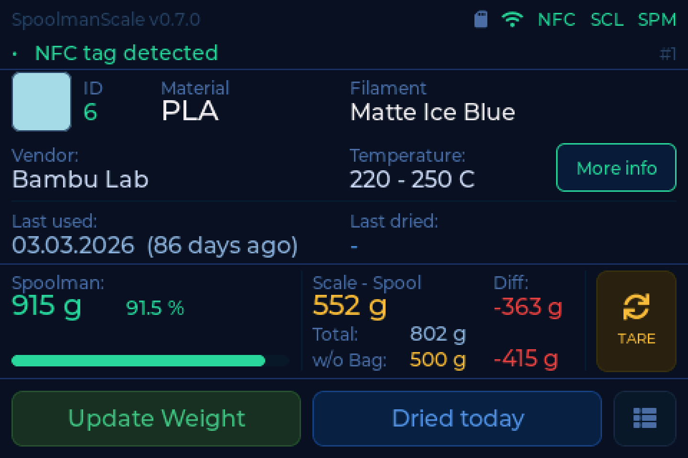
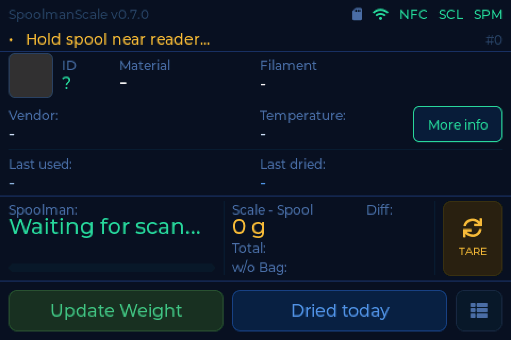
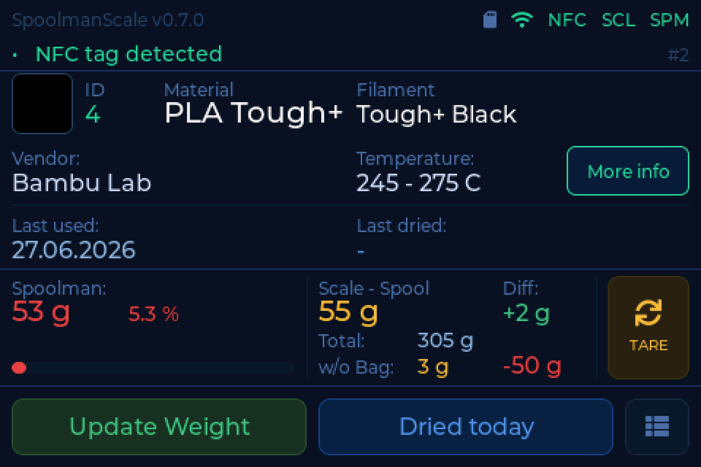
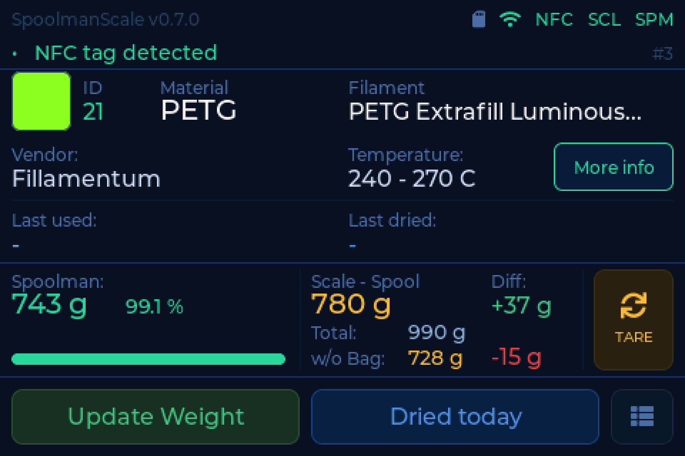
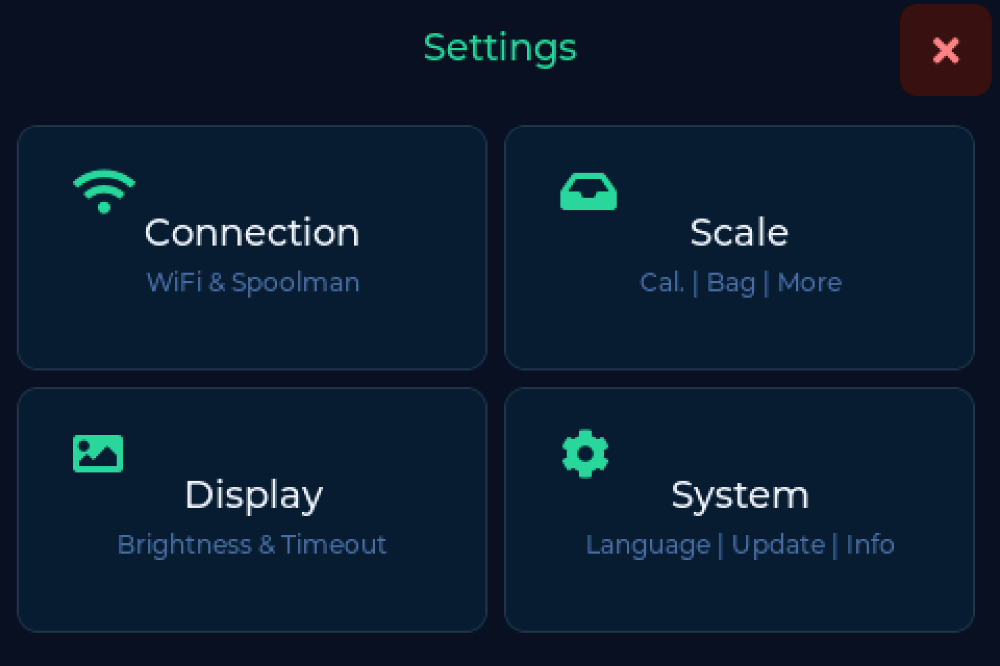

# The main screen

Everything the scale knows about the spool in front of you, on one screen.

!!! tip "It wakes up on its own"
    Put something on the pad and the display comes back by itself. No tapping.

---

## What is on it

| Area | Shows |
|---|---|
| Top row | filament name, vendor, colour swatch |
| Status bar | WiFi, backend, and any [diagnostic finding](../help/index.md) |
| Remaining | what your inventory says is left on the spool |
| Scale | what the load cell reads right now |
| Difference | scale minus inventory, so you can see at a glance what a print used |
| Bottom | last used, last dried |
| Bottom right | settings |

Weights are shown and written back as **whole grams**.

---

## The states you will see

=== "Nothing on the pad"

    

    Waiting. The scale is tared and ready.

=== "Running low"

    

    A spool with little left on it. The remaining weight is highlighted so an
    almost-empty spool is obvious before you start a long print.

=== "Backend unreachable"

    

    WiFi is up but the backend does not answer. The scale keeps weighing; it
    just cannot look anything up or write anything back.

    Check the address and port under **Settings → Connection**. A missing port
    is a common cause - see [Backends](backends.md).

=== "No WiFi"

    

    No network at all. Weighing still works, everything else waits.

---

## The status bar talks

If something is wrong with the hardware, the status bar says so in plain words
rather than showing a cryptic abbreviation. Tap it and it explains the cause and
what to do, with a button that takes you straight there where there is something
to do.

Every message it can show is listed under
[What the scale is telling you](../help/index.md).

---

## Detail view

Tap the spool area for the full record: article number, production date,
temperatures, Spoolman ID, tag UID. Main screen and detail view share one layout
grid, so nothing jumps when you switch between them.

---

## Settings

Bottom right. Four tiles:

| Tile | Holds |
|---|---|
| **Connection** | WiFi, backend, addresses and credentials |
| **Scale** | [bag weight](weighing.md), [drying](drying.md), location, [tag writing](tags.md), calibration |
| **Display** | brightness, timeout, date format |
| **System** | [web interface](web.md), [firmware](updating.md), language, info, [NFC reset check](../build/wiring.md#after-the-rewiring), restart, factory reset |
