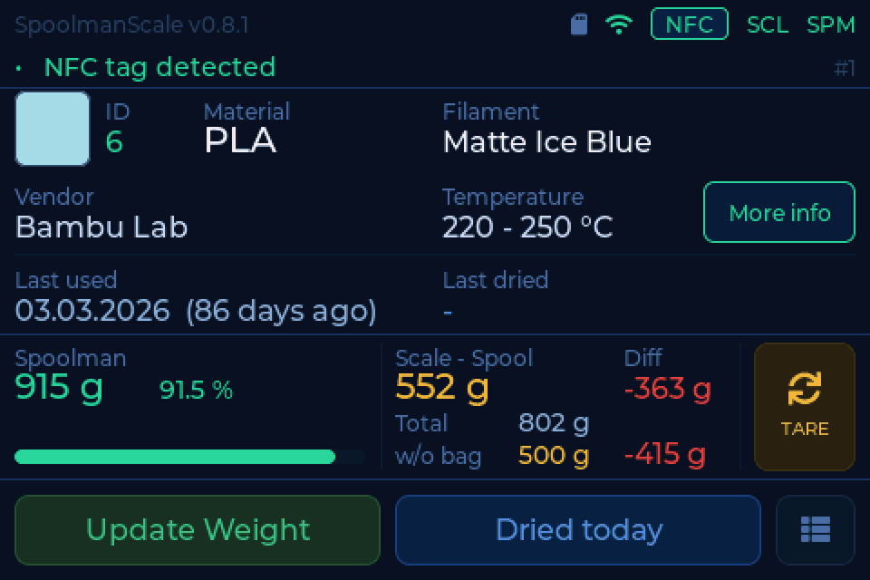
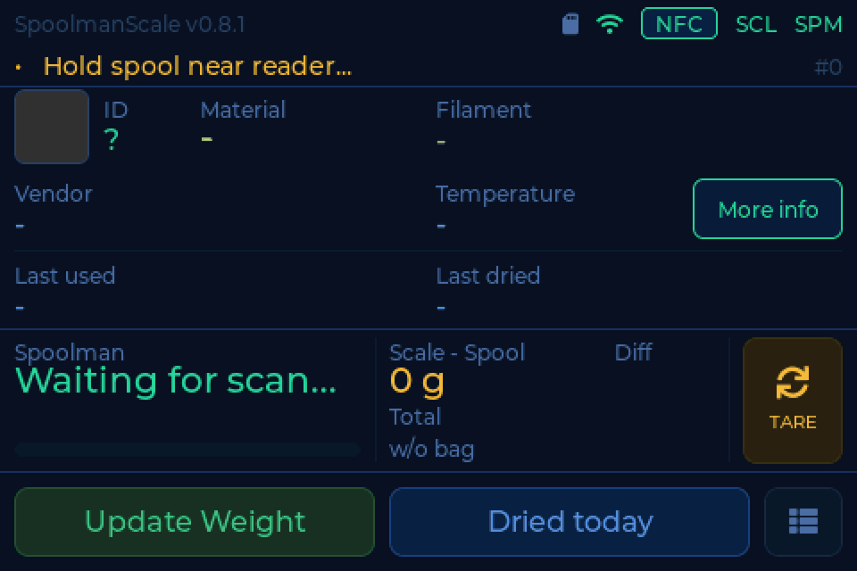
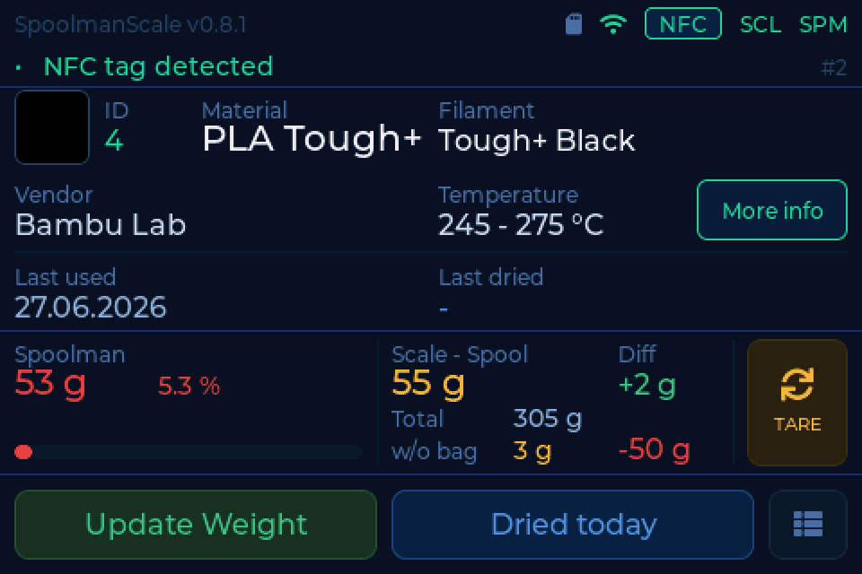
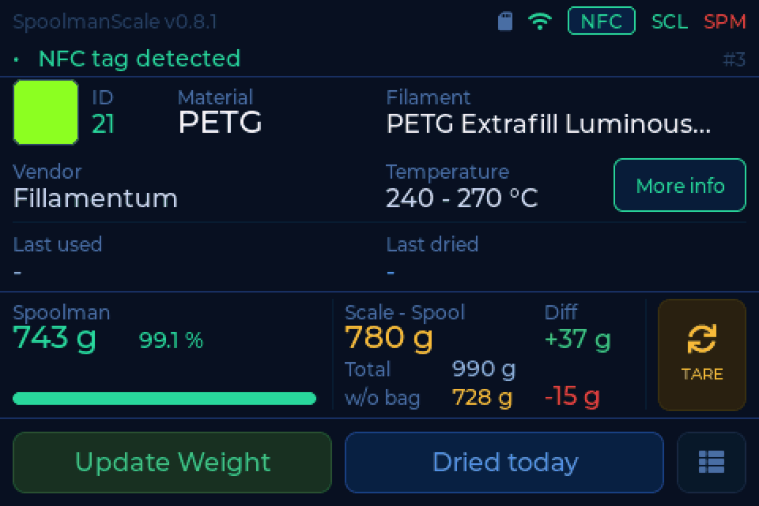
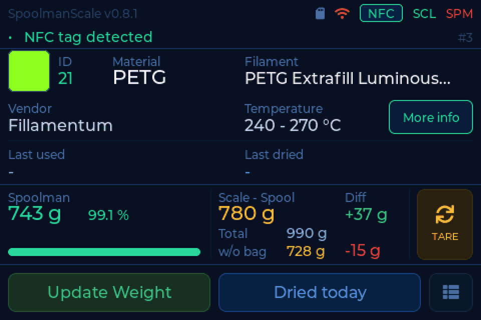
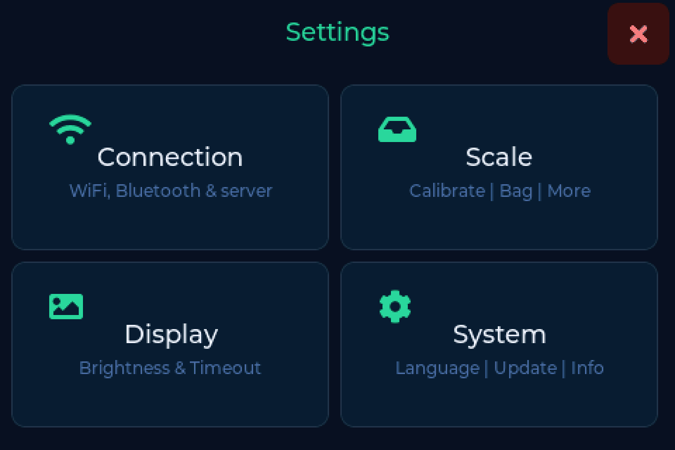
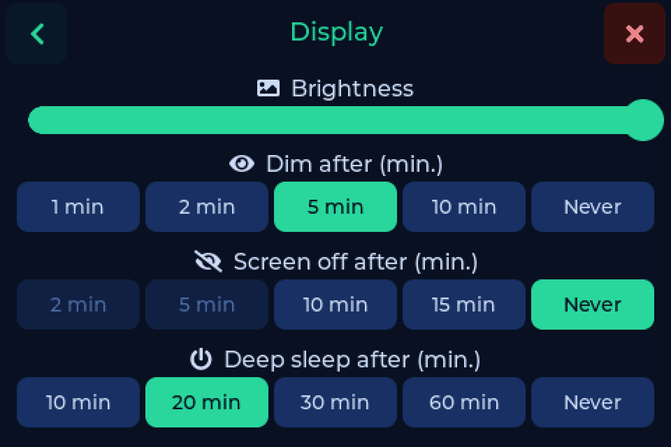

# The main screen

Everything the scale knows about the spool in front of you, on one screen.

!!! tip "It wakes up on its own"
    Put something on the pad and the display comes back by itself. No tapping.

---

## What is on it

| Area | Shows |
|---|---|
| Header | firmware version and status chips: SD card, Bluetooth, WiFi, NFC, SCL (load cell), AMS and the backend badge |
| Status bar | what the scale is doing, any [diagnostic finding](../help/index.md), the scan counter |
| Spool | ID, material, filament name, colour swatch, vendor, temperature, and the **More info** button |
| Below it | last used, last dried |
| Remaining | what your inventory says is left on the spool |
| Scale - Spool | the filament on the scale right now, without the empty spool. Below it the total and the weight without the bag |
| Diff | scale minus inventory, so you can see at a glance what a print used |
| **TARE** | zeroes the scale |
| Bottom | **Update Weight** and **Dried today**. For a tag that is not linked yet, **Link Spool** and **Copy spool** |
| Bottom right | settings |

Two of the header chips are buttons:

- **NFC** opens the tag view: what the tag on the reader holds, and for an
  NTAG buttons to erase it or write the spool onto it. It reads **NFC!** in
  red when the reader does not answer.
- **AMS** opens the AMS view. It only appears with FilaMan or BamBuddy, and
  only when your printer has an AMS.

The backend badge (**SPM**, **FLM**, **BBY** or **BBS**) turns red when the
server does not answer. **SCL!** in red means the load cell does not answer.

Weights are shown and written back as **whole grams**.

---

## The states you will see

=== "Nothing on the pad"

    

    Waiting. The scale is tared and ready.

=== "Running low"

    

    A spool with little left on it. The remaining weight is highlighted so an
    almost-empty spool is obvious before you start a long print.

=== "Long name"

    

    A filament name too long for its field is cut off with three dots.

=== "Backend unreachable"

    

    WiFi is up but the backend does not answer. The scale keeps weighing; it
    just cannot look anything up or write anything back.

    Check the address and port under **Settings → Connection**. A missing port
    is a common cause - see [Backends](backends.md).

=== "No WiFi"

    

    No network at all. Weighing still works, everything else waits.

---

## The status bar talks

If something is wrong with the hardware, the status bar says so in plain words
rather than showing a cryptic abbreviation. Tap it and it explains the cause and
what to do, with a button that takes you straight there where there is something
to do.

Every message it can show is listed under
[What the scale is telling you](../help/index.md).

---

## Detail view

Tap **More info** for the full record: ID, material, filament, colour,
production date, article number, empty spool weight, tag UID, location and the
backend's UUID. Main screen and detail view share one layout grid, so nothing
jumps when you switch between them.

From here you also change the location, unlink the tag and, with Bluetooth on
and a label printer set up, tap **Print label**.

---

## Settings

Bottom right. Four tiles:

=== "Settings"

    

=== "Display"

    

=== "System"

    

| Tile | Holds |
|---|---|
| **Connection** | WiFi, Bluetooth and the label printer, filament manager with address and credentials, **More options** for the active backend |
| **Scale** | **Show the AMS** (FilaMan and BamBuddy, with an AMS), [bag weight](weighing.md), [drying reminder](drying.md), location on removal, [tag writing](tags.md), last used mode, calibration, **Scale fitted** |
| **Display** | brightness, dim after, screen off after, deep sleep after |
| **System** | [web interface](web.md), [firmware](updating.md), language with time zone and date format, info, [NFC reset check](../build/wiring.md#after-the-rewiring), restart, factory reset |
