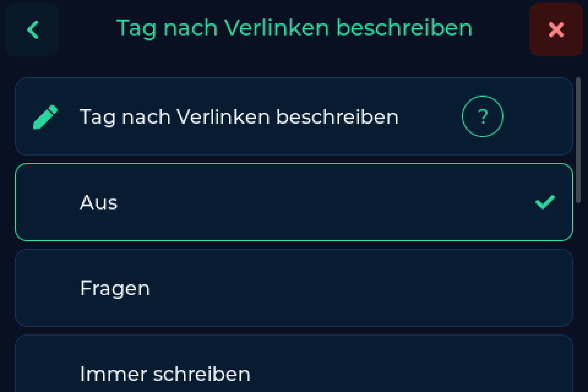

# NFC-Tags

Welche Tags funktionieren, wie die Waage sie liest und - neu in v0.7.0 - wie sie
sie beschreibt.

---

## Woran die Waage einen Tag erkennt

Alles folgt aus der Länge der UID:

| UID-Länge | Tag-Typ | Was passiert |
|---|---|---|
| 4 Byte | MIFARE Classic, auch Bambu Labs interne Tags | **Bambu-Flow** - KDF-Entschlüsselung |
| 7 Byte | NTAG / MIFARE Ultralight | **NTAG-Flow** - die UID ist der Schlüssel |
| alles andere | unbekannt | wird **ignoriert**, nichts passiert |

Ein unbekannter Tag bringt nichts zum Absturz und nichts zum Hängen. Die
NFC-Anzeige blinkt grün, es erscheint keine Spule, und nach dem Abnehmen ist
alles wie vorher.

---

## Lesen

Spule auflegen. Die Waage liest die UID, schlägt sie bei deinem
[Backend](backends.md) nach und zeigt die Spule. Mehr ist es nicht.

Die UID wird als reines Hex gespeichert (`04B9E542447080`), so wie es jedes
andere Werkzeug rund um Spoolman tut - Verknüpfungen von woanders werden hier
gefunden und umgekehrt.

---

## Schreiben

Bis v0.7.0 hat die Waage Tags nur gelesen. Jetzt schreibt sie sie auch, von
selbst, im Hintergrund, **mit jedem Backend** - auch mit Spoolman, das dafür
nichts mitbringen muss.

!!! danger "Schreiben ersetzt alles auf dem Tag"
    Ein Schreibvorgang ersetzt den Inhalt des Tags vollständig. Was jetzt darauf
    steht, ist danach verloren. Bambu-Tags werden nie beschrieben.

### Wann sie schreibt

**Einstellungen → Waage → Tag nach Verlinken beschreiben**

| Modus | Verhalten |
|---|---|
| **Aus** | Nur die UID wird mit der Spule verknüpft, der Tag bleibt unberührt. Schreiben geht weiterhin über die [Weboberfläche](web.md), wo vorher sichtbar ist, was draufgeht. |
| **Fragen** | Die Waage fragt jedes Mal nach. |
| **Immer schreiben** | Ohne Rückfrage, nur das Ergebnis wird gemeldet. |

### Wenn Tag und Bestand auseinanderlaufen

Die Waage passt auch danach noch auf. Steht auf dem Tag etwas anderes als im
Bestand - weil sich das Material geändert hat, die Farbe oder die Spule selbst -
sagt sie Bescheid und bietet an, den Tag richtigzustellen. Abschaltbar unter
**Einstellungen → Waage → Tag nach Verlinken beschreiben**.

### Formate

Das Format entscheidet, wer den Tag lesen kann.

=== "OpenSpool"

    Ein NDEF-Datensatz mit Material, Farbe, Marke, Temperaturen und der
    Spulen-ID. Das verstehen die Filament-Manager und OpenSpool-Leser.

    **Die Voreinstellung, und die richtige Antwort, solange nichts dagegen
    spricht.**

=== "FilaMan"

    Derselbe Datensatz unter dem Protokollnamen, den eine FilaMan-Installation
    erwartet.

    Nimm das, wenn FilaMan dein Backend ist und dessen eigene Leser den Tag
    aufnehmen sollen.

=== "Anycubic ACE"

    Gar kein Datensatz, sondern rohe Seiten mit Artikelnummer, Marke, Material,
    Farbe, Düsen- und Betttemperatur, Durchmesser, Länge und Gewicht.

    Die ACE liest diese Seiten selbst - das ist das Format, um den Drucker
    direkt zu füttern statt einen Filament-Manager.

=== "Leeren"

    Setzt den Tag zurück auf null. Zu finden auf der Tag-Seite der
    [Weboberfläche](web.md).

### Aus dem Browser

Die Tag-Seite der [Weboberfläche](web.md) gibt dir die meiste Kontrolle: beide
Seiten nebeneinander, was auf dem Tag steht und was draufkäme, mit farbig
markierten Unterschieden, und das Format wählst du selbst.

Geschrieben wird trotzdem am Gerät - der NFC-Bus gehört der Waage, eine Anfrage
aus dem Browser wird geparkt und beim nächsten Durchlauf ausgeführt. Der Tag muss
also auf dem Leser liegen.

---

## Welchen Tag soll ich kaufen?

!!! warning "NTAG213 ist zum Schreiben zu klein"
    Ein NTAG213 hat 144 Byte Nutzspeicher, und das reicht **nicht für den
    OpenSpool- oder FilaMan-Datensatz**. Zum Lesen ist er einwandfrei, dort
    zählt nur die UID - beschreiben lässt er sich nicht.

    **Wenn die Waage deine Tags beschreiben soll, kauf NTAG215 oder NTAG216.**

| Wenn du willst | Kauf | Suche nach |
|---|---|---|
| Nur lesen | NTAG213 | *"NTAG213 NFC Sticker"* |
| Lesen und schreiben | **NTAG215** | *"NTAG215 NFC Sticker"* |
| Schreiben mit Luft nach oben | NTAG216 | *"NTAG216 NFC Sticker"* |
| Größtmögliche Lesestabilität | MIFARE Ultralight | *"MIFARE Ultralight NFC Sticker"* |

Runde 25-mm-Aufkleber sind am verbreitetsten und passen gut auf Spulenkerne.

---

## Kompatibilität

| Tag-Typ | UID | Lesen | Schreiben | Anmerkung |
|---|---|---|---|---|
| NTAG213 | 7 Byte | ja | **nein** | 144 Byte, zu klein für einen Datensatz |
| NTAG215 | 7 Byte | ja | ja | empfohlen |
| NTAG216 | 7 Byte | ja | ja | mehr Speicher, etwas teurer |
| MIFARE Ultralight | 7 Byte | ja | nein | am stabilsten zu lesen |
| MIFARE Ultralight C | 7 Byte | ja | nein | läuft problemlos |
| Bambu Lab intern | 4 Byte | ja | **nie** | verschlüsselt, Bambu-Flow |
| MIFARE Classic 1K / 4K / Mini | 4 Byte | nein | nein | löst den Bambu-Flow aus |
| MIFARE DESFire | 7 Byte | unzuverlässig | nein | nicht empfohlen |
| ISO 15693 | - | nein | nein | falsches Protokoll |

---

## Position - näher ist nicht besser

Das ist die häufigste Ursache für unzuverlässige NTAG-Lesungen, und es ist das
Gegenteil dessen, was die meisten erwarten: ein Tag, der direkt am Leser klebt,
wird oft **schlechter** gelesen als einer ein paar Millimeter davor.

Leserantenne und Tag bilden einen lose gekoppelten Transformator. Auf sehr
kurzer Distanz wird die Kopplung so stark, dass die Last des Tags auf den
Schwingkreis des Lesers zurückwirkt und ihn von 13,56 MHz wegzieht. Das Feld
bricht zusammen, und gleichzeitig wird die Antwort des Tags klein gegenüber dem
Träger, sodass der Leser sie kaum noch dekodiert. Das Ergebnis ist eine Totzone
direkt an der Antennenoberfläche - zuverlässig gelesen wird erst etwas weiter
draußen.

!!! tip "Liest ein Tag schlecht, gib ihm Abstand, bevor du ihn tauschst"
    Etwa **5 bis 20 mm** sind für die meisten Aufkleber-Tags der beste Bereich.
    Ein paar Lagen Schaumklebeband oder ein kleiner gedruckter Abstandshalter
    unter dem Tag reichen meist. Manche brauchten bis zu 20 mm.

- Kleb den Tag nicht dorthin, wo er bündig auf der Leseroberfläche endet.
- Größere Tags vertragen näheren Sitz als kleine - ein 25-mm-Aufkleber verhält
  sich anders als ein 15-mm-Aufkleber.
- Kleb den Tag nicht auf Metall oder über einen metallischen Spuleneinsatz, das
  verstimmt den Tag selbst.
- Die Position des Lesers gibt das Gehäuse vor, und eine Spule kann auf der
  Wiegeplatte nur etwa 10 mm wandern - der Abstand muss also von der Tag-Seite
  kommen.

**Warum Bambu-Lab-Spulen das kaum zeigen:** ihr Tag sitzt versenkt im Spulenkern
und hält dadurch von sich aus ein paar Millimeter Abstand. Ein Aufkleber außen
auf einer Fremdspule tut das nicht. Das ist ein großer Teil des Rufs, NTAG sei
der unzuverlässigere von beiden - der eigentliche Unterschied ist oft nur die
Montage.

---

## Bekannte Einschränkung - das Lagerort-Popup

NTAG-Tags benutzen ein komplexeres HF-Protokoll als Bambu Labs MIFARE-Classic-Tags.
Der PN532 kann einen NTAG zwischendurch nicht erkennen, obwohl die Spule sich
nicht bewegt hat - er liest sie kurz als abgenommen und dann wieder als aufgelegt.

Normalerweise hat das keine sichtbare Wirkung. **Die Ausnahme ist das
automatische Lagerort-Popup** - ein solcher Fehlausschlag kann die Lagerort-Auswahl
öffnen, während die Spule noch daliegt.

!!! tip "Abhilfe"
    Prüfe zuerst die Position weiter oben, zu wenig Abstand ist die häufigere
    Ursache. Bleibt es dabei, schalte **Automatisches Lagerort-Popup** unter
    **Einstellungen → Waage** aus. Sonst ändert sich nichts.

Bambu-Lab-Spulen zeigen das nicht.

---

## Tags erkennen, die du schon hast

Mit einer kostenlosen NFC-App wie **NFC Tools**:

1. Tag scannen
2. Die App nennt den Typ, etwa "NTAG215" oder "MIFARE Classic 1K"
3. Eine UID mit 7 Byte heißt: wird gelesen. NTAG215 oder 216 heißt: wird auch
   beschrieben

Oder einfach auf die Waage legen:

- Spulendaten oder "nicht gefunden" → kompatibel
- Leseanimation, dann nichts → höchstwahrscheinlich MIFARE Classic
- Gar nichts → ignoriert, falsche UID-Länge
