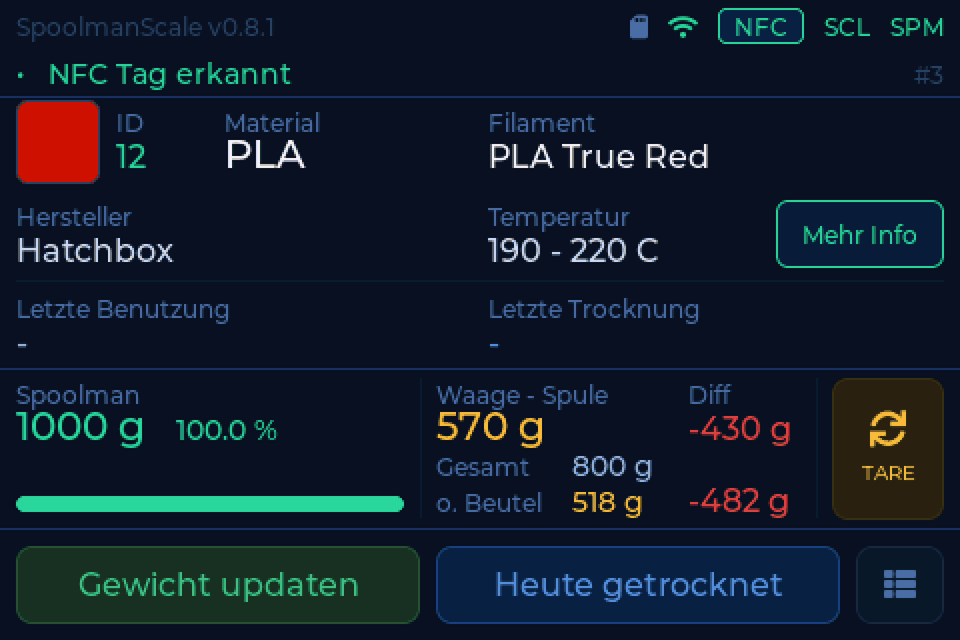
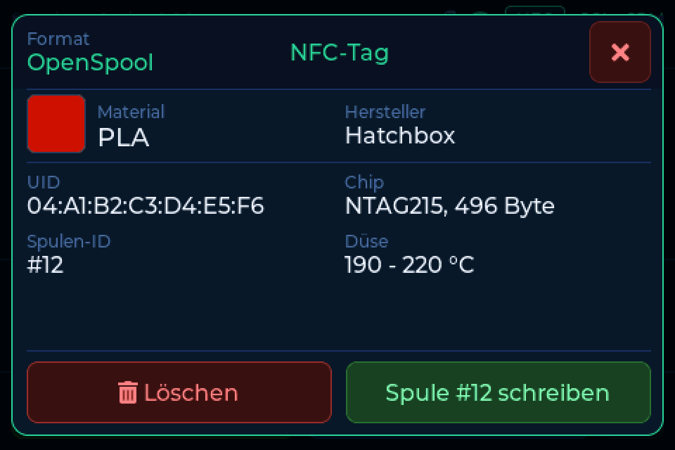
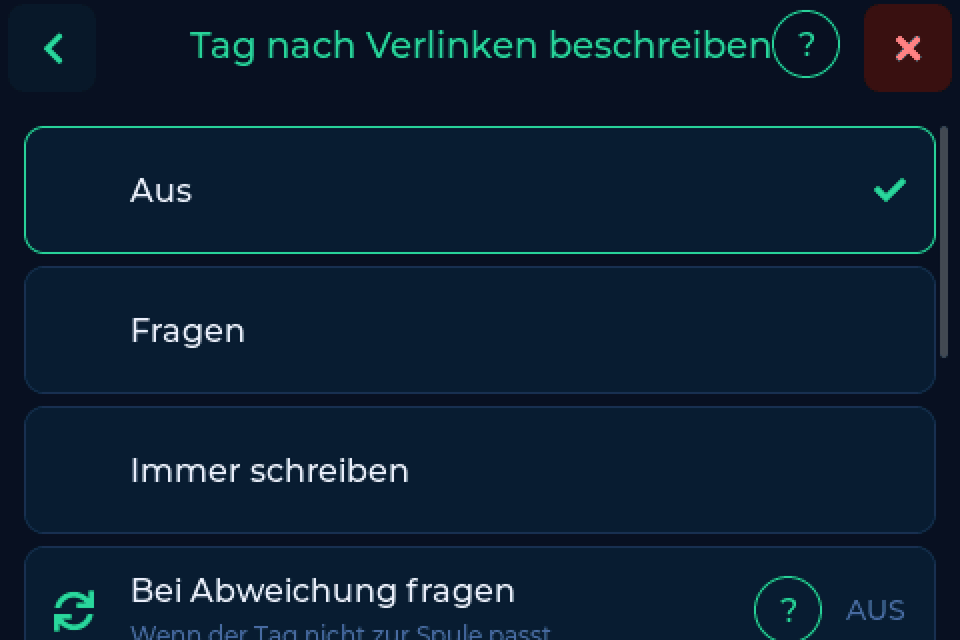

# NFC-Tags

Welche Tags funktionieren, wie die Waage sie liest und wie sie sie beschreibt.

---

## Lesen

Leg eine Spule auf. Die Waage liest den Tag, fragt dein [Backend](backends.md)
und zeigt die Spule. Mehr ist nicht zu tun.

- **NTAG-Sticker** werden an ihrer UID erkannt. Sie wird als reines Hex
  gespeichert (`04B9E542447080`), so wie es jedes andere Werkzeug rund um
  Spoolman macht. Verknüpfungen von woanders werden hier gefunden und
  umgekehrt.
- **Bambu-Lab-Tags** werden gelesen und entschlüsselt: Material, Farbe und die
  Spule kommen von selbst.
- **MIFARE-Classic-Karten und -Sticker** werden an ihrer UID erkannt. Kennt
  dein Backend die Karte, erscheint sie nach 3 bis 5 Sekunden, sonst nach etwa
  zehn.
- **Snapmaker-Tags** lassen sich ebenfalls lesen. Schalte dafür in der
  [Weboberfläche](web.md) unter **Einstellungen** **Snapmaker-Tags lesen** ein.
  Standardmäßig ist das aus, weil es andere MIFARE-Tags etwas bremst.

### Die Tag-Ansicht

Tipp auf den NFC-Chip in der Kopfzeile, und du siehst, was auf dem Tag auf dem
Leser steht. Bei einem NTAG leert **Löschen** ihn, und **Spule #N schreiben**
schreibt die Spule vom Bildschirm darauf.

---

## Schreiben

Die Waage beschreibt Tags auch, mit jedem Backend, und auf dem Server braucht es
dafür nichts Besonderes.

!!! danger "Schreiben ersetzt alles auf dem Tag"
    Was jetzt auf dem Tag steht, ist danach weg. Bambu-Tags werden nie
    beschrieben.

**Einstellungen → Waage → Tag nach Verlinken beschreiben**

- **Aus** - nur die UID wird mit der Spule verknüpft, der Tag bleibt unberührt.
- **Fragen** - die Waage fragt jedes Mal.
- **Immer schreiben** - ohne Rückfrage, nur das Ergebnis wird gemeldet.

Während die Waage schreibt, bittet eine Karte mit Fortschrittsbalken, die Spule
liegen zu lassen. **Bei Abweichung fragen** auf demselben Screen lässt die Waage
später ein Neuschreiben anbieten, wenn der Tag nicht mehr zur Spule passt.

### Formate

=== "OpenSpool"

    Material, Farbe, Marke, Temperaturen und die Spulen-ID, lesbar für
    Filamentverwaltungen und OpenSpool-Leser. **Der Standard und die richtige
    Wahl, solange du keinen Grund für etwas anderes hast.**

=== "FilaMan"

    Derselbe Datensatz unter dem Namen, den FilaMan erwartet. Nimm ihn, wenn
    FilaMan dein Backend ist und seine eigenen Leser und seine App den Tag
    erkennen sollen.

=== "Anycubic ACE"

    Die Rohseiten, die die Anycubic ACE selbst liest. Um den Drucker direkt zu
    füttern statt einer Filamentverwaltung.

### Aus dem Browser

Die Seite **Tags** in der [Weboberfläche](web.md) zeigt, was auf dem Tag steht,
neben dem, was draufkäme, und du wählst das Format. Dort kannst du einen Tag auch
verknüpfen, ohne ihn zu beschreiben (**Nur verknüpfen**), und dir die Rohdaten
ansehen. Der Tag muss dafür auf dem Leser liegen.

---

## Ein zweiter Tag pro Spule

Ein Tag auf jeder Seite der Spule, und sie wird erkannt, egal wie herum sie
liegt. Direkt nach dem Verknüpfen fragt die Waage nach dem zweiten: Spule
umdrehen, fertig. Die Frage schaltest du unter **Einstellungen → Verbindung →
Weitere Optionen → Zweites Tag abfragen** ein oder aus.

Das braucht ein Backend, das mehrere Tags pro Spule kennt: Spoolman 0.27 oder
neuer mit nativen Tags (oder dem Feld `card_uids`), oder FilaMan 1.3.1 oder
neuer. BamBuddy kann das nicht.

Verknüpfst du einen Tag, der schon zu einer anderen Spule gehört, zeigt die
Waage beide Spulen und bietet **Umhängen** an.

!!! tip "Happy Hare"
    Happy Hare liest die Hardware-UID des Chips aus dem Feld `rfid_tag`. Schalte
    **Chip-UID mitschreiben** ein (nur Spoolman, unter **Weitere Optionen**),
    und die Waage trägt sie für dich ein.

---

## Welchen Tag soll ich kaufen?

**NTAG215.** Er wird zuverlässig gelesen und hat Platz für einen Datensatz, falls
die Waage ihn beschreiben soll.

| Tag | Lesen | Schreiben | Hinweis |
|---|---|---|---|
| NTAG213 | ja | **nein** | 144 Byte, zu klein für einen Datensatz |
| **NTAG215** | ja | ja | **empfohlen** |
| NTAG216 | ja | ja | mehr Speicher, etwas teurer |
| MIFARE Ultralight | ja | nein | sehr stabil beim Lesen |
| MIFARE Classic, Creality, Snapmaker | ja | nein | über die UID |
| Bambu Lab | ja | **nie** | verschlüsselt |
| ISO 15693, Prusa OpenPrintTag | nein | nein | anderer Funkstandard |

Runde 25-mm-Sticker sind am verbreitetsten und sitzen gut auf Spulennaben.

---

## Position - näher ist nicht besser

Die häufigste Ursache für unzuverlässiges Lesen ist das Gegenteil dessen, was
die meisten erwarten: Ein Tag direkt am Leser wird oft **schlechter** gelesen als
einer ein paar Millimeter entfernt. Aus nächster Nähe verstimmt der Tag die
Antenne des Lesers, und das Feld bricht zusammen.

!!! tip "Liest ein Tag schlecht, erst Abstand schaffen, dann tauschen"
    Etwa **5 bis 20 mm** Abstand sind für die meisten Sticker ideal. Ein paar
    Lagen Schaumstoffband oder ein kleiner gedruckter Abstandshalter unter dem
    Tag reichen meist.

- Klebe den Tag nicht auf Metall oder über einen Metalleinsatz der Spule.
- Die Spule kann auf der Platte nur wenig rutschen, der Abstand muss also vom
  Tag kommen.

Bambu-Lab-Spulen zeigen das selten, weil ihr Tag vertieft im Spulenkern sitzt.

---

## Verlorene Lesungen und die Lagerort-Frage

Ab und zu verliert der Leser einen NTAG kurz, obwohl die Spule nicht bewegt
wurde. Die [Lagerort-Frage](drying.md#ortsabfrage-bei-entnahme) fällt darauf
nicht herein: Sie prüft das Gewicht und kommt erst, wenn du die Spule wirklich
abnimmst.

Unter 50 g oder an einem Gerät ohne Wägezelle hat die Waage nur den Leser. Öffnet
sich die Lagerort-Liste dann von selbst, prüf die Position oben oder schalte
**Ortsabfrage bei Entnahme** unter **Einstellungen → Waage** aus.
