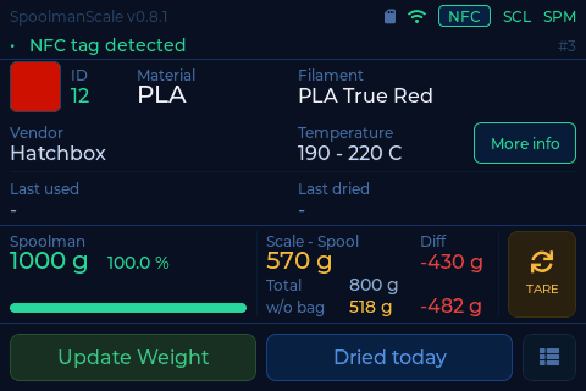
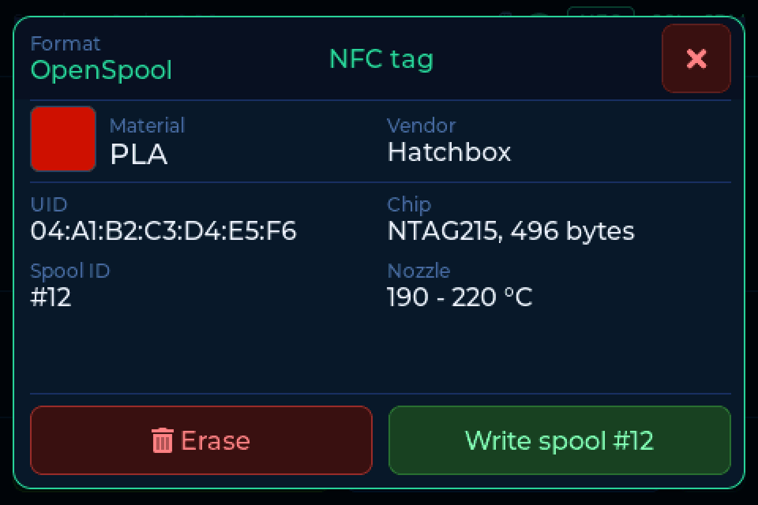
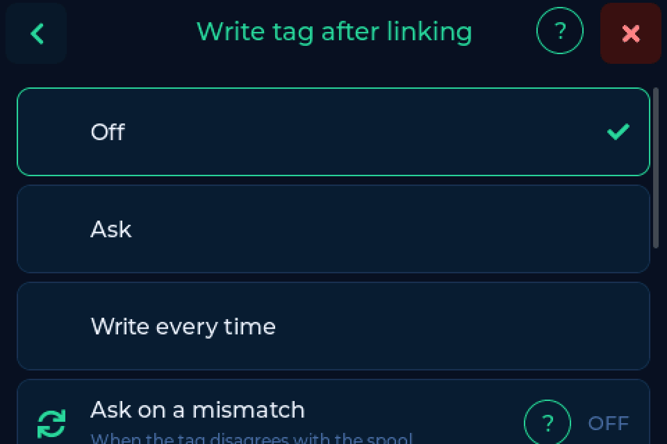

# NFC tags

Which tags work, how the scale reads them, and how it writes them.

---

## Reading

Put a spool on the pad. The scale reads the tag, looks it up at your
[backend](backends.md) and shows the spool. That is the whole interaction.

- **NTAG stickers** are found by their UID. It is stored as plain hex
  (`04B9E542447080`), the same way every other tool around Spoolman does it,
  so links made elsewhere are found here and the other way round.
- **Bambu Lab tags** are read and decrypted: material, colour and the spool
  come up by themselves.
- **MIFARE Classic cards and stickers** are found by their UID. A card your
  backend knows shows up after 3 to 5 seconds, an unknown one after about ten.
- **Snapmaker tags** can be read as well. Switch on **Read Snapmaker tags** in
  the [web interface](web.md) under **Settings**. It is off by default because
  it slows down other MIFARE tags a little.

### The tag view

Tap the NFC chip in the header to see what is on the tag on the reader. For an
NTAG, **Erase** empties it and **Write spool #N** writes the spool on the
screen onto it.

---

## Writing

The scale also writes tags, with every backend, and needs nothing special on the
server for that.

!!! danger "Writing replaces everything on the tag"
    Whatever is on the tag now is lost. Bambu tags are never written.

**Settings → Scale → Write tag after linking**

- **Off** - only the UID is bound to the spool, the tag is left alone.
- **Ask** - the scale asks every time.
- **Write every time** - no question, only the result is reported.

A card with a progress bar asks you to leave the spool where it is while the
scale writes. **Ask on a mismatch** on the same screen lets the scale offer a
rewrite later, when the tag no longer matches the spool.

### Formats

=== "OpenSpool"

    Material, colour, brand, temperatures and the spool ID, readable by
    filament managers and OpenSpool readers. **The default, and the right
    choice unless you have a reason otherwise.**

=== "FilaMan"

    The same record under the name FilaMan expects. Pick this if FilaMan is
    your backend and you want its own readers and app to pick the tag up.

=== "Anycubic ACE"

    The raw pages the Anycubic ACE reads itself. For feeding the printer
    directly rather than a filament manager.

### From the browser

The **Tags** page in the [web interface](web.md) shows what is on the tag next
to what would go on it, and lets you pick the format. There you can also link a
tag without writing it (**Link only**) and look at the tag's raw data. The tag
has to be on the reader.

---

## A second tag per spool

A tag on each side of the spool means it is found whichever way round it lies.
Right after a link the scale asks for the second one: turn the spool over,
done. Switch the question on or off under **Settings → Connection → More
options → Ask for a second tag**.

This needs a backend that can hold more than one tag per spool: Spoolman 0.27 or
newer with native tags (or the `card_uids` field), or FilaMan 1.3.1 or newer.
BamBuddy cannot.

If you link a tag that already belongs to another spool, the scale shows both
spools and offers to **Move** it.

!!! tip "Happy Hare"
    Happy Hare reads the chip's hardware UID from the `rfid_tag` field. Switch
    on **Also write the chip UID** (Spoolman only, under **More options**) and
    the scale fills it in for you.

---

## Which tag should I buy?

**NTAG215.** It reads reliably and has room for a record if you want the scale
to write it.

| Tag | Read | Write | Notes |
|---|---|---|---|
| NTAG213 | yes | **no** | 144 bytes, too small for a record |
| **NTAG215** | yes | yes | **recommended** |
| NTAG216 | yes | yes | more memory, slightly pricier |
| MIFARE Ultralight | yes | no | very stable to read |
| MIFARE Classic, Creality, Snapmaker | yes | no | by UID |
| Bambu Lab | yes | **never** | encrypted |
| ISO 15693, Prusa OpenPrintTag | no | no | a different radio standard |

Round 25 mm stickers are the most common and sit well on spool hubs.

---

## Positioning - closer is not better

The most common cause of unreliable reads is the opposite of what most people
expect: a tag pressed directly against the reader often reads **worse** than one
a few millimetres away. At very close range the tag detunes the reader's
antenna, and the field collapses.

!!! tip "If a tag reads badly, add distance before replacing it"
    A gap of roughly **5 to 20 mm** is the sweet spot for most sticker tags. A
    few layers of foam tape or a small printed spacer under the tag is usually
    all it takes.

- Do not stick the tag onto metal or over a metal spool insert.
- The spool can only shift a little on the plate, so the distance has to come
  from the tag side.

Bambu Lab spools rarely show this because their tag sits recessed inside the
spool core.

---

## Lost reads and the location question

Now and then the reader briefly loses an NTAG although the spool has not moved.
The [location question](drying.md#location-on-removal) does not fall for it: it
checks the weight and only comes when you really lift the spool.

Below 50 g, or on a device without a load cell, the scale has only the reader to
go by. If the location list then opens on its own, check the positioning above,
or switch off **Location on removal** under **Settings → Scale**.
