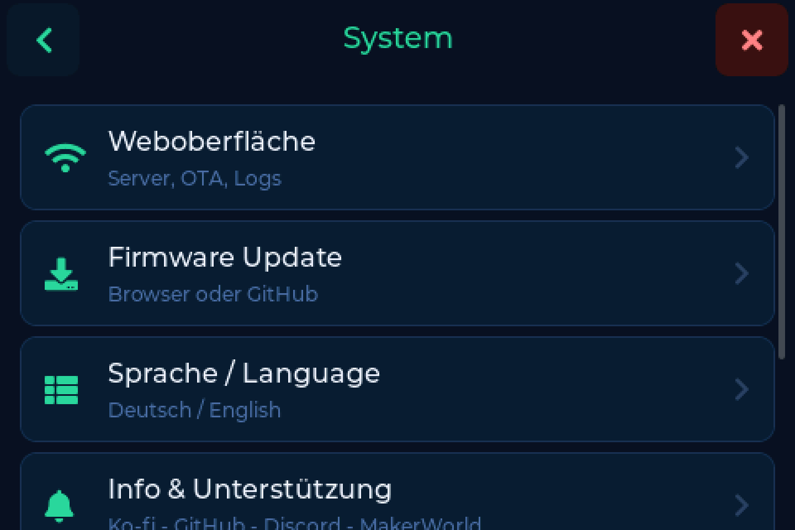
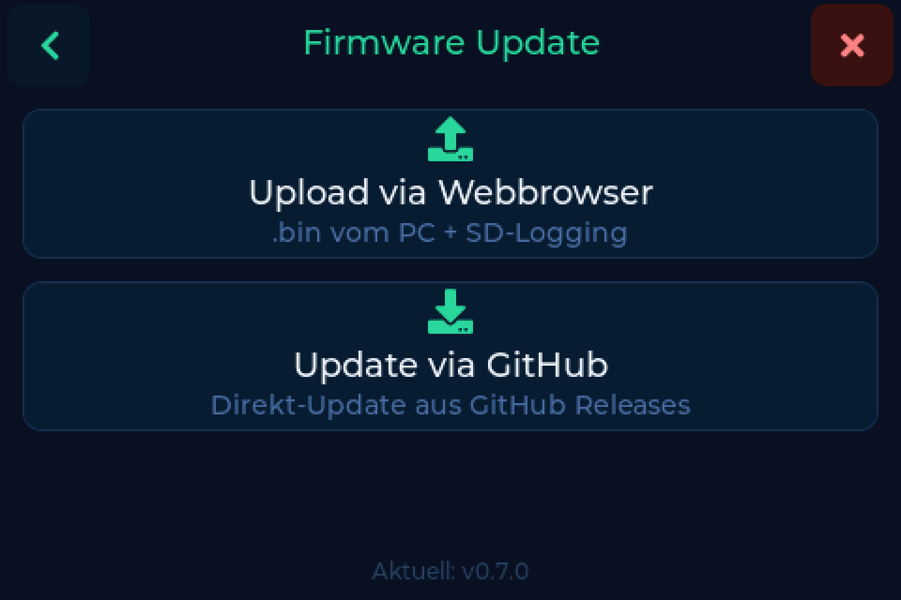

# Firmware aktualisieren

Nach dem [ersten Flash](index.md#der-erste-flash-der-web-flasher) brauchst du das
USB-Kabel nie wieder. Updates laufen am Gerät oder aus dem Browser.

---

## Am Gerät

**Einstellungen → System → Firmware Update**

1. **Auf Updates prüfen** antippen
2. Die Waage fragt bei GitHub nach und zeigt dir die Release Notes zu dem, was
   sie gefunden hat
3. **Installieren** antippen

Sie lädt, schreibt und startet von selbst neu und meldet dabei, wie weit sie ist.

---

## Aus dem Browser

Die Firmware-Seite der [Weboberfläche](web.md) tut dasselbe mit mehr Platz zum
Lesen und funktioniert auch vom Handy.

!!! note "Braucht Wartung"
    Die Firmware-Seite liegt hinter dem Schalter **Wartung**, und der ist
    standardmäßig aus. Einschalten unter **Einstellungen → System →
    Weboberfläche**. Siehe [Die Weboberfläche](web.md#die-drei-schalter).

---

## Eine bestimmte Version installieren

Wenn ein Update scheitert oder du auf eine bestimmte Version zurück willst:

1. Die `.bin` von den
   [GitHub Releases](https://github.com/Niko11111/SpoolmanScale/releases) laden
2. Die Firmware-Seite der [Weboberfläche](web.md) öffnen
3. Die Datei hochladen

---

## Beta oder Release

Veröffentlichungen gibt es in zwei Sorten:

| Sorte | Sieht aus wie | Für |
|---|---|---|
| Release | `v0.7.0` | alle |
| Vorabversion | `v0.7.0-beta.88` | Testen und Rückmelden im Discord |

Die vollständige Historie steht auf der
[Releases-Seite](https://github.com/Niko11111/SpoolmanScale/releases) - jede
Version bringt ihre eigenen Notizen mit.

!!! tip "Beta-Tester willkommen"
    Drei Backends, vier Tag-Formate und jede Menge Hardware-Kombinationen sind
    mehr, als eine Werkbank abdecken kann. Wenn auf einer Beta etwas klemmt, sag
    Bescheid, im [Discord](https://discord.gg/xadskCrPFu) oder als Issue. Genau
    dafür ist sie da.
