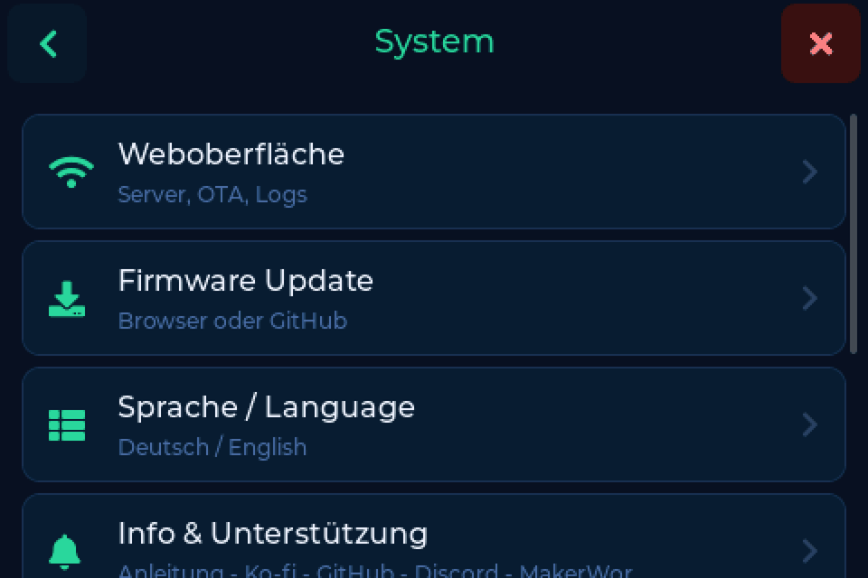
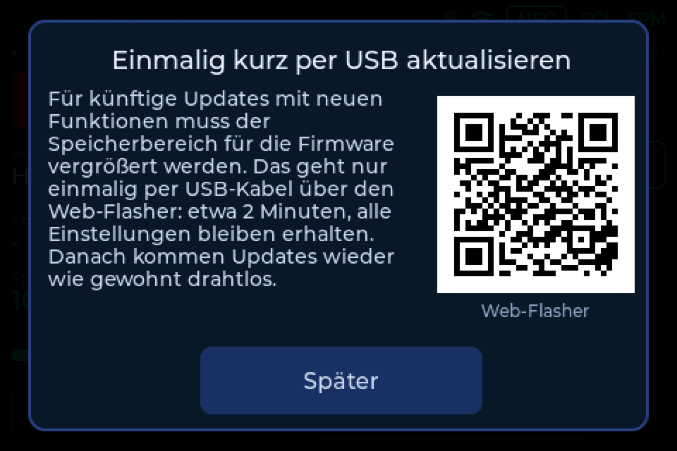
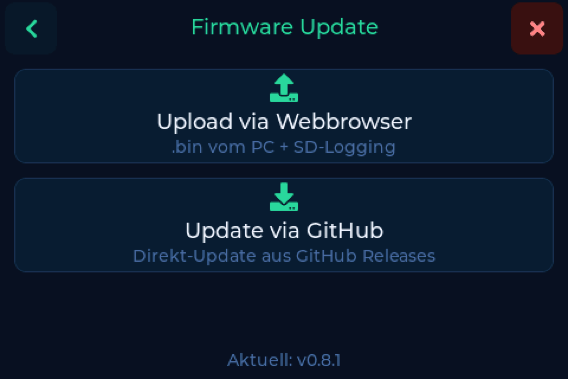
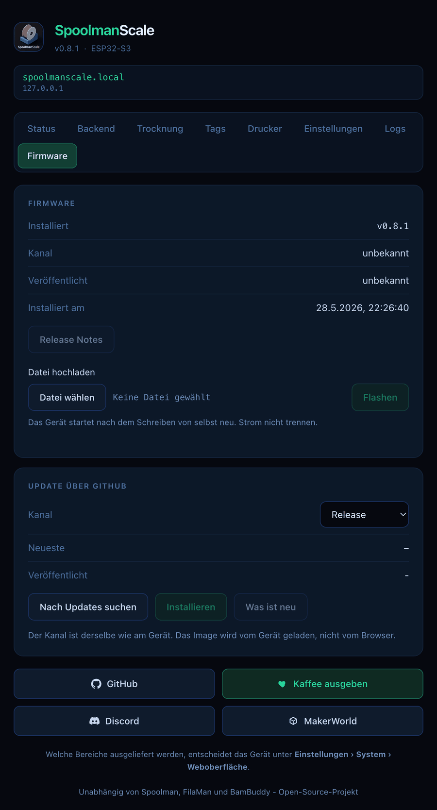

# Firmware aktualisieren

Nach dem [ersten Flash](index.md#der-erste-flash-der-web-flasher) laufen Updates
am Gerät oder aus dem Browser, ohne USB-Kabel.

!!! note "Von 0.7.x kommend: ein Update per USB"
    v0.8.0 teilt den Speicher der Waage neu auf (6 MB statt 3 MB für die
    Firmware), und das geht nur über das Kabel, einmal. Öffne den
    [Web-Flasher](https://niko11111.github.io/SpoolmanScale/) in Chrome oder
    Edge, schließ die Waage an und wähle **Update**. Das dauert etwa 2 Minuten,
    WLAN, Kalibrierung und Backend-Einstellungen bleiben erhalten. Bietet der
    Flasher stattdessen "Install" an, lass "Erase" ohne Haken, sonst sind WLAN
    und Kalibrierung weg.

    Eine Waage, die den Schritt auslässt, läuft weiter und bekommt v0.8.0 auch
    über WLAN. Sie erinnert dich bei jedem Start daran, mit QR-Code zum Flasher.
    Spätere Updates, die größer sind als die alte Aufteilung erlaubt, lassen
    sich dann nicht mehr über WLAN installieren.

    

!!! tip "Wenn der Flasher meldet: Failed to initialize"
    Er kommt nicht an den Chip heran. Probier nacheinander:

    1. Alles schließen, was den USB-Port belegen könnte: Arduino IDE, Slicer,
       ein zweiter Tab mit dem Flasher.
    2. Ein anderes Kabel, sicher ein Datenkabel, an einer USB-Buchse direkt am
       Rechner, ohne Hub.
    3. Die Waage von Hand in den Download-Modus bringen: **BOOT** gedrückt
       halten, **RST** kurz drücken, **BOOT** loslassen. Dann im Flasher
       verbinden und installieren. Danach einmal **RST** drücken.

---

## Am Gerät

**Einstellungen → System → Firmware Update**

1. **Auf Updates prüfen** antippen
2. Die Waage fragt bei GitHub nach und zeigt dir die Release Notes zu dem, was
   sie gefunden hat
3. **Installieren** antippen

Sie lädt, schreibt und startet von selbst neu und meldet dabei, wie weit sie ist.

---

## Aus dem Browser

Die Firmware-Seite der [Weboberfläche](web.md) tut dasselbe mit mehr Platz zum
Lesen und funktioniert auch vom Handy.

{ width="420" }

!!! note "Braucht Wartung"
    Die Firmware-Seite liegt hinter dem Schalter **Wartung**, und der ist
    standardmäßig aus. Einschalten unter **Einstellungen → System →
    Weboberfläche**. Siehe [Die Weboberfläche](web.md#die-drei-schalter).

---

## Eine bestimmte Version installieren

Wenn ein Update scheitert oder du auf eine bestimmte Version zurück willst:

1. Die `.bin` von den
   [GitHub Releases](https://github.com/Niko11111/SpoolmanScale/releases) laden
2. Die Firmware-Seite der [Weboberfläche](web.md) öffnen
3. Die Datei hochladen

---

## Beta oder Release

Veröffentlichungen gibt es in zwei Sorten:

| Sorte | Sieht aus wie | Für |
|---|---|---|
| Release | `v0.7.0` | alle |
| Vorabversion | `v0.7.0-beta.88` | Testen und Rückmelden im Discord |

Die vollständige Historie steht auf der
[Releases-Seite](https://github.com/Niko11111/SpoolmanScale/releases) - jede
Version bringt ihre eigenen Notizen mit.

!!! tip "Beta-Tester willkommen"
    Drei Backends, vier Tag-Formate und jede Menge Hardware-Kombinationen sind
    mehr, als eine Werkbank abdecken kann. Wenn auf einer Beta etwas klemmt, sag
    Bescheid, im [Discord](https://discord.gg/xadskCrPFu) oder als Issue. Genau
    dafür ist sie da.
