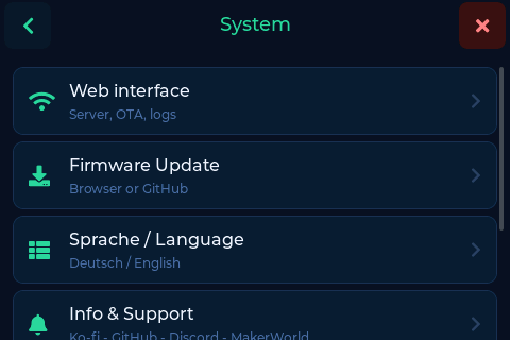
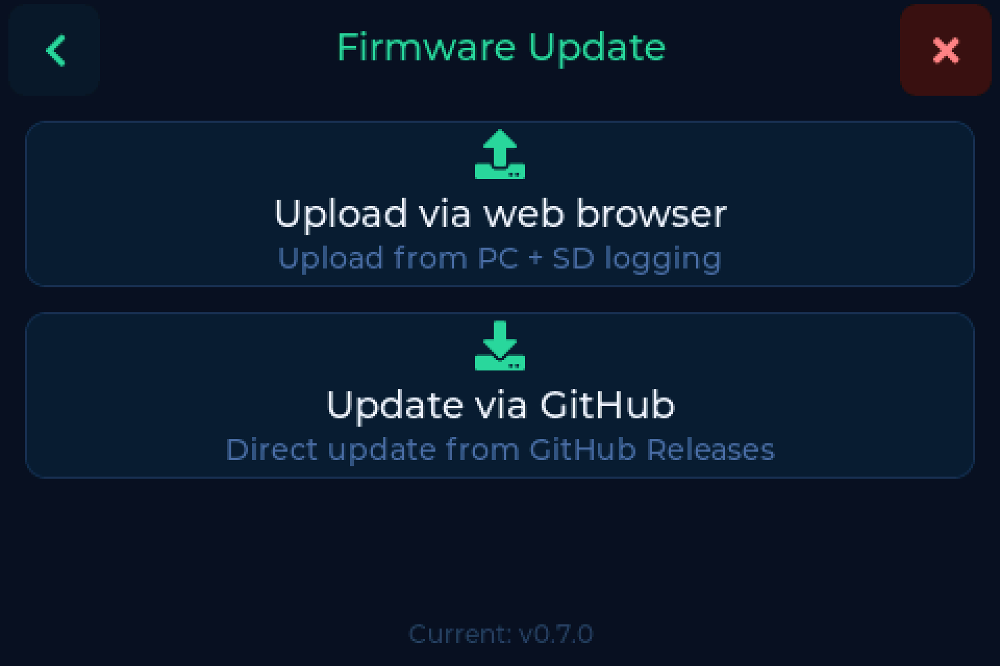

# Updating the firmware

After the [first flash](index.md#first-flash-the-web-flasher) you never need the
USB cable again. Updates run on the device or from your browser.

---

## From the device

**Settings → System → Firmware Update**

1. Tap **Check for updates**
2. The scale asks GitHub, and shows you the release notes for what it found
3. Tap **Install**

It downloads, writes and reboots on its own, reporting how far it got as it
goes.

---

## From the browser

The firmware page of the [web interface](web.md) does the same thing with more
room to read, and works from a phone.

!!! note "Needs Maintenance"
    The firmware page sits behind the **Maintenance** switch, which is off by
    default. Turn it on under **Settings → System → Web interface**. See
    [The web interface](web.md#the-three-switches).

---

## Installing a specific version

If an update fails, or you want to go back to a particular release:

1. Download the `.bin` from
   [GitHub Releases](https://github.com/Niko11111/SpoolmanScale/releases)
2. Open the firmware page in the [web interface](web.md)
3. Upload the file

---

## Beta or stable

Releases come in two kinds:

| Kind | Looks like | For |
|---|---|---|
| Release | `v0.7.0` | everyone |
| Pre-release | `v0.7.0-beta.88` | testing, reporting back on Discord |

The full history is on the
[releases page](https://github.com/Niko11111/SpoolmanScale/releases) - every
version carries its own notes.

!!! tip "Beta testers welcome"
    Three backends, four tag formats and a lot of hardware combinations are more
    than one workbench can cover. If something goes wrong on a beta, say so on
    [Discord](https://discord.gg/xadskCrPFu) or open an issue. That is what it
    is for.
