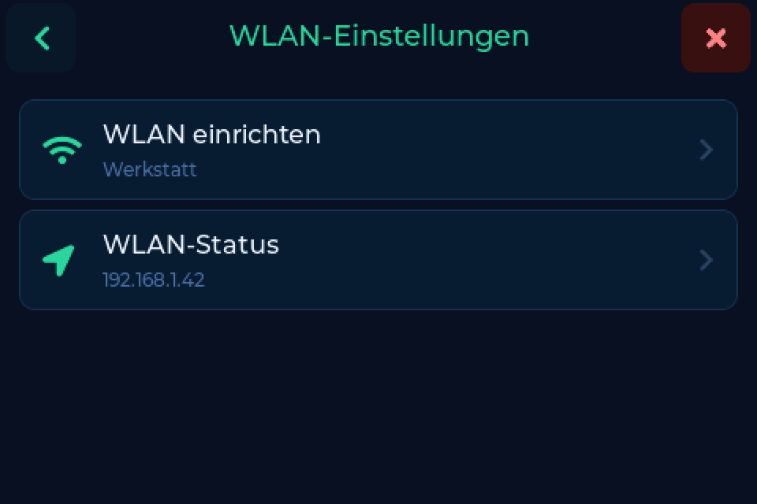
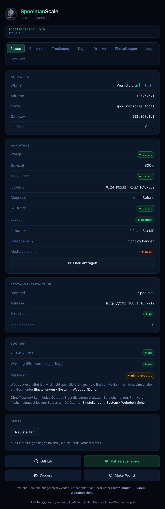
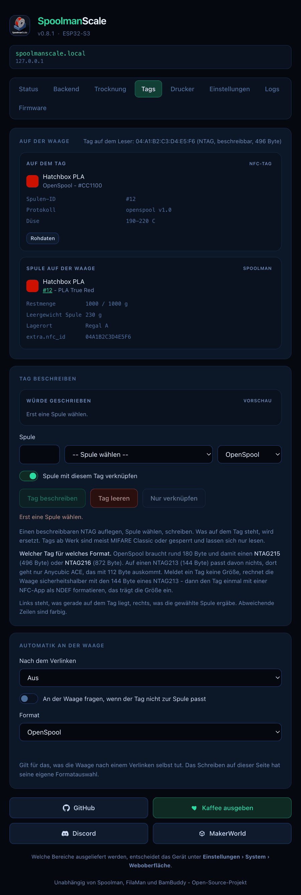
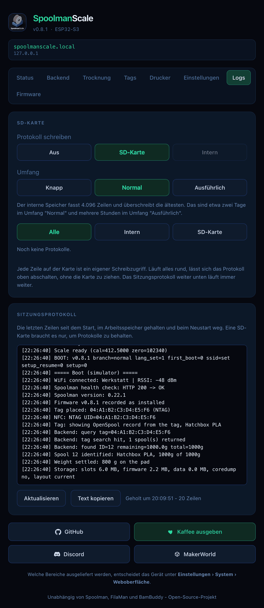

# Die Weboberfläche

Alles, was das Gerät kann, im Browser: einzelne Seiten, auf Deutsch, Englisch
und Französisch, auf dem Handy genauso brauchbar wie am Rechner. Was du hier und
am Gerät änderst, ist dieselbe Einstellung.

Erreichbar unter **`http://spoolmanscale.local`** oder der IP-Adresse des
Geräts. Die IP steht unter
**Einstellungen → Verbindung → WLAN-Einstellungen → WLAN-Status**.

---

## Die drei Schalter

Drei Schalter unter **Einstellungen → System → Weboberfläche** bestimmen, wie
viel ausgeliefert wird:

| Schalter | Liefert aus | Standard |
|---|---|---|
| **Webserver** | der Hauptschalter. Aus antwortet Port 80 nicht mehr. | an |
| **Einstellungen** | Backend, Trocknung, Drucker, Listenlimits, Anzeige, Tag-Automatik | aus |
| **Wartung** | Tags, Logs, Firmware, Neustart | aus |

Schalte **Einstellungen** und **Wartung** ein, wenn du sie brauchst, in einem
Netz, dem du vertraust. **Passwort** auf demselben Screen schützt beide mit 4
bis 8 Ziffern.

!!! note "FilaMan läuft weiter"
    Ist FilaMan eingerichtet, erreichen FilaMans eigene Tag-Anfragen die Waage
    auch bei ausgeschaltetem Webserver.

---

## Die Seiten

| Seite | Was sie tut | Braucht |
|---|---|---|
| **Status** | Live-Gewicht, aufliegende Spule, WLAN, Backend, Diagnose | Webserver |
| **Backend** | Backend, Adresse, Zugangsdaten, [Optionen](backends.md#optionen) | Einstellungen |
| **Trocknung** | Trocknungserinnerung und Intervalle je Material | Einstellungen |
| **Tags** | Tag auf dem Leser lesen, vergleichen, beschreiben, verknüpfen oder leeren | Wartung |
| **Drucker** | Bluetooth und der [Etikettendrucker](labels.md) | Einstellungen |
| **Einstellungen** | Listenlimits, Anzeige, Gerätename, Zeitzone, Snapmaker-Tags | Einstellungen |
| **Logs** | wohin und wie viel protokolliert wird, Logs lesen und speichern | Wartung |
| **Firmware** | Update von GitHub oder Datei hochladen | Wartung |

{ width="420" }

---

## Tags

Die Seite Tags zeigt, was auf dem Tag steht, neben dem, was aus deinem Bestand
draufkäme, mit farbig markierten Unterschieden. Wähle das Format, dann schreib,
leere oder verknüpfe den Tag nur. Der Tag muss dafür auf dem Leser liegen. Mehr
unter [NFC-Tags](tags.md).

{ width="420" }

---

## Logs

- **Protokoll schreiben:** **Aus**, **SD-Karte** oder **Intern**. Intern braucht
  keine Karte und hält die letzten 4.096 Zeilen.
- **Umfang:** **Knapp**, **Normal** oder **Ausführlich**. Für einen
  Fehlerbericht stell ihn vorher auf Ausführlich.
- Logs lesen, filtern und speichern. Das **Sitzungsprotokoll** darunter zeigt
  die Zeilen seit dem letzten Start.

{ width="420" }

---

## Firmware-Update

Die Seite prüft GitHub, zeigt die Release Notes und installiert das Update. Du
kannst auch selbst eine `.bin`-Datei hochladen. Ein Update, das nicht mehr auf
die Waage passt, wird nicht angeboten; die Seite verweist dann auf den
Web-Flasher. Siehe [Firmware aktualisieren](updating.md).
