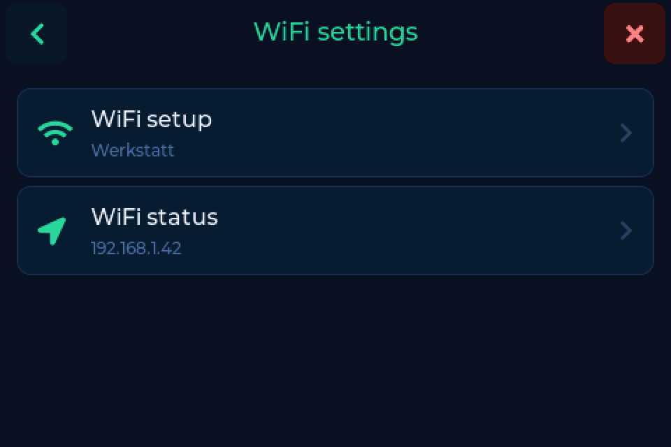
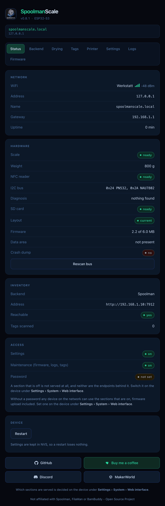
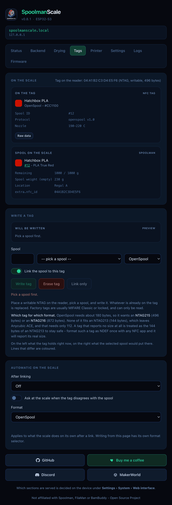
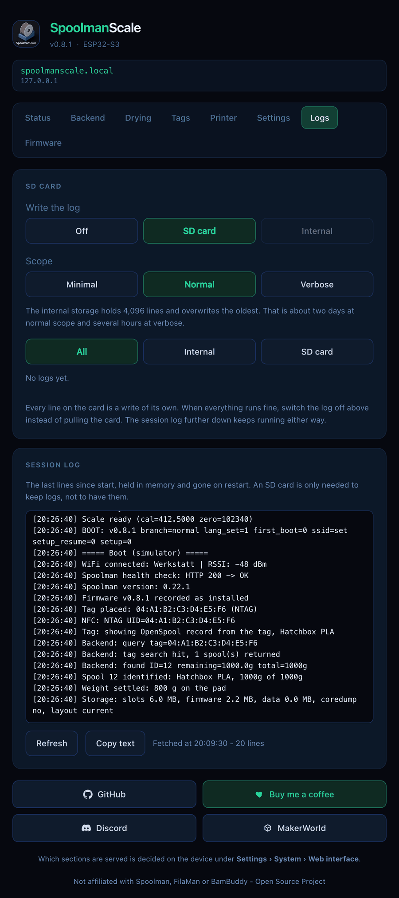

# The web interface

Everything the device can do, in a browser: separate pages, in German, English
and French, as usable on a phone as on a desktop. What you change here and on
the device is the same setting.

Reach it at **`http://spoolmanscale.local`** or the device's IP address. The IP
is shown under **Settings → Connection → WiFi settings → WiFi status**.

---

## The three switches

Three switches under **Settings → System → Web interface** decide how much is
served:

| Switch | Serves | Default |
|---|---|---|
| **Web server** | the master switch. Off, port 80 stops answering. | on |
| **Settings** | backend, drying, printer, list limits, display, tag options | off |
| **Maintenance** | tags, logs, firmware, restart | off |

Turn **Settings** and **Maintenance** on when you need them, on a network you
trust. **Password** on the same screen protects both with 4 to 8 digits.

!!! note "FilaMan keeps working"
    With FilaMan set up, FilaMan's own tag requests still reach the scale when
    the web server is off.

---

## The pages

| Page | What it does | Needs |
|---|---|---|
| **Status** | live weight, the spool on the pad, WiFi, backend, diagnosis | web server |
| **Backend** | backend, address, credentials, [options](backends.md#options) | Settings |
| **Drying** | drying reminder and intervals per material | Settings |
| **Tags** | read, compare, write, link or erase the tag on the reader | Maintenance |
| **Printer** | Bluetooth and the [label printer](labels.md) | Settings |
| **Settings** | list limits, display, device name, time zone, Snapmaker tags | Settings |
| **Logs** | where the log goes and how much, read and download it | Maintenance |
| **Firmware** | update from GitHub or upload a file | Maintenance |

{ width="420" }

---

## Tags

The Tags page shows what is on the tag next to what would go on it from your
inventory, with the differences highlighted. Pick the format, then write, erase
or just link the tag. The tag has to be on the reader. More in
[NFC tags](tags.md).

{ width="420" }

---

## Logs

- **Write the log:** **Off**, **SD card** or **Internal**. Internal needs no
  card and holds the last 4,096 lines.
- **Scope:** **Minimal**, **Normal** or **Verbose**. For a bug report, set it to
  Verbose first.
- Read, filter and download the logs. The **Session log** below shows the
  lines since the last start.

{ width="420" }

---

## Firmware updates

The page checks GitHub, shows the release notes and installs the update. You can
also upload a `.bin` file yourself. An update that no longer fits the scale is
not offered; the page points you to the web flasher instead. See
[Updating the firmware](updating.md).
