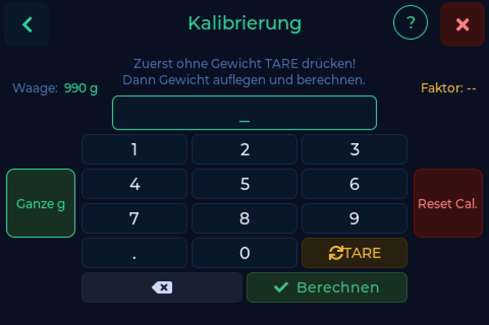

# Wiegen & Kalibrieren

---

## Kalibrierung

Eine nie kalibrierte Waage zeigt den Rohwert des Wandlers, keine Gramm - eine
sechsstellige Zahl, die von selbst um Hunderte springt. Das ist kein Defekt, und
die Waage sagt es in der Statuszeile auch.

**Einstellungen → Waage → Kalibrierung**

1. Plattform leer räumen und **TARE** drücken. Die Anzeige muss auf 0 gehen.
2. Ein Gewicht auflegen, das du genau kennst. Ideal sind etwa **1000 g** - eine
   volle Spule, auf einer Küchenwaage nachgewogen, reicht völlig.
3. Dieses Gewicht in Gramm eintippen und auf **Berechnen** drücken.

!!! tip "Das Referenzgewicht setzt die Obergrenze"
    Je genauer deine Referenz, desto genauer alles danach. Ihr Fehler steckt in
    jeder folgenden Messung.

Kalibriere neu, wenn du das Gerät deutlich bewegt hast, und **immer nach einer
Verkabelungskorrektur**. Eine Kalibrierung, die bei falsch verdrahteter
Wägezelle entstanden ist, bleibt gespeichert - wer die Adern richtigstellt und
nicht neu kalibriert, hat das Gewicht danach auf neue Weise falsch.

!!! warning "Zahlen laufen in die falsche Richtung"
    Wird die Zahl beim Auflegen **kleiner**, sind A+ und A- an der NAU7802
    vertauscht. Siehe [Wägezelle verpolt](../help/index.md#wagezelle-verpolt).

---

## Tarieren

**TARE** setzt die Waage bei leerer Plattform auf null. Mach das, wann immer der
Leerwert von der Null weggelaufen ist.

---

## Beutelgewicht

**Einstellungen → Waage → Beutelgewicht**

Das Gewicht eines Vakuumbeutels samt Trockenmittelpack, in Gramm. Ist es
gesetzt, wird es abgezogen - eine eingeschweißte Spule wiegt damit dasselbe wie
eine unverpackte, und dein Bestand stimmt in beiden Fällen.

!!! tip "Die eine Tara, die BamBuddy-Nutzer brauchen"
    BamBuddy kennt weder Filamente noch Hersteller als eigene Objekte und kann
    dort deshalb keinen Tarawert halten. Das Beutelgewicht wird an der Waage
    gesetzt und wirkt unabhängig vom Backend.

---

## Gewicht automatisch speichern

Sobald eine Spule erkannt ist und das Gewicht **3 Sekunden ruhig** steht,
speichert die Waage von selbst. Ruhig heißt: weniger als **0,5 g** Bewegung.

Ein Fortschrittsbalken zeigt die Wartezeit, du siehst also, dass gleich
geschrieben wird, statt dich zu fragen, ob es passiert ist.

- Gespeichert wird **ohne** Beutelgewicht, im Bestand steht also die Spule allein
- Abschaltbar über **Automatik aus**, wenn du lieber selbst drückst

!!! info "FilaMan ohne Tag"
    Bei FilaMan wird auch eine Spule ohne Tag automatisch gespeichert, solange
    das eingeschaltet ist, nicht nur über den Knopf.

---

## Ganze Gramm

Seit v0.7.0 zeigt und schreibt die Waage überall **ganze Gramm**.

Spoolman leitete `used_weight` aus der gesendeten Nachkommastelle ab und machte
daraus Zahlen wie `251,70000000000005 g`. Mit ganzen Gramm hört das ab der
nächsten Wägung auf.

---

## Zuletzt-benutzt-Modus

**Einstellungen → Waage → Zuletzt-benutzt-Modus**

Was als "benutzt" zählt. Die Auswahl hängt vom Backend ab - Druckverbrauch oder
Wiegen - damit das Datum auf dem Hauptbildschirm das bedeutet, was du erwartest.
