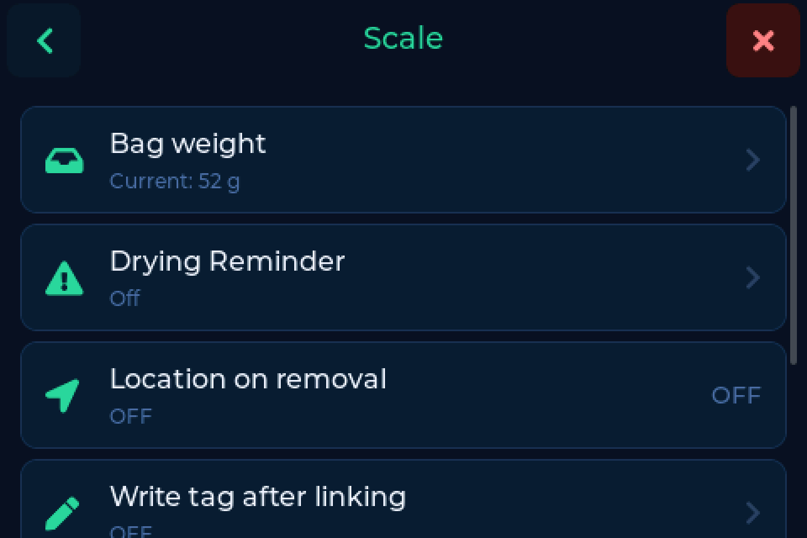
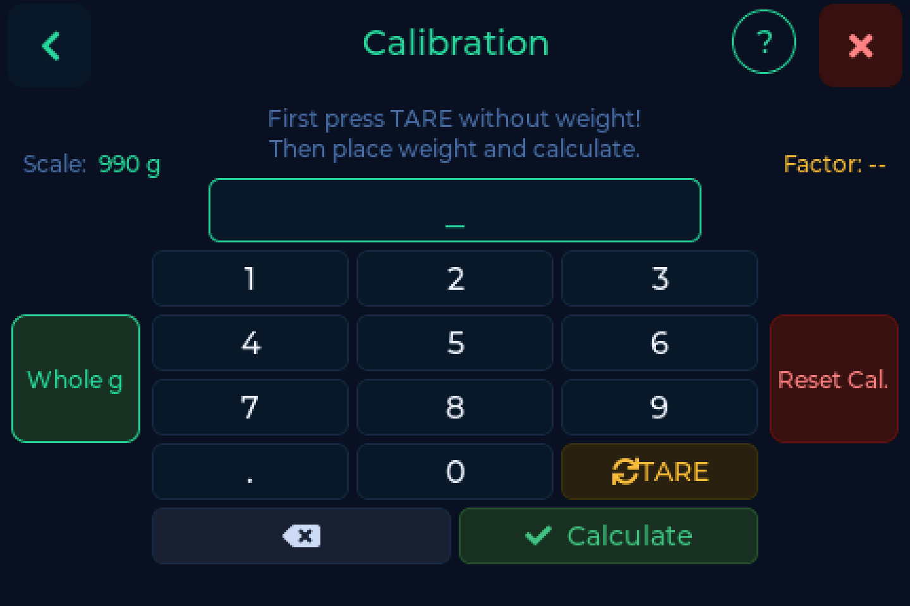

# Weighing & calibration

---

## Calibration

A scale that has never been calibrated shows the converter's raw value, not
grams - a six digit number that drifts by hundreds on its own. That is not a
fault, and the scale says so in the status bar.

**Settings → Scale → Calibration**

1. Clear the platform and press **TARE**. The reading has to go to 0.
2. Place a weight you know exactly. Around **1000 g** is ideal - a full spool
   checked on a kitchen scale is plenty.
3. Type that weight in grams and press **Calculate**.

!!! tip "The reference weight sets the ceiling"
    The more precise your reference, the more accurate everything afterwards.
    Whatever error is in it is baked into every measurement.

Recalibrate after moving the device significantly, and **always after fixing
wiring**. A calibration taken while the load cell was miswired is still stored;
correcting the wires without recalibrating leaves the weight wrong in a new way.

!!! warning "Numbers going the wrong way"
    If putting weight on makes the number go **down**, A+ and A- are swapped on
    the NAU7802. See [Load cell reversed](../help/index.md#load-cell-reversed).

---

## Tare

**TARE** zeroes the scale with the platform empty. Do it whenever the empty
reading has drifted off zero.

---

## Bag weight

**Settings → Scale → Bag weight**

The weight of a vacuum bag plus its silica gel pack, in grams. When set, it is
subtracted so a bagged spool weighs the same as an unbagged one and your
inventory stays right either way.

!!! tip "The one tare BamBuddy users need"
    BamBuddy keeps neither filaments nor vendors as objects of their own, so it
    cannot hold a tare value at that level. The bag weight is set on the scale
    and works regardless of backend.

---

## Automatic weight update

Once a spool is detected and the weight has been **stable for 3 seconds**, the
scale saves it by itself. Stable means moving by less than **0.5 g**.

A countdown bar shows the wait, so you can see it is about to write rather than
wondering whether it did.

- Saved **without** the bag weight, so the figure in your inventory is the spool
  alone
- Switch it off with **Disable auto** if you would rather press the button

!!! info "FilaMan without a tag"
    With FilaMan, a spool that has no tag is also saved automatically when this
    is on, not only via the button.

---

## Whole grams

Since v0.7.0 the scale shows and writes back **whole grams** everywhere.

Spoolman derived `used_weight` from the decimal it was sent and turned it into
numbers like `251.70000000000005 g`. Sending whole grams stops that from the
next weighing onwards.

---

## Last used mode

**Settings → Scale → Last used mode**

What counts as "used". The choices depend on the backend - printing usage or
weighing - so the date on the main screen means what you expect it to mean.
